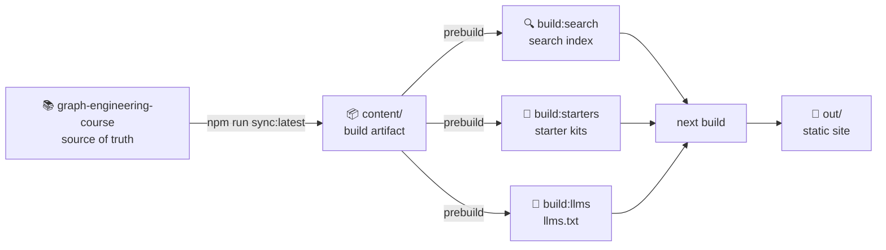

<div align="center">

[](https://github.com/ayeshakhalid192007-dev/graph-lab)
[](https://github.com/ayeshakhalid192007-dev/graph-lab/stargazers)
[](#-license)

[](https://nextjs.org)
[](https://react.dev)
[](https://www.typescriptlang.org)
[](https://tailwindcss.com)

[](#-deployment)
[](#-contributing)

</div>

<div align="center">

# Graph Engineering — Landing Site

*Learn graph engineering — from data structures to real-world systems.*

**A premium, fully-static learning platform for graph engineering —
86 doc pages, 23 patterns, 7 quizzes, 6 flashcard sets, 8 practice projects,
and a Graph Ready certification flow, all built with Next.js.**

</div>

---

## 📌 Quick links

| I want to… | |
| --- | --- |
| **See it live** — the deployed learning platform | [**View →**](https://ayeshakhalid192007-dev.github.io/graph-lab/) |
| Browse the documentation | [**Docs →**](https://ayeshakhalid192007-dev.github.io/graph-lab/docs/) |
| Explore graph patterns | [**Patterns →**](https://ayeshakhalid192007-dev.github.io/graph-lab/patterns/) |
| Try a practice project | [**Projects →**](https://ayeshakhalid192007-dev.github.io/graph-lab/projects/) |
| Take a quiz | [**Quiz →**](https://ayeshakhalid192007-dev.github.io/graph-lab/quiz/) |
| Run the site locally | [**Getting Started →**](#-getting-started) |

---

## 🔭 Overview

Graph engineering is the discipline of building systems where data, decisions, and workflows
are represented as graphs — nodes, edges, paths, and patterns. **Graph Lab** is a hands-on
learning platform that teaches this discipline end to end.

The curriculum is organized into 9 parts, from foundational concepts through advanced
topics like graph traversal, dependency resolution, and distributed graph systems. Every
concept is paired with runnable patterns, quizzes, and practice projects so you learn by
building — not just reading.

> **Content is synced, not hand-edited.** The educational content lives in a
> [separate course repository](https://github.com/ayeshakhalid192007-dev/graph-engineering-course)
> and is pulled into this site via an automated sync pipeline. This repository owns the
> platform — the content source owns the curriculum.

---

## ✨ Features

| | |
|---|---|
| 📚 **86 documentation pages** | Full graph engineering curriculum across 9 parts — foundations, data structures, traversal, patterns, and real-world systems. |
| 🧩 **23 patterns · 24 starter kits** | Reusable graph patterns with copy-paste starter code for hands-on practice. |
| 🧠 **7 quizzes · 6 flashcard sets** | Interactive assessment and spaced repetition for every major topic. |
| 🛠️ **8 practice projects** | End-to-end projects that combine multiple patterns into working systems. |
| 🔍 **Full-text search** | Search across titles, headings, and body text — built at compile time. |
| 🎓 **Graph Ready certification** | A structured certification flow to validate your graph engineering skills. |
| ⚡ **100% static export** | `output: "export"` — zero server, deployable to any static host. |
| 🎞️ **Smooth motion** | Scroll reveals and transitions via Framer Motion, all gated behind `prefers-reduced-motion`. |
| 📱 **Responsive** | Verified clean on mobile, tablet, laptop, and desktop. |
| ♿ **Accessible** | Semantic HTML, keyboard navigation, visible focus states, reduced-motion support. |
| 🌗 **Dark & light themes** | Theme-aware via `next-themes` with a premium dark-first palette. |

---

## 🛠 Tech Stack

| Layer | Choice |
|-------|--------|
| **Framework** | [Next.js 16](https://nextjs.org) (App Router, static export) |
| **Language** | [TypeScript 5](https://www.typescriptlang.org/) |
| **UI** | [React 19](https://react.dev/) |
| **Styling** | [Tailwind CSS v4](https://tailwindcss.com/) |
| **Animation** | [Framer Motion](https://www.framer.com/motion/) |
| **Theming** | [next-themes](https://github.com/pacocoursey/next-themes) |
| **Syntax highlighting** | [Shiki](https://shiki.style/) via `@shikijs/rehype` |
| **Diagrams** | [Mermaid](https://mermaid.js.org/) |
| **Content pipeline** | [unified](https://unified.js.org/) + remark + rehype (MDX-style processing) |
| **Icons** | [lucide-react](https://lucide.dev/) |
| **Tooling** | ESLint 9 · PostCSS · sharp |

---

## ⚙️ Content Pipeline

The site's educational content is **not maintained here**. It flows through an automated pipeline
from the source course repository:



1. **Source** — all docs, patterns, quizzes, and flashcards live in the
   [graph-engineering-course](https://github.com/ayeshakhalid192007-dev/graph-engineering-course) repo.
2. **Sync** — `npm run sync:latest` copies the `content/` directory into this repo.
3. **Build** — three generators run at prebuild time: search index, starter kits, and `llms.txt`.
4. **Export** — `next build` produces a fully static site in `out/`.

> **Never hand-edit `content/`.** Changes belong in the source repo. Run `npm run sync:check`
> to verify the copy matches.

---

## 🚀 Getting Started

### Prerequisites

- **Node.js 24+** (required — see `engines` in `package.json`)
- **npm** (or `yarn` / `pnpm` / `bun`)

### Installation

```bash
# 1. Clone the repository
git clone https://github.com/ayeshakhalid192007-dev/graph-lab.git
cd graph-lab

# 2. Install dependencies
npm install

# 3. Sync content from the course repo
npm run sync:latest

# 4. Start the dev server
npm run dev
```

Open **[http://localhost:3000](http://localhost:3000)** in your browser. The page hot-reloads as
you edit — start with `app/page.jsx` or the content in `content/`.

### Building for production

```bash
npm run build      # static export → ./out
npx serve out      # preview the real deployed artifact
```

---

## 📜 Available Scripts

| Script | What it does |
|--------|--------------|
| `npm run dev` | Start the local development server with hot reload. |
| `npm run sync:latest` | Sync content from the course repo into `content/`. |
| `npm run sync:check` | Verify content matches the source. |
| `npm run check:content-shape` | Validate quizzes, flashcards, and content structure. |
| `npm run check:links` | Verify all internal links resolve. |
| `npm run build:starters` | Generate starter kit ZIPs from pattern content. |
| `npm run build:search` | Build the search index from content. |
| `npm run build:llms` | Generate `llms.txt` for LLM consumption. |
| `npm run build` | Produce the fully-static export in `out/`. |
| `npm run typecheck` | Run TypeScript checks — must pass before commit. |
| `npm run lint` | Run ESLint — must pass before commit. |
| `npm run verify:all` | Run all checks: sync, content shape, typecheck, lint, build, links. |

---

## 🗂 Project Structure

```
graph-lab/
├── app/                        # Next.js App Router
│   ├── layout.jsx              # Root layout, fonts, metadata, theme provider
│   ├── page.jsx                # Homepage
│   ├── globals.css             # Design tokens + Tailwind
│   ├── docs/                   # Documentation pages
│   ├── patterns/               # Graph pattern pages
│   ├── projects/               # Practice project pages
│   ├── quiz/                   # Interactive quizzes
│   ├── flashcards/             # Flashcard review sessions
│   ├── certification/          # Graph Ready certification flow
│   ├── tracks/                 # Learning tracks
│   └── resources/              # Additional resources
├── components/                 # Reusable React components
│   ├── landing/                # Homepage sections
│   ├── ui/                     # Primitives (GlassCard, GlassButton, etc.)
│   └── animations/             # Motion wrappers
├── lib/                        # Utilities, content parsing, config
├── content/                    # Synced educational content (DO NOT HAND-EDIT)
│   └── docs/                   # Markdown docs, patterns, quizzes, flashcards
├── public/                     # Static assets, generated search index, starters
├── scripts/                    # Build scripts (sync, search, starters, llms, OG)
├── next.config.js              # Static export + GitHub Pages basePath
└── package.json
```

---

## 🌐 Deployment

The site ships as a **100% static export** — plain HTML, CSS, and JavaScript with zero runtime
server requirements. It deploys automatically to **GitHub Pages** on every push to `main`.

Because the export is fully static, it deploys just as happily to **Vercel**, **Netlify**,
**Cloudflare Pages**, or any static file host. For hosts that serve from the domain root,
simply leave `PAGES_BASE_PATH` unset.

---

## 🤝 Contributing

Contributions are welcome! To keep the project healthy:

1. **Fork** the repository and create a branch: `git checkout -b feature/your-idea`.
2. Make your change. Keep educational content changes in the
   [course repo](https://github.com/ayeshakhalid192007-dev/graph-engineering-course).
3. **Verify before you commit:**
   ```bash
   npm run verify:all    # must pass cleanly
   ```
4. Commit with a clear message and **open a pull request** describing the change.

---

## 📄 License

Released under the **MIT License**. You are free to use, modify, and distribute this project with
attribution.

---

## 🙏 Acknowledgements

- Built with **[Next.js](https://nextjs.org)**, **[React](https://react.dev)**, and
  **[Tailwind CSS](https://tailwindcss.com)**.
- Content pipeline powered by **[unified](https://unified.js.org/)**, **remark**, and **rehype**.
- Syntax highlighting by **[Shiki](https://shiki.style/)**.
- Diagrams by **[Mermaid](https://mermaid.js.org/)**.

---

<p align="center">
  <sub>Learn graph engineering — from structures to systems. &nbsp;·&nbsp; <b>Graph Lab</b></sub>
</p>
