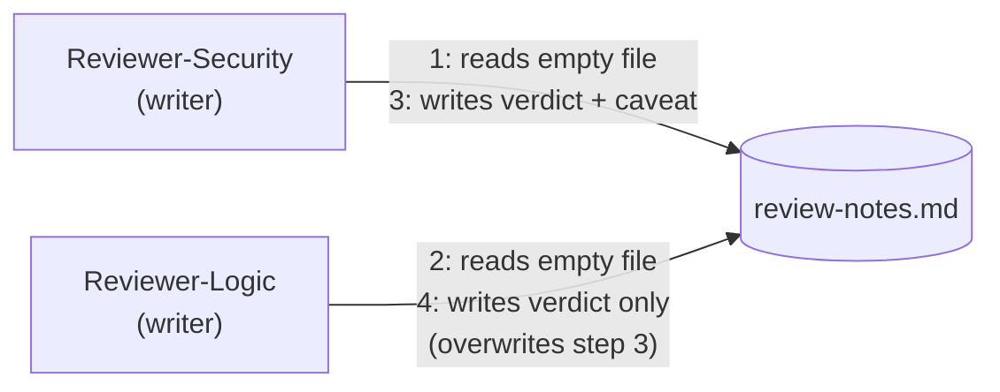

# Step 1 · When a Single Memory File Stops Being Enough

## Hook

A pull request touches a login rate limiter. The harness sends it to two reviewer agents at once. `Reviewer-Security` checks for auth-bypass risk. `Reviewer-Logic` checks the business logic. Both read and write the same file: `review-notes.md`.

`Reviewer-Security` finishes first. It writes: *safe, but only while the rate limiter stays enabled above this endpoint.* Seconds later, `Reviewer-Logic` finishes too. It loaded the file before that write landed, so it never saw the caveat. It saves its own "safe" verdict — over the top.

The caveat is gone. Nobody deleted it on purpose. Nobody notices until the rate limiter gets disabled, three weeks later, in some unrelated change — and the "safe" verdict everyone still trusts turns out to have been conditional the whole time.

## Explanation

### The thin-memory trick

A single loop can run on almost no memory infrastructure. One plain file. Read on wake, rewritten before it sleeps. Call this the **[thin-memory trick](../02-foundations/glossary.md#thin-memory-trick)**: one loop, one file, one reader, one writer — and reader and writer are never active at the same time, because they're the same process taking turns. A flat file, under those conditions, is the right amount of infrastructure. Not a shortcut. The right amount.

### The hidden condition

The trick has one hidden condition: exactly one loop touches the file. Add a second reviewer, a second worker, anything else reading or writing that same file, and two separate failures show up.

1. **Writers clobber each other.** Two agents read the file, decide what to add, then write their own copy back. Whichever write lands second wins — completely. A flat file can't merge two changes; it only knows "the last write."
2. **Readers can't tell settled from unsettled.** A third agent reads "verdict: safe." That could mean two reviewers independently confirmed it, or that one got interrupted mid-check. A **settled fact** and a **half-finished guess** look identical in plain text.

Neither failure is a bug in the agents. Both behaved reasonably given what they could see. The failure is in the storage — a single file can't answer "who else is touching this" or "how sure are we," and past one loop, both questions matter.

### Edge cases worth naming

1. **Only one writer, but two readers.** Safe from clobbering, but a reader that opened the file before the writer's last save is still working from stale data — it just won't know it.
2. **Writes spaced far apart.** A once-an-hour write schedule makes the collision rare, not impossible. The race window shrinks; it never closes.
3. **Atomic writes (write-then-rename).** This stops a reader from ever seeing a half-written file. It does nothing to stop a full, complete write from replacing another full, complete write — atomicity protects against corruption, not against overwriting.
4. **Sub-second writers.** Fast agents narrow the gap between "read" and "write" to milliseconds. A fast-enough second writer still lands inside it.

## Diagram



Both reviewers race to the same file. The edge labels show the real order: both reads land before either write, so neither write accounts for the other. Whoever writes last wins. See it happen yourself: `labs/step-1-two-writers-one-file.sh` reproduces this exact race and shows the caveat vanish.

## Claude Code vs OpenCode

Neither snippet below adds protection — that's the point. Both show the same shape: read the file, decide, write the file.

### Claude Code

A minimal skill that a fanned-out reviewer agent would run:

```markdown
---
name: pr-verdict-writer
description: Appends this reviewer's verdict to the shared review notes file.
---

1. Read `review-notes.md` from the repo root.
2. Decide this reviewer's verdict based on what was just read and on this
   reviewer's own analysis of the diff.
3. Append the verdict as a new line, then write the whole file back to
   `review-notes.md`.
```

Nothing between step 1 and step 3 checks for another writer. Two parallel runs — one per reviewer — each read, decide, write, with no idea the other exists.

### OpenCode

The equivalent custom command, same three steps, same missing check:

```markdown
---
description: Append this reviewer's verdict to review-notes.md
---

Read the current contents of review-notes.md, form a verdict for this
reviewer's assigned concern, append it as a new bullet, and write the
updated file back to disk. Do not wait on or check for any other writer.
```

Run one of these per reviewer, in parallel, on the same file, and you get the same collision — no matter which tool ran it. The failure is in the plan, not the tool.

## Going Deeper

The obvious patch is a lock: make each writer wait its turn. That fixes the clobbering. It doesn't fix the second failure — a reader still can't tell a checked verdict from a guess. And now every writer waits in line instead of working in parallel, which defeats the point of fanning the review out at all. The rest of this Part takes a different path: structure the shared memory so more than one writer can use it safely, and so a claim carries some record of how settled it is.

## Check Yourself

<details>
<summary>Suppose the harness fixed the collision by making Reviewer-Logic wait until Reviewer-Security's write finishes before it reads the file. Does that also fix the "settled fact vs. half-finished guess" problem? Reveal the answer.</summary>

No. Serializing the writes stops the clobbering — Reviewer-Logic would now see the caveat. But the file still stores every verdict as identical plain text. An interrupted verdict reads exactly like a finished one. Ordering the writes fixes collision. It does nothing for telling settled from unsettled.

</details>

## Try With AI

1. In a throwaway repo, create `notes.md` with one placeholder line.
2. Open two sessions of your agent tool.
3. In each session, ask it to read `notes.md`, add a one-line note with today's date, and save — without telling either session about the other.
4. Read the file in both sessions before either one saves, so the gap actually overlaps.
5. Open `notes.md` yourself. Whichever agent saved last is the only note that survived.

## When It Goes Wrong

| Symptom | Cause | Fix |
| --- | --- | --- |
| Something you were sure got recorded is missing. Nobody knows when it vanished. | Two writers touched the same flat file. The last write silently replaced the rest. | Don't ask agents to "be careful." Replace the flat file with something built for more than one writer — Step 2. |
| Two verdicts look equally trustworthy. Only one was ever checked. | A settled fact and a half-finished guess share the same plain-text format. | Give every claim a status field, not just content. |
| A lock stops the overwrite. Reviewers now run one at a time. | Locking fixes the collision but kills the parallelism the fan-out was for. | Treat a lock as a stopgap, not the fix. |
| The collision only shows up once every few hundred runs, so it looks fixed. | Rare doesn't mean gone — a narrow race window still gets hit eventually. | Don't judge safety by how often a bug shows up. Judge it by whether the race window still exists at all. |
| A backup or version-control snapshot "restores" the missing caveat. | The snapshot happened to land between the two writes, not because anything detected or fixed the collision. | Treat a recovered value as luck, not a repair. The underlying gap is still open for the next race. |

---

This Step's key term, **thin-memory trick**, is defined in the [glossary](../02-foundations/glossary.md#thin-memory-trick). The fan-out gap in the hook above — many workers, no shared understanding between them — is the same problem Anthropic's *Dynamic Workflows in Claude Code* names; see the [attribution table](../../resources/sources.md) for the full record.

---

Next: [Step 2 · Graphs in Plain Terms](step-2-graphs-in-plain-terms.md)
