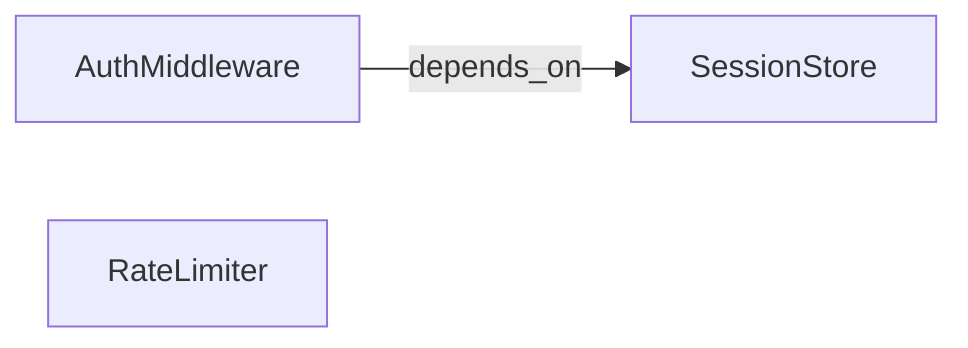

# Step 2 · Graphs in Plain Terms

## Hook

A new engineer joins a team. They ask the obvious onboarding question: "how does login actually work here?" Someone answers in one sentence: "the auth middleware depends on the session store."

That sentence is useful. It's also slippery. Depends on *how*? Reads from it, writes to it, or both? Would the middleware still work if the session store were swapped out — or break immediately? One sentence like that can mean three or four different relationships, and everyone in the room is free to imagine whichever one they already had in mind.

A graph exists to stop that sentence from being slippery.

## Explanation

### Nodes: one thing, tracked

Strip a graph down to its working parts and there isn't much to it. A **[node](../02-foundations/glossary.md#node)** stands for one thing worth tracking — a service, a person, something that happened. A node alone carries almost no information: write "AuthMiddleware" on a page and a reader learns only that something by that name exists. A node starts pulling its weight once it's tied to at least one other node.

### Edges: a specific, checkable claim

That tie is an **[edge](../02-foundations/glossary.md#edge)** — a connection between exactly two nodes. An edge is always two things at once:

1. **Directed.** It points one way, from a specific starting node to a specific ending node.
2. **Labeled.** It names, in a word or short phrase, exactly what kind of connection this is — not "related to," which could mean anything, but something specific enough that you could imagine checking whether it's true.

### A sentence vs. an edge

| | A loose sentence | A directed edge |
| --- | --- | --- |
| Example | "auth middleware and the session store are related" | `AuthMiddleware --depends_on--> SessionStore` |
| What it claims | Unclear — reads, writes, or both, in either direction | AuthMiddleware needs SessionStore; the dependency runs one way only |
| Can you falsify it? | No single claim to check | Yes — read the code and confirm or refute exactly this |
| What silence means | Ambiguous — two things mentioned near each other often gets misread as "connected" | Unambiguous — no edge means nobody has asserted a relationship yet |

Direction does real work here, not decoration. `AuthMiddleware --depends_on--> SessionStore` and its reverse are two different claims about two different systems, and a real codebase is rarely symmetric that way. Silence matters too: if a `RateLimiter` node sits near `AuthMiddleware` with no edge between them, that absence says nobody has asserted a relationship yet. Nothing connects by proximity alone.

### Edge cases worth naming

1. **A true two-way dependency.** Sometimes both directions really are true — a cache and the service that both reads it and invalidates it, say. That's two edges, not one, and each still needs its own check.
2. **A relationship that changes over time.** "Depends_on" today might not hold after a refactor. The edge doesn't expire on its own; something has to update it, or it goes stale silently.
3. **A label that's specific but still wrong.** `AuthMiddleware --calls--> SessionStore` is specific, and it might still be false if the real call goes through a cache layer instead. Specific isn't the same as correct — it just means the claim is checkable.
4. **No edge because no one has looked yet.** Missing evidence and a checked absence aren't the same thing. A graph can't tell you which one you're looking at unless someone records that the check happened.

## Diagram



Three nodes, one directed edge. `RateLimiter` is part of the same service, but no edge connects it to anything yet — nobody has asserted a relationship for it. That's a legitimate state, not a sign the graph is wrong. See `labs/step-2-label-the-arrow.py` for this structure built as a plain adjacency dictionary, with a check that the two directions of an edge are never treated as the same claim.

## Claude Code vs OpenCode

Both tools can turn a plain sentence like the hook's into a structured edge — the point is the schema they're both filling in, not the tool doing the filling.

### Claude Code

A minimal extraction skill, scoped to producing exactly one directed edge per invocation:

```markdown
---
name: sentence-to-edge
description: Turns one sentence describing a relationship into a directed, labeled edge.
---

Given one sentence describing a relationship between two things, output a
single JSON object with three fields: `from` (the node the edge starts at),
`label` (a specific verb phrase for the relationship, not a vague word like
"related"), and `to` (the node the edge points to). Do not output a second
edge unless the sentence clearly describes more than one relationship.
```

Feeding it "the auth middleware depends on the session store" should produce:

```json
{ "from": "AuthMiddleware", "label": "depends_on", "to": "SessionStore" }
```

### OpenCode

The same contract, expressed as a custom command:

```markdown
---
description: Extract one directed, labeled edge from a sentence
---

Read the sentence provided as input. Identify the two things it relates and
the direction the relationship runs. Respond with JSON: {"from": ..., "label":
..., "to": ...}. The label must be specific enough that someone could check
whether it's true — reject vague labels like "related_to" or "connected_to"
and pick a verb that names the actual relationship instead.
```

Both prompts refuse the same shortcut on purpose: a label like "related_to" would technically satisfy "output a label," but it throws away exactly the specificity that makes an edge worth having over a sentence.

## Going Deeper

This page never claimed a graph needs to be large or stored in a database to count. Three nodes and one edge, written by hand in a JSON file, is a complete, valid graph — small, not incomplete. Size is a separate question from correctness: a ten-thousand-node graph built from vague, unlabeled edges is worse than the three-node example above, because the three-node example is at least honest about what it does and doesn't claim.

## Check Yourself

<details>
<summary>A teammate adds `SessionStore --depends_on--> AuthMiddleware` to the graph above, alongside the existing `AuthMiddleware --depends_on--> SessionStore`. Does the graph now just say the two are mutually dependent, in a slightly redundant way? Reveal the answer.</summary>

No — those are two separate, independently falsifiable claims, not one claim stated twice. The graph now asserts both that AuthMiddleware needs SessionStore *and* that SessionStore needs AuthMiddleware, which is a much stronger and much less common situation than either claim alone. If only one direction is actually true, the reverse edge doesn't restate the fact. It plants a second, separately wrong claim that someone still has to track down and pull back out later.

</details>

## Try With AI

1. Pick one real dependency from a codebase you know — something you can verify by reading the code, not something you're guessing at.
2. Write it down first as a loose sentence, the way you'd say it out loud to a teammate.
3. Ask Claude Code or OpenCode to turn that sentence into a `{from, label, to}` edge, using a prompt shaped like the ones above.
4. Check the label it picked: would you know how to falsify it?
5. If the label is vague, tighten the prompt until it isn't, and notice how much more specific the resulting edge gets.

## When It Goes Wrong

| Symptom | Cause | Fix |
| --- | --- | --- |
| A graph "looks" connected when drawn, but a query for a specific relationship comes back empty. | Wrong direction, or a label too vague to match what the query was actually asking for. | Treat every label like a claim you'd defend under questioning. Sharpen anything you can't picture falsifying. |
| Two teammates read the same diagram and describe the system differently. | Edges are unlabeled, or labeled with something as vague as "related to." | Reject any label without a falsifying test. Replace it with a specific verb phrase. |
| A reverse edge gets added "to be thorough," and now the graph claims a mutual dependency that doesn't exist. | Direction got treated as optional, or the reverse edge added as a courtesy copy of the first. | Only add a reverse edge when you can independently verify it as its own true claim. |
| An edge was true when written, but nobody's checked it since a refactor changed the code. | Edges don't expire on their own, and nothing flags them for review. | Give edges a way to be marked stale, not just added — this becomes central in Part 3. |
| A missing edge gets read as "confirmed: no relationship," when really nobody has checked yet. | A graph can't distinguish an unchecked gap from a verified absence unless someone records which one it is. | Don't treat silence as an answer. Treat it as an open question until it's actually been checked. |

---

The **node** and **edge** entries in the [glossary](../02-foundations/glossary.md#node) cover the vocabulary this page introduced, which follows the concept scope of Panaversity's *Graph Engineering: A Crash Course* (full attribution: [resources/sources.md](../../resources/sources.md)).

---

Up next, this Part's last page draws the line between two different kinds of graph you can build out of nodes and edges like these.
