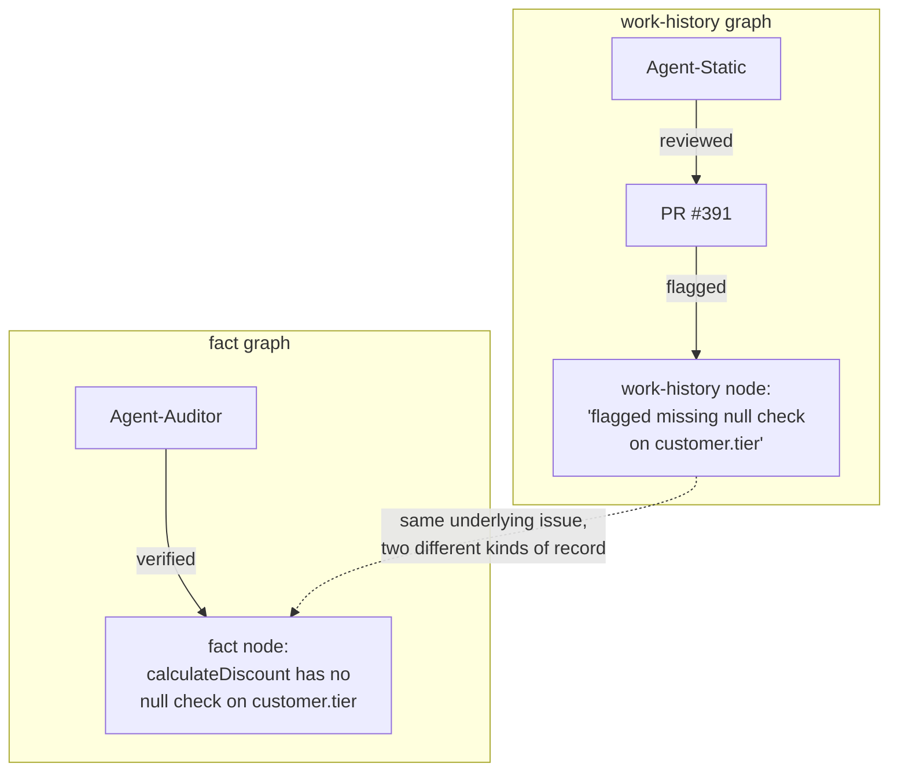

# Step 3 · Keep Your Two Graphs Separate

## Hook

PR #391 changes a pricing function, `calculateDiscount`. `Agent-Static`, a static-analysis reviewer, scans the diff and flags something: the function reads `customer.tier` without checking whether `customer` is null first. That gets logged: *Agent-Static reviewed PR #391 and flagged a missing null check.*

Later, `Agent-Auditor` is asked to independently confirm defects before they can block a merge. It reads the merged code, traces every call site, and confirms: yes, `calculateDiscount` really has no null check on `customer.tier`. Not a false positive. That gets logged too: *`calculateDiscount` has no null check on `customer.tier`.*

Two log entries, about what looks like the same fact. A team building one graph out of this review might store them as a single node. That single node is the mistake this Step exists to head off.

## Explanation

### Two different kinds of record

Those two entries aren't the same kind of record, even though they're about the same issue.

*Agent-Static reviewed PR #391 and flagged a missing null check* belongs to a **[work-history graph](../02-foundations/glossary.md#work-history-graph)**: a record of what was attempted, by whom, when, and with what outcome. Its job is to answer "what happened, and in what order."

*`calculateDiscount` has no null check on `customer.tier`* belongs to a different graph — the **[fact graph](../02-foundations/glossary.md#fact-graph)**: claims about the codebase that someone has actually verified, not just proposed. Its job is to answer "is this true, right now" — not "who said so" or "when."

### What merging them actually costs

| Cost of merging | What breaks |
| --- | --- |
| **Too noisy to trust** | An unconfirmed flag now reads exactly like a confirmed fact. A later agent asking "what are the real known issues" has no field left to filter on — confirmation got flattened into the same sentence as the claim. |
| **Too sparse to reconstruct** | "How did we first learn about this, and who confirmed it?" no longer has an answer. The order of events and who raised it first are exactly what a work-history graph exists to preserve — and exactly what a fact-focused merge tends to discard. |

Keeping the two graphs apart costs almost nothing extra to write — still one flag from Agent-Static, one confirmation from Agent-Auditor, just filed under two node types instead of squeezed into one. What it buys back is the ability to ask either question cleanly later.

### Edge cases worth naming

1. **A flag that's later disproven.** Agent-Static's flag stays in the work-history graph even if Agent-Auditor finds it's a false positive. The event still happened and still has record value — it just never earns a fact-graph node.
2. **A fact confirmed twice, by two different agents.** Both confirmations go into the work-history graph as separate events. The fact graph still holds one node for the underlying claim, now with two verifications attached.
3. **An agent that both flags and confirms in the same pass.** That's still two records, not one — an event (what it did) and, only if it actually checked the code, a claim (what's true). Collapsing them back into one node reproduces the exact mistake this Step is about.
4. **No agent ever confirms a flag.** It's a legitimate, permanent resident of the work-history graph. It never becomes a fact-graph node until something actually checks it — sitting unconfirmed forever is a valid, honest state, not a bug.

## Diagram



The dotted edge is the only thing tying the two graphs together — it says "these are about the same real issue," not "these are the same node." Everything else stays where it belongs: attempts and outcomes in the work-history graph, checked claims about the code in the fact graph.

## Claude Code vs OpenCode

Both snippets write to two separate append-only stores instead of one, which is the entire mechanism this Step is teaching.

### Claude Code

```markdown
---
name: review-graph-writer
description: Writes review findings to the correct graph -- work-history or facts, never both in one node.
---

1. If this entry is an agent's action or finding (who did what, when), append
   it to `work-history.jsonl` with fields: agent, event, pr, claim.
2. If this entry is an independently confirmed claim about the code itself,
   append it to `facts.jsonl` with fields: subject, claim, verified_by.
3. Never write the same entry to both files. If an entry has both an event
   and a confirmed claim, write two linked entries -- one per file -- not one
   merged entry.
```

### OpenCode

```markdown
---
description: Route a review entry to work-history.jsonl or facts.jsonl, never one merged file
---

Classify the incoming entry: is it a record of what an agent did (an event),
or a confirmed claim about the code (a fact)? Events go to
work-history.jsonl. Confirmed facts go to facts.jsonl. If an entry contains
both, split it into two entries and write one to each file, connected by a
shared PR or issue identifier -- do not collapse them into a single record
in either file.
```

## Going Deeper

Nothing about "verified by Agent-Auditor" makes a fact permanent. A fact graph holds the team's current best-checked understanding, not eternal truth. If `calculateDiscount` gets patched next sprint, the fact node needs to be marked superseded, not silently deleted, so a later reader can see both what used to be true and when that changed. Part 3 covers that lifecycle in full. For now, the point to hold onto is narrower: a confirmed claim and the event that produced it are always at least two nodes, never one.

## Check Yourself

<details>
<summary>A teammate proposes a shortcut: store only the fact graph, and skip the work-history graph entirely, since "the fact graph has the actually-true stuff anyway." What breaks? Reveal the answer.</summary>

You lose the ability to answer "how did we find out, and who checked it" for anything already in the fact graph — and, worse, you lose every unconfirmed flag entirely, since flags that never got independently verified have nowhere to live if the work-history graph doesn't exist. The next agent working a similar issue can't see what's already been raised and is still pending confirmation; it re-flags the same things from scratch, with no memory that someone already looked at them once.

</details>

## Try With AI

1. Set up a throwaway repo with two empty files: `work-history.jsonl` and `facts.jsonl`.
2. Ask Claude Code or OpenCode to act as a reviewer on some real function in a small project you have locally.
3. Have it note, in `work-history.jsonl`, that it reviewed the function and what it found.
4. Only after it re-reads the actual code to confirm the finding, have it write the confirmed claim to `facts.jsonl`.
5. Open both files afterward — does either contain a sentence that really belongs in the other?
6. If the agent wrote the same sentence to both, ask it why, and have it rewrite each entry so the two files answer different questions.

## When It Goes Wrong

| Symptom | Cause | Fix |
| --- | --- | --- |
| Querying "what's actually broken right now" returns unconfirmed false positives mixed in with real, verified issues, with no field to filter one from the other. | Work-history events and fact-graph claims got written to the same node, usually because the two entries looked redundant enough that merging them felt like an obvious cleanup. | Split the merged node back into its two parts — an event with an agent and a timestamp, a claim with a verifier — connected by an edge instead of collapsed into one. |
| "How did we find out about this?" has no answer, even though the fact is sitting right there in the graph. | The work-history graph was skipped or discarded to save space, keeping only the fact-graph phrasing. | Keep both graphs, always. The event that produced a fact is not the same information as the fact itself. |
| The same finding gets re-flagged from scratch by a different agent weeks later. | The unconfirmed flag lived nowhere a later agent could find it, because only the fact graph was kept. | An unconfirmed flag still belongs in the work-history graph — that's exactly what lets the next agent see it's already pending. |
| A confirmed fact still shows up as "just a static-analysis flag" in a downstream report. | The report queried the work-history graph for something only the fact graph can answer — whether the claim is actually true. | Query the right graph for the right question: work-history for what happened, facts for what's true. |

---

Look up **work-history graph** and **fact graph** in the [glossary](../02-foundations/glossary.md#work-history-graph) if either needs a refresher. This Part's attempts-vs-checked-claims split is part of the overall curriculum shape this course draws from Panaversity — the complete record of who contributed what is kept at [resources/sources.md](../../resources/sources.md).

---

That's Part 1. Head to [Part 2 — The DAG of Work](../04-part-2-the-dag-of-work/) next, or revisit the [overview](README.md) first.
