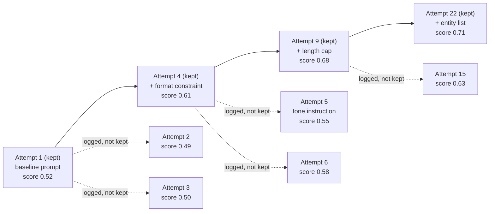

# Step 4 · The Ratchet — Recording Progress Without Losing the Trail

## Hook

A team points an overnight loop at a narrow job: find a better system prompt for a support-ticket summarizer. Each cycle, it drafts one candidate, runs it against forty held-out tickets, and scores the output against reference summaries.

By morning, the loop has tried thirty-one candidates. The engineer opens the log expecting a research trail. Instead: one line. `current prompt: variant-31, score: 0.71`.

Every other candidate is gone — including the twenty-two that scored worse than what was already in place, and the one that crashed the scorer entirely. That evening, a second loop starts from the same baseline. It wanders back into the exact same "add a tone instruction" idea variant-9 already tried and lost with, and burns forty minutes rediscovering something the first loop already knew didn't work.

## Explanation

### Two ways to keep a log, both wrong

The overnight loop's mistake wasn't scoring badly — thirty-one attempts to climb to 0.71 is a reasonable night's work. The mistake was in what it kept.

Overwriting `current prompt` every cycle is [Step 1's single-file trap](../02-foundations/glossary.md#thin-memory-trick) wearing a new outfit. One file, rewritten in place. The moment a better candidate lands, every trace of what came before is gone — including the losers, which is exactly the information the second loop needed.

The opposite mistake is just as real: log all thirty-one attempts, unfiltered. Now nobody can read the record either. A reader wants two things fast — what's the current best, and what's already ruled out. A flat log answers neither quickly.

### The ratchet

A **[ratchet](../02-foundations/glossary.md#ratchet)** splits the difference. Each new attempt gets compared against the current best kept attempt.

1. **Beats it?** The attempt becomes the new best. It's appended to **[durable history](../02-foundations/glossary.md#durable-history)** — a chain that only ever grows toward improvement.
2. **Doesn't beat it?** The attempt isn't deleted. It's logged as a side entry attached to whatever it lost to, but the comparison point for the *next* candidate stays exactly where it was.

The name comes from the tool: a ratchet wrench turns one way and refuses to slip backward. However many times you crank it, the socket never quietly loses ground.

### The payoff

For thirty-one attempts, maybe four or five actually improved on the one before it — that's the whole chain a later reader needs to skim. Nothing about a losing attempt vanished, either; it's still in the graph, attached to the node it lost to, with its own score and reasoning. A second loop starting cold doesn't need to read all thirty-one entries to avoid variant-9's mistake — it checks the log attached to whichever kept attempt variant-9 lost to, and sees in an instant that the idea already scored worse.

### Edge cases worth naming

1. **A tie, not a loss.** An attempt scoring exactly equal to the current best isn't an improvement. Treat ties as non-improving — log them as a side entry, same as a loss.
2. **No current best yet.** The very first attempt has nothing to beat. Treat "no baseline" as an automatic pass — it becomes durable history's first entry.
3. **A discarded attempt that matters later.** A dead end from one search might be exactly the idea a different task needs. Queryable discards, covered next in Step 5, are what make that possible.
4. **The scoring function changes mid-search.** If the yardstick moves while the ratchet runs, "strictly greater" stops meaning anything — a ratchet assumes the same scorer is used from the first attempt to the last.

## Diagram



The solid chain across the top is durable history: four attempts, each strictly better than the last — all a reader needs to trace how the loop reached 0.71. The dotted branches are logged-but-not-kept attempts, filed against whichever kept attempt they lost to. Attempt 5's "tone instruction" idea sits right there, attached to Attempt 4, waiting for the second loop from the Hook to find it before wasting forty minutes.

## Claude Code vs OpenCode

Both snippets implement the same rule: read the current best, compare, then either extend the chain or log a side entry — never overwrite the chain with a non-improving attempt.

### Claude Code

```markdown
---
name: prompt-search-ratchet
description: Scores a candidate prompt and ratchets durable history forward only on strict improvement.
---

1. Read the current best entry from `durable-history.jsonl` (the last line;
   empty file means no baseline yet).
2. Score the candidate prompt against the held-out ticket set.
3. If the candidate's score is strictly greater than the current best's
   score (or there is no current best yet), append the candidate as a new
   line in `durable-history.jsonl`.
4. Otherwise, append the candidate to `discarded.jsonl`, including which
   entry in `durable-history.jsonl` it was compared against and why it
   lost -- never touch `durable-history.jsonl` in this branch.
```

### OpenCode

```markdown
---
description: Ratchet a candidate prompt into durable-history.jsonl only if it strictly beats the current best
---

Read the last line of durable-history.jsonl as the current best (or treat
an empty file as no baseline). Score the candidate against the held-out
ticket set. Strictly greater than the current best: append it to
durable-history.jsonl. Anything else -- tie or worse -- gets appended to
discarded.jsonl instead, tagged with the id of the entry it lost to.
durable-history.jsonl only ever grows toward better scores; it is never
rewritten in place.
```

## Going Deeper

A ratchet needs one more rule to be trustworthy: what counts as "strictly greater." A scoring function that's the least bit noisy — 0.61 one run, 0.615 the next, same prompt — will eventually let a lucky roll "improve" the chain for no real reason, quietly breaking the promise that durable history only records genuine progress. The fix isn't a bigger tolerance band bolted onto the comparison; it's a scoring function stable enough that "strictly greater" is a claim worth making in the first place. That's a property of the eval, not of the ratchet — the ratchet just enforces whatever the eval tells it, faithfully.

## Check Yourself

<details>
<summary>A teammate suggests simplifying the ratchet: instead of logging non-improving attempts to a side file, just delete them once you know they lost. Durable history would look exactly the same either way. What's lost by deleting instead of logging? Reveal the answer.</summary>

Durable history does look identical either way — that's exactly the trap. What's lost is everything the Hook depended on: the ability for a later loop, or a later engineer, to check whether some specific idea was already tried and already scored worse. Deleting a losing attempt doesn't just shrink the log; it erases the one piece of information a fresh run most needs before it repeats the same dead end.

</details>

## Try With AI

1. Open a throwaway repo. Create empty `durable-history.jsonl` and `discarded.jsonl` files.
2. Pick a small, scorable task you can judge quickly by eye — three-sentence summaries of a short paragraph, rated 1-5, works fine.
3. Ask Claude Code or OpenCode to generate five candidate outputs, one at a time.
4. Score each yourself, tell the agent the score, and have it apply the ratchet rule.
5. When all five are scored, open both files. Is `durable-history.jsonl` shorter than five lines? Does `discarded.jsonl` have every non-improving attempt, none missing?

## When It Goes Wrong

| Symptom | Cause | Fix |
| --- | --- | --- |
| One evening's loop re-tries an idea a previous run already scored worse on. | The previous run's non-improving attempts were overwritten or deleted, so nothing told the new run "this was tried." | Keep two permanent records — durable history for improvements, a discard log for everything measured but not kept. |
| Durable history is one line long, and nobody's sure if that's because little else was tried or because everything else was deleted. | The discard log doesn't exist, so "short" and "incomplete" look identical. | Never treat a short durable-history chain as proof that few attempts happened — check the discard log too. |
| A candidate that scored the same as the current best gets promoted anyway. | "Greater than or equal" got used instead of "strictly greater than." | Ties don't count as improvement. Log them as a side entry, same as a loss. |
| The ratchet promotes a worse prompt because the scoring changed between runs. | The eval itself drifted mid-search, so "strictly greater" compared two different yardsticks. | Fix the scoring function before trusting comparisons across it — a ratchet is only as honest as the eval underneath it. |

---

The **ratchet** and **durable history** entries are in the [glossary](../02-foundations/glossary.md#ratchet). This Step's discipline — log everything, promote only real improvement — comes from Andrej Karpathy's `autoresearch` project; the [attribution table](../../resources/sources.md) has the specifics.

---

The chain gets shorter to read, but the attempts that fell off it are still sitting somewhere in the graph. The final page of this Part asks what a later worker is actually allowed to do with them.
