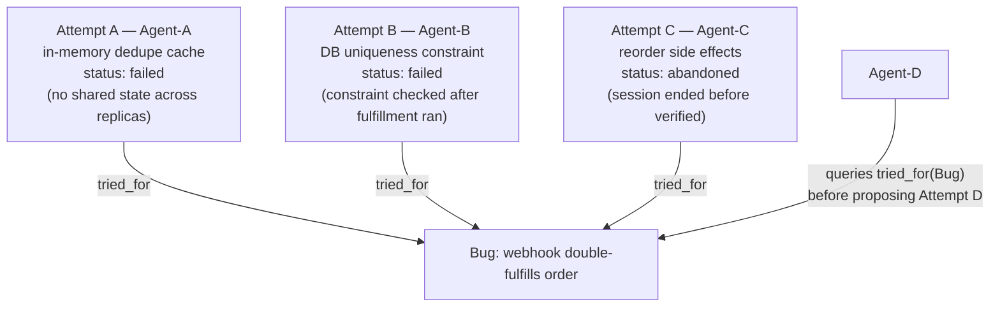

# Step 5 · Letting Failed Branches Stay Queryable

## Hook

A webhook handler is occasionally fulfilling the same order twice. Stripe fires a `payment_confirmed` event, the handler processes it, and a retried delivery of that same event slips through — fulfilling the order again.

Three agents take a run at it over one day, handing off session to session. `Agent-A` adds an in-memory cache keyed by event ID. It fails: the handler runs across several load-balanced replicas, and one replica's cache means nothing to the others. `Agent-B` adds a database uniqueness constraint on the event ID. It fails too, for a different reason — the constraint check happens after the fulfillment side effects already ran, so the duplicate gets rejected while the order still ships twice. `Agent-C` starts reordering the side effects to run after the constraint check, but the session ends before the fix is tested. Neither confirmed nor ruled out — just abandoned mid-attempt.

When `Agent-D` picks up the ticket that evening, one question matters: what's already been tried, and why didn't it work? If the answer lives nowhere, `Agent-D` starts from zero on a bug three sessions have already partly mapped out.

## Explanation

### Kept, not just logged

It's tempting to think a failed attempt is something the graph should clean up once it's done being useful. The fix didn't work, the branch is dead — why keep it around? That instinct treats "failed" as a reason to remove a node. It's actually a reason to make sure that node stays easy to find.

A **[queryable failed branch](../02-foundations/glossary.md#queryable-failed-branch)** is exactly that: an attempt that didn't resolve the bug, kept as a node with its outcome and its reasoning attached, so a later worker can ask "what's already been tried" and get a real answer.

### Queryable is the word that matters

A failed attempt scribbled into a commit message or buried in a chat transcript technically still "exists" somewhere. None of that makes it findable by a worker who doesn't already know to go looking. A queryable failed branch is a node connected to the bug it targeted, through an edge that says so — `tried_for`, in this Step's scenario. Ask the graph "what's connected to this bug by `tried_for`" and every attempt comes back, successful or not, with nobody needing to remember where each one was written down.

This is the discard log from Step 4, earning its keep beyond prompt search. The same shape — an attempt, an outcome, a reason it didn't advance — applies just as well to `Agent-A`'s cache and `Agent-B`'s constraint as to a losing prompt variant. Neither Step is really about prompts or bugs specifically. Both are the same move: don't let "this one didn't work" default to "this one disappears."

### A third status, not two

`Agent-C`'s attempt isn't the same shape as `Agent-A`'s or `Agent-B`'s. It wasn't disproven — it was interrupted. A graph with room for only "succeeded" or "failed" forces `Agent-C`'s node into one of those boxes, and either choice loses information. Marking it "failed" claims something was tested that wasn't. Dropping it loses the reordering idea entirely. The honest answer is a third status — abandoned, unresolved, whatever the schema calls it — so `Agent-D` can tell "already tried and disproven" apart from "in progress and worth finishing" before deciding where to spend the next hour.

### Edge cases worth naming

1. **Two attempts that look identical but aren't.** `Agent-A`'s cache and a hypothetical distributed cache with the same class name aren't the same attempt — the edge needs real detail attached, not just a label, so a reader can tell them apart.
2. **A bug that later splits into two separate bugs.** Splitting the bug node shouldn't silently disconnect the `tried_for` edges — each attempt still targeted something real, and needs to end up attached to whichever bug it actually addressed.
3. **An attempt that partly worked.** A fix that solves the bug for one code path but not another isn't cleanly "succeeded" or "failed" either — it needs its own honest status, same as `Agent-C`'s interruption.
4. **A long-lived bug with dozens of attempts.** Queryable doesn't mean unsorted forever — Going Deeper below covers how a long list stays readable without dropping anything from it.

## Diagram



`Agent-D` doesn't need to know any of this history in advance. It queries the `tried_for` edges on the bug node and gets all three attempts back, statuses included, in one step. Nothing about that query filters out the failed or abandoned ones — if it did, `Agent-D` would be right back to starting cold.

## Claude Code vs OpenCode

Both snippets query every `tried_for` edge on a bug before letting an agent propose a new fix — filtering that query down to only successful attempts would defeat the entire point.

### Claude Code

```markdown
---
name: bug-fix-history-check
description: Queries every prior fix attempt for a bug, failed and abandoned included, before proposing a new one.
---

1. Given a bug node ID, find every edge labeled `tried_for` pointing at it,
   regardless of the status on the attempt node at the other end.
2. Summarize each attempt found: who tried it, what the approach was, its
   status, and (if failed or abandoned) the reason recorded on that node.
3. Only after reviewing that full list, propose a new fix approach --
   and if the new approach resembles a failed attempt closely, say so
   explicitly instead of proposing it anyway.
```

### OpenCode

```markdown
---
description: Fetch all tried_for attempts on a bug node, statuses included, before drafting a new fix
---

Find every attempt node connected to the given bug ID by a tried_for edge.
Do not filter by status -- failed and abandoned attempts must appear in the
result alongside any successful one. List each attempt's approach, status,
and recorded reason. Only draft a new fix proposal after that full list has
been reviewed, and flag it if the new proposal overlaps with something
already marked failed.
```

## Going Deeper

Keeping failed branches queryable doesn't mean keeping them equally visible forever. A bug open for months can accumulate a long list of failed attempts, and a worker querying `tried_for` still needs to read that list quickly — the same problem Step 4 solved for prompt search. The fix is the same shape: sort by recency, group by underlying cause, summarize before a worker reads full detail. What has to stay true, however the result gets shaped for readability, is that a failed or abandoned attempt is always in the underlying result set — never silently dropped from it.

## Check Yourself

<details>
<summary>Someone proposes closing the loop faster: once a fix attempt fails, delete its node immediately instead of leaving it there for a query to find later. Storage stays smaller, and nothing about the bug's current status changes. What actually breaks? Reveal the answer.</summary>

The bug's current status doesn't change, which is exactly why this feels safe — but the next agent's starting point changes completely. Without Attempt A and Attempt B's nodes, Agent-D has no way to learn that an in-memory cache and a misplaced constraint check were already tried and already failed, for specific, recorded reasons. It's free to re-propose either one from scratch, and nothing in the graph will stop it or even warn it, because the evidence that would have stopped it was deleted the moment it stopped being a "current" fix.

</details>

## Try With AI

1. Create a throwaway repo with one file, `bug-attempts.jsonl`, seeded with two JSON lines representing failed fix attempts for a bug you invent — each with an approach and a reason it failed.
2. Have Claude Code or OpenCode step into the role of a new agent picking up that bug.
3. First, get it to read `bug-attempts.jsonl` in full and summarize what's already been tried.
4. Then have it propose a third approach.
5. Check the proposal against the two failed attempts: does it avoid re-proposing either one, or does it wander back into the same idea because it wasn't forced to read the file first?

## When It Goes Wrong

| Symptom | Cause | Fix |
| --- | --- | --- |
| Someone proposes a fix already tried and failed, and nobody notices until it fails again the same way. | The failed attempt's node was deleted, or never made queryable in the first place. | Attach every fix attempt to the bug it targets with a real, queryable edge — keep it regardless of outcome. |
| An abandoned attempt gets treated as a failure, and someone rules out an idea that was never actually tested. | The graph's schema only had room for "succeeded" or "failed," so "interrupted" got forced into one of them. | Give interrupted work its own status. Abandoned isn't the same claim as disproven. |
| A long-running bug's attempt history gets summarized so aggressively that a real failed attempt drops out of view. | Readability shaping — sorting, grouping — started silently excluding entries instead of just reordering them. | Summarize for readability, but keep every attempt in the underlying queryable set. Summarizing is a view, not a deletion. |
| Two agents each add nearly identical failed attempts for the same bug, and neither notices the other already tried it. | The `tried_for` query wasn't checked before proposing, even though the edge existed and was queryable. | Queryable isn't the same as queried. The discipline is checking the edge before proposing, not just maintaining it. |

---

Look up **queryable failed branch** in the [glossary](../02-foundations/glossary.md#queryable-failed-branch) any time this Step's wording gets fuzzy. Its core idea — a dead end kept as evidence, not erased — traces to Andrej Karpathy's `AgentHub` sketch, cataloged in the [attribution table](../../resources/sources.md).

---

Back to [Part 2 overview](README.md) · On to [Part 3 — The Graph of Facts](../05-part-3-the-graph-of-facts/)
