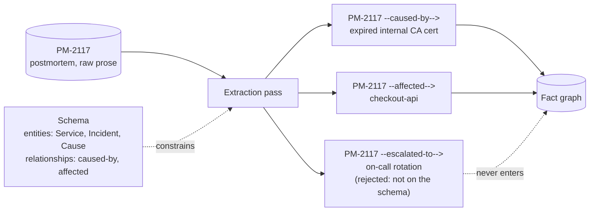

# Step 6 · Extraction — Schema First, Prose Second

## Hook

An on-call engineer files the postmortem for `PM-2117`. Overnight, `checkout-api` started rejecting every request with a 500. The root cause: a certificate authority's root cert expired, breaking mutual TLS between `checkout-api` and its database sidecar. The outage cascaded into `notifications-worker`, which depends on `checkout-api`'s queue.

Someone points an agent at the postmortem and asks it to "pull out the facts." First run: *"Incident: checkout had an outage last night, the cert expired, and notifications got hit too."* Same document, five minutes later, no code changed: *"PM-2117 — checkout-api down, root cause was an expiring internal CA cert, downstream impact on notifications-worker."*

A teammate wires a small dashboard on top of whichever run happens to land, expecting a `caused_by` field to chart. Depending on which run it reads, that field is either missing or spelled three different ways. Neither run was wrong, exactly. Neither was answering a question with a fixed shape, because nobody had defined one.

## Explanation

### Prose has no fixed shape

Ask a capable model to "pull out the facts" from a document and it will — competently, fluently, and differently every time. Prose has no fixed shape for an extraction to fall back on. Two runs over the same postmortem can both be reasonable summaries and still be structurally incompatible, because "reasonable summary" was never the target.

The fix isn't a better prompt for summarizing. It's deciding, before any extraction runs at all, exactly what an acceptable answer is allowed to look like.

### Schema: the shape, fixed in advance

A **[schema](../02-foundations/glossary.md#schema)** is that decision made explicit — a fixed list of entity types and a fixed list of relationship types the graph is willing to hold. For `PM-2117`, a small schema works:

- Entity types: `Service`, `Incident`, `Cause`.
- Relationship types: `caused-by` (an `Incident` traces to a `Cause`), `affected` (an `Incident` reaches a `Service`).

Nothing outside that list gets in. The postmortem also mentions an on-call rotation, a Slack channel, a rollback that didn't help — the schema doesn't touch any of it, because a promise to hold only certain things is worthless the moment it quietly expands to fit whatever showed up.

### Extraction: filling the shape, or rejecting what doesn't fit

**[Extraction](../02-foundations/glossary.md#extraction)** turns the postmortem's prose into items shaped like the schema — and just as importantly, it's the pass with somewhere to send items that don't fit.

- `PM-2117 --caused-by--> "expired internal CA cert"` matches: an `Incident` node, a `Cause` node, a `caused-by` edge, all on the allowed list.
- `PM-2117 --escalated-to--> "on-call rotation"` matches nothing the schema defined — no `escalated-to` relationship, no `Team` entity — and gets rejected outright.

A schema that accepts everything offered to it isn't a schema. It's a suggestion, and the dashboard from the Hook breaks exactly when a field it depends on turns out to have been a suggestion the whole time.

### Edge cases worth naming

1. **A borderline item that almost fits.** `PM-2117 --degraded--> notifications-worker` might seem close enough to `affected` — but "close enough" isn't on the schema. Add `degraded` deliberately, ahead of time, or reject it; don't let extraction decide case by case.
2. **An item that's schema-valid but still wrong.** A well-formed item can still misstate the relationship (calling something `caused-by` when it was really `correlated-with`). Schema conformance checks shape, not truth — that's a separate check.
3. **A document that genuinely needs a new type.** Sometimes the schema really is missing something. The fix is a deliberate, reviewed schema change — not a one-off exception smuggled in by a single extraction run.
4. **Two schemas, two teams, one domain.** If `Service` means something subtly different in each, merging their fact graphs later inherits that mismatch — worth naming now, before it becomes Step 7's problem.

## Diagram



Two items pass through because their entity types and relationship type are on the allowed list. The third is built from the same document and reads just as plausibly as the other two, but `escalated-to` and a `Team` entity were never defined in the schema — so it's discarded at the gate, not admitted and reshaped to fit.

## Claude Code vs OpenCode

Both snippets do the same job: hand the model a fixed schema up front, then check every item the model returns against that schema before anything reaches the graph — nothing gets a pass for merely sounding right.

### Claude Code

```markdown
---
name: postmortem-fact-extractor
description: Extracts Service/Incident/Cause facts from a postmortem doc against a fixed schema, rejecting anything outside it.
---

1. Read the schema first: entity types are exactly `Service`, `Incident`,
   `Cause`; relationship types are exactly `caused-by` (Incident to Cause)
   and `affected` (Incident to Service). Do not add a type because the
   document seems to call for one.
2. Read the postmortem and produce a list of `{subject_type, subject,
   relation, object_type, object}` items describing what it states.
3. Check every item against the schema from step 1. Keep only items whose
   subject_type, relation, and object_type all appear on the allowed
   lists. Report every dropped item and which part of it failed the check.
```

### OpenCode

```markdown
---
description: Extract Service/Incident/Cause facts from a postmortem against a fixed schema; drop anything the schema doesn't define
---

Entity types allowed: Service, Incident, Cause. Relationship types
allowed: caused-by (Incident -> Cause), affected (Incident -> Service).
Read the postmortem and list candidate {subject_type, subject, relation,
object_type, object} items. Before returning anything, filter the list:
drop any item whose subject_type, relation, or object_type is not one of
the four allowed values above, and say what was dropped and why. Never
invent a fifth entity type or a third relationship type to fit something
the document mentions.
```

## Going Deeper

Schema-first extraction is also a shortcut around building a dedicated pipeline. Instead of writing bespoke parsing code for every document shape a team might produce, a capable model given a fixed schema and asked for structured output does the same job — the schema does the work a hand-built parser used to do. That's the idea this Step borrows, credited in the [attribution table](../../resources/sources.md). It's still worth sizing the schema to the job: three entities and two relationships, like `PM-2117`'s, is easy to enforce and review. A fifty-type schema drifts toward unreviewable by anyone, which defeats the reason to have one.

## Check Yourself

<details>
<summary>A teammate suggests loosening the rule: instead of rejecting an item that names a type the schema doesn't have, just add that type to the schema on the spot so nothing gets lost. What does this quietly give up? Reveal the answer.</summary>

It gives up the one thing a schema was for: a fixed, reviewed definition of what counts as an acceptable answer. If every extraction run is allowed to expand the schema to fit whatever it found, the schema stops being a contract decided in advance and becomes a running tally of whatever any document has ever mentioned — which is exactly the shapeless, inconsistent output from the Hook, just accumulated one convenient exception at a time instead of all at once.

</details>

## Try With AI

1. Write three or four sentences describing a small, made-up incident of your own — pick any service name and any single cause.
2. Define a tiny schema for it: two or three entity types, one or two relationship types, written down before you touch the model.
3. Ask Claude Code or OpenCode to extract facts from your sentences against that schema.
4. Add one more sentence mentioning something outside the schema's types — a person's name, a ticket number, anything you didn't define an entity type for.
5. Check the output: did the extraction leave that extra detail out, or did it invent a new type to fit it in? If it invented one, tighten your prompt until it stops.

## When It Goes Wrong

| Symptom | Cause | Fix |
| --- | --- | --- |
| Two extraction runs over the same document produce facts that don't line up — different field names, different granularity, one run mentioning something the other silently dropped. | No schema was decided in advance, so each run improvised its own shape for what counts as a fact. | Write the schema down before running extraction at all, and enforce it as a hard filter on the output. |
| An item matches every type on the schema, but the relationship it asserts is still wrong. | Schema conformance checks shape, not truth — a well-formed item can still misstate what actually happened. | Add a separate verification step for truth. Passing the schema only proves an item is well-formed, not correct. |
| The schema keeps growing every time a document mentions something new. | Individual extraction runs were allowed to add types on the fly instead of flagging them for review. | Treat schema changes as a deliberate, reviewed decision — never a side effect of a single run. |
| Two teams' fact graphs use the same entity name for subtly different things. | Each team's schema was written independently, with no shared definition of what the entity actually means. | Agree on shared entity definitions before merging graphs across teams. |

---

The compact versions of **schema** and **extraction** live in the [glossary](../02-foundations/glossary.md#schema).

---

Schema settles what an item is allowed to look like. The next page covers what to do once two differently-shaped mentions turn out to name the same thing.
