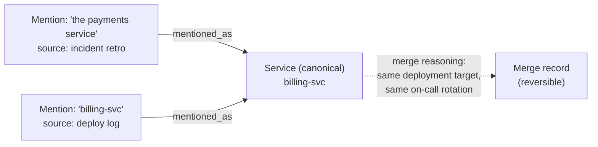

# Step 7 · Resolution — Merge Without Losing the Evidence

## Hook

Two documents feed the same fact graph in the same week. The first is a human-written incident retro. In its prose, it refers to *"the payments service"* — never anything more specific, because everyone in the room already knew which service that meant. The second is an automated deploy log. It only ever names things by exact deployment identifier: `billing-svc`.

An extraction pass, run separately over each document, does exactly what Step 6 asked of it. It produces two `Service` nodes — one named `the payments service`, one named `billing-svc` — both schema-valid, both correctly extracted from what their source actually said.

A week later, someone queries the graph for "every incident that touched `billing-svc`" and gets one result. The honest answer is two. The retro's incident sits on a node the query never thought to look at, under a name the query never typed.

## Explanation

### A gap Step 6 was never meant to catch

Nothing in Step 6 catches this, and nothing should have to. The retro really did say "the payments service." The deploy log really did say `billing-svc`. An extraction pass that stuck faithfully to its source produced two accurate nodes for two different surface forms.

The gap between them has its own name: **[resolution](../02-foundations/glossary.md#resolution)** — recognizing that two mentions from two different sources actually name one underlying thing, and collapsing them to a single node a query finds no matter which name it asked about.

### The fast version destroys evidence

The tempting version of resolution is the fast one: pick a canonical name, rewrite both mentions to point at it, delete whichever node was decided to be the duplicate. That's also the version that quietly destroys evidence.

Once `the payments service` node is gone, so is the fact that the incident retro is where that name came from. If the merge turns out wrong later — a second, genuinely different `billing-svc-eu` shows up, say, and the original merge conflated two real services — there's no way back. The thing being undone no longer exists anywhere to check against.

### Reversible merge: keep both, plus the reason

A **[reversible merge](../02-foundations/glossary.md#reversible-merge)** leaves both original mentions reachable from the resulting canonical node, instead of erasing either one. `the payments service` and `billing-svc` both stay reachable — each a mention pointing at the same canonical `Service` node — alongside a short record of why they were judged the same thing (same deployment, same on-call rotation, same incident channel, whatever the actual reasoning was).

Querying for `billing-svc` now correctly surfaces the retro's incident, because the merge didn't discard the connection between the two names — it recorded it. If that merge is ever found wrong, undoing it means reading the attached reasoning and splitting the node back apart, not reconstructing evidence that was thrown away the moment the merge happened.

### Edge cases worth naming

1. **Three or more mentions of the same thing.** A reversible merge isn't limited to pairs — a third source using yet another name attaches to the same canonical node, with its own reason, same as the first two.
2. **A merge that's later proven wrong.** When `billing-svc-eu` turns out to be real and separate, splitting the node back apart only works because the original mentions and reasoning never left. That's the whole payoff of doing it this way.
3. **Two names that really are the same, but the stated reason is weak.** "Sounds similar" isn't a reason. If nobody can name a concrete shared fact, the honest move is to leave the mentions unmerged rather than merge on a guess.
4. **A mention with no clear match either way.** Not every mention resolves. A `Service` node that stays alone, unmerged, because nothing else in the graph names the same thing, is a legitimate and common outcome — not a sign resolution failed.

## Diagram



Both mentions still exist as their own nodes, each pointing at the merged `Service` node through a `mentioned_as` edge that names its own source. Nothing about folding them together required deleting either one — the merge record hanging off to the side is what makes the decision itself inspectable, and reversible, instead of a name swap nobody can trace back.

## Claude Code vs OpenCode

Both snippets keep both original mentions on record and attach the merge reasoning, rather than picking a winner and quietly discarding the other name.

### Claude Code

```markdown
---
name: service-mention-resolver
description: Merges two Service mentions into one canonical node only if it can name why they're the same thing, keeping both mentions attached.
---

1. Given two candidate mentions of a Service (e.g. "the payments service"
   and "billing-svc") plus the source each one came from, decide whether
   they name the same underlying service. Require a specific reason --
   shared deployment target, shared on-call rotation, explicit
   cross-reference in either document -- not just surface similarity.
2. If they're the same: create (or reuse) one canonical Service node, add
   a `mentioned_as` edge from each original mention to it, and attach the
   reason from step 1 as a merge record on the canonical node. Do not
   delete either mention node.
3. If they're not the same, or the evidence is too thin to be sure, leave
   both nodes unmerged and say so explicitly rather than guessing.
```

### OpenCode

```markdown
---
description: Resolve two Service mentions into one canonical node with a reversible, evidence-backed merge
---

Compare the two given Service mentions and their sources. Merge them only
with a concrete stated reason (shared deployment target, shared
on-call rotation, an explicit cross-reference) -- never on name
similarity alone. On merge: keep both original mention nodes, add a
mentioned_as edge from each to one canonical node, and record the reason
for the merge on that canonical node so it can be checked or reversed
later. If the evidence is too thin, leave both nodes separate and report
that the merge was skipped and why.
```

## Going Deeper

A merge that can't be reversed doesn't just risk being wrong once — it compounds. Every later fact attached to the wrong side of an incorrect merge inherits the mistake, and untangling means figuring out which of the graph's more recent additions belong to which of the two things that never should have been folded together. Requiring a stated reason for every merge is what makes that untangling possible at all — the reason is exactly what a reviewer needs to decide whether a merge should be split back apart.

## Check Yourself

<details>
<summary>Someone proposes a faster resolution rule: if two mention strings are similar enough (edit distance, fuzzy match, whatever), merge them automatically and don't bother keeping a record of why -- the merged node is obviously correct if the strings looked that close. What's the risk in dropping the "why"? Reveal the answer.</summary>

Similarity in spelling isn't evidence of sameness, and dropping the reason removes the only way to check the merge later. Two genuinely different services with similar names ("billing-svc" and "billing-svc-eu") would sail through a pure string-similarity rule, and without a recorded reason attached to the merge, nobody reviewing the graph afterward has anything to evaluate — there's no stated claim to agree or disagree with, just a merged node that looks confident and might be wrong.

</details>

## Try With AI

1. Pick two real things from a project you know that get referred to by at least two different names in practice — a service and its repo name, a feature and its internal codename, a person and their username.
2. Ask Claude Code or OpenCode to decide whether the two names refer to the same underlying thing, and require it to state a specific reason before treating them as a match — not just "these sound similar."
3. If it agrees they're the same, have it write out what a reversible merge record would contain: both original mentions, their sources, and the reason.
4. Check that record yourself. Is the stated reason actually convincing, or did the agent merge on vibes and backfill a reason afterward?

## When It Goes Wrong

| Symptom | Cause | Fix |
| --- | --- | --- |
| Looking a thing up by one of its known names comes back empty or incomplete, even though facts about it definitely exist in the graph under a different name. | Resolution merged the two mentions by picking one name and discarding the other, so the discarded name no longer points anywhere. | Never let a merge delete a mention. Keep every original mention attached to the canonical node, with the reason it was judged the same. |
| A merge gets undone, but nobody can reconstruct what the graph looked like before it happened. | The merge deleted one of the two original mentions instead of keeping both attached. | Treat every mention as permanent once recorded — a merge should only add a canonical node and connect to it, never remove what it connects. |
| Two clearly different things get merged because their names look alike. | The merge rule used string similarity instead of a stated, checkable reason. | Require a concrete shared fact before merging — never merge on spelling alone. |
| A reviewer wants to check an old merge and finds no explanation for why it happened. | The merge recorded which nodes were combined, but not the reasoning behind the decision. | Attach the reason to the merge itself, not just the outcome — that's what makes it reviewable later. |

---

For the formal wording, **resolution** and **reversible merge** each get their own entry in the [glossary](../02-foundations/glossary.md#resolution).

---

Merging fixed who a node refers to. The next page covers what a node needs to carry so a wrong claim can be found and fixed later instead of silently rewritten.
