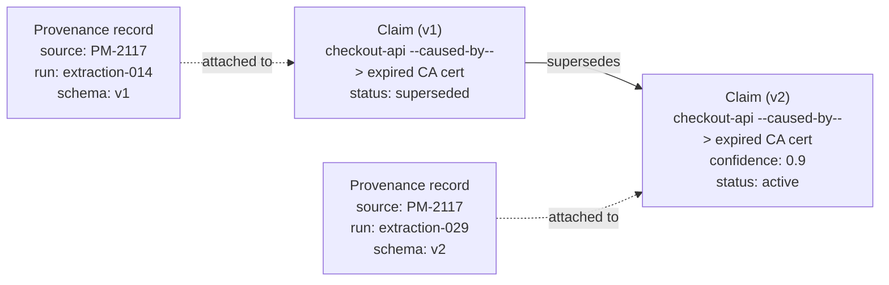

# Step 8 · Provenance — Every Claim Carries a Receipt

## Hook

`PM-2117`'s cause gets extracted under the small, fixed schema from Step 6 — nothing beyond the handful of entities and relationships it defined. The resulting claim, `checkout-api caused-by expired internal CA cert`, is accurate and ships into the fact graph.

Months later, two more postmortems disagree about whether a cert-expiry incident was actually preventable. Someone realizes the graph has no way to settle it: nothing on any `caused-by` claim says how confident the extraction was, so there's no way to weigh one claim against another.

The schema gets a second version, `v2`, adding a required `confidence` field to every `caused-by` claim. Someone re-runs extraction on `PM-2117` under the new schema and gets a `confidence` score this time. The easy move is to open the old claim and add the missing field to it. The move that doesn't quietly erase history is different.

## Explanation

### Editing in place erases history

Editing the old claim in place feels harmless — it's "the same fact," just more complete now. But the moment that edit lands, the graph loses something real: there's no longer any record that a `caused-by` claim without a `confidence` field ever existed. That means there's no way to tell, for any other `v1`-era claim still in the graph, whether it's missing `confidence` because nobody re-extracted it yet, or because it was silently backfilled with a guess.

The claim's own history — what schema was live when it was made, what changed since — disappears the instant the record itself is rewritten.

### Provenance: a receipt on every claim

**[Provenance](../02-foundations/glossary.md#provenance)** is what prevents that disappearance. Every claim in the fact graph carries a provenance record: which source document it came from, which extraction run produced it, which version of the schema was active when that run happened.

`PM-2117`'s original claim carries a provenance record naming schema `v1`. Nothing about that record is optional — it's the only thing that later lets anyone ask "was this claim made under the old rules or the new ones" and get a real answer instead of a guess.

### Supersession: a new claim, not a rewritten one

When the `v2` re-extraction produces a more complete version of the same claim, it doesn't overwrite the `v1` provenance record. It creates a new claim, with its own provenance record naming schema `v2`, and connects the two with a `supersedes` edge.

This is **[supersession](../02-foundations/glossary.md#supersession)**: the old claim's status changes to `superseded`, but the claim itself stays exactly where it was, provenance record intact, still readable by anything that queries the graph as of the moment `v1` was current. Nothing was deleted. Nothing was rewritten in place. A reader who needs to know "what did we believe about this cause, and under which schema" can walk the `supersedes` edge backward and get the honest sequence.

### Edge cases worth naming

1. **A claim superseded twice.** `v1` → `v2` → `v3` chains just as cleanly — each version keeps its own provenance, each links forward with its own `supersedes` edge. Nothing caps the chain at one hop.
2. **A superseded claim that turns out to have been right all along.** Marking `v1` superseded doesn't mean `v1` was wrong — only that something more complete replaced it. If `v2` later turns out to be the mistaken one, `v1`'s intact record is what makes reverting possible.
3. **Two re-extractions racing to supersede the same claim.** If two runs both try to supersede the same `v1` claim at once, the graph needs a rule for which one wins the edge — the same two-writer problem from Step 1, one layer up.
4. **A claim nobody ever re-extracts.** Staying on `v1` forever is a legitimate state, not a problem to fix. Provenance just means anyone reading it later knows exactly which rules produced it.

## Diagram



The `v1` claim never leaves the graph — its status changes and a `supersedes` edge points forward from it, but its own provenance record is untouched. A query run against the graph as it stood before the `v2` extraction still gets a truthful answer, because nothing about that earlier moment was rewritten to look like the later one.

## Claude Code vs OpenCode

Both approaches follow the same rule on discovering a more complete claim: create a new claim with its own provenance record, link it back to the old one, and change the old one's status — never edit the old claim's fields directly.

### Claude Code

```markdown
---
name: claim-supersession-writer
description: Records a more complete re-extraction as a new claim that supersedes the old one, never edits the old claim in place.
---

1. Given an existing claim and a newly re-extracted version of it (same
   subject, same relation, same object, produced under a newer schema
   version), do not modify any field on the existing claim.
2. Create a new claim node carrying the new fields, and attach a
   provenance record to it naming the source document, the extraction
   run, and the schema version that produced it.
3. Add a `supersedes` edge from the old claim to the new one, and change
   the old claim's status to `superseded`. Leave every other field on the
   old claim, including its own provenance record, exactly as it was.
```

### OpenCode

```markdown
---
description: Supersede an outdated claim with a re-extracted one instead of editing it in place
---

When a re-extraction under a newer schema produces a fuller version of an
existing claim: never touch the existing claim's fields. Create a new
claim node with its own provenance record (source document, extraction
run, schema version), add a supersedes edge from the old claim to the new
one, and set the old claim's status to superseded. The old claim's
provenance record must stay exactly as it was recorded originally.
```

## Going Deeper

Provenance has a cost, and it isn't free just because it's the right habit. A provenance record on every claim means every extraction pass tracks and attaches three extra fields, and every downstream consumer has to decide what to do with a claim that's `superseded` instead of quietly reading whatever's newest. That cost is worth paying when something downstream might someday need to ask "where did this come from, and is it still current" — a fact graph feeding an automated checker, or a claim likely to be revised as schemas evolve, both qualify. A one-off summary nobody will re-derive doesn't need the same discipline. The point isn't provenance everywhere; it's provenance wherever a claim might later need defending.

## Check Yourself

<details>
<summary>A teammate argues that supersession is overkill here: the v1 and v2 claims say the same thing about the same cause, so just add the confidence field to the existing claim and skip creating a second node. What breaks if the team does that? Reveal the answer.</summary>

The graph loses the ability to tell "this claim was always this complete" from "this claim was patched later to look complete." Once the v1 claim's fields are edited directly, its provenance record — which still says schema v1 — no longer matches what the claim actually contains, since a v1 extraction run could never have produced a confidence field. Anyone auditing the graph afterward has no way to trust any provenance record again, because they'd have no way of knowing whether it describes what actually produced the claim or was quietly left behind after an edit.

</details>

## Try With AI

1. In a scratch directory, write one claim into `claims.jsonl` as a single JSON line — invent any short factual statement and give it a `schema_version` field of `v1`.
2. Ask Claude Code or OpenCode to imagine a `v2` schema that adds one new required field.
3. Have it "re-extract" the same claim under `v2`, making up a plausible value for the new field.
4. Have it append the result correctly: a new line for the `v2` claim with its own provenance fields, plus a status change on the original `v1` line to `superseded` and a `supersedes` reference pointing at the new line's id.
5. Open `claims.jsonl` afterward. Is the original line still there, still readable, still saying `v1` — or did the agent take the shortcut and edit it in place?

## When It Goes Wrong

| Symptom | Cause | Fix |
| --- | --- | --- |
| Nobody can agree on what the graph used to say about a claim, and there's no way to settle it because the record has already changed. | A claim was edited directly when new information came in, instead of being superseded by a new claim. | Never modify a claim's recorded fields after the fact — create a new claim, link it back with `supersedes`, flip only the old claim's status. |
| A provenance record names a schema version that couldn't have produced the fields the claim actually has. | The claim was edited in place after the fact, so its provenance no longer matches its real contents. | Treat that mismatch as a hard signal the claim was patched — audit every other claim from the same run once you find one. |
| Two `supersedes` edges point at the same old claim, from two different re-extractions. | Two runs raced to supersede the same claim without checking whether it was already superseded. | Check a claim's current status before superseding it — supersession needs the same care as any other single-writer operation. |
| A claim sits unsuperseded for years, and someone assumes that means it was never re-checked. | Provenance alone doesn't say why a claim wasn't updated — only what produced it originally. | Don't infer "never reviewed" from "not superseded." If that distinction matters, record it separately. |

---

**Provenance** and **supersession** each carry a full write-up in the [glossary](../02-foundations/glossary.md#provenance).

---

Back to [Part 3 overview](README.md) · On to [Part 4](../06-part-4-working-from-the-graph/), where a worker finally reads from this graph instead of just adding to it.
