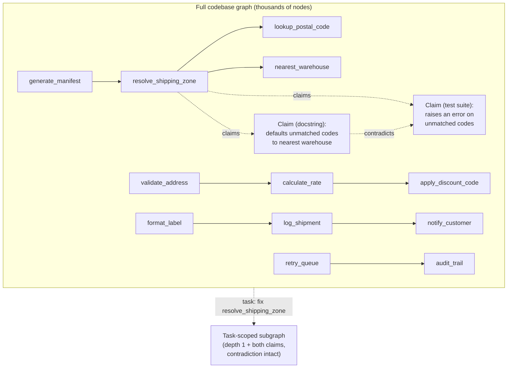

# Step 9 · Give a Worker a Slice, Not the Whole Graph

## Hook

A shipping platform's codebase has run through extraction for months. Every function is a node. Every `calls` relationship is an edge. Every docstring or test assertion describing what a function should do landed as its own claim node, connected back by a `claims` edge. The graph now holds a few thousand nodes.

A ticket comes in: `resolve_shipping_zone`, the function that decides which warehouse fulfills an order, is occasionally routing shipments to the wrong coast. An agent picks up the ticket and, wanting to be thorough, asks for the whole graph before touching anything.

What comes back is every function in the platform, chained together call after call, with `resolve_shipping_zone` buried somewhere in the middle. Attached to that one function: two claim nodes from two different sources that flatly disagree about what it's supposed to do when a postal code doesn't match anything on file. Nobody built a way to hand this agent just the part of the graph its task touches. It gets everything — and the one detail it actually needed sits lost among thousands of edges that have nothing to do with the bug.

## Explanation

### A slice, not the whole thing

Nothing about having a graph requires handing the whole thing to whoever asks for it. A **[subgraph](../02-foundations/glossary.md#subgraph)** is a deliberately bounded slice of a larger graph. For a worker fixing `resolve_shipping_zone`, that means the function itself plus its direct dependencies — what it calls, what calls it, nothing two or three hops further out.

Building that slice isn't a shortcut taken because the full graph is inconvenient to read. It's the whole point of having a graph rather than a document. A graph handed over in full, every time, defeats its own purpose — an agent drowning in a few thousand irrelevant nodes is barely better off than one working from no structured memory at all.

### Scoped by task, not just by distance

The package a worker actually receives — the subgraph plus whatever framing tells it what task it's for — is its **task-scoped context**. Scoping by task, not just by proximity, matters because "everything within one hop" and "everything this fix actually needs" aren't automatically the same set.

- A neighbor that only handles formatting or logging can usually be left out.
- A claim node hanging off the target and disputing what it does usually can't be — even though a `claims` edge isn't part of the call graph the depth rule was written for.

A subgraph built by depth alone is a starting point. A subgraph built for a task asks depth *and* relevance the same question.

### Keeping a disagreement intact

The part that's easy to get wrong is what happens when the slice-building step runs into an actual disagreement. `resolve_shipping_zone` has two claim nodes attached that contradict each other — one from a docstring, one from a test file. It's tempting for whatever assembles the subgraph to quietly pick the more recent one, or the more trusted source, and hand the worker one clean answer.

That's not resolution in [Part 3](../05-part-3-the-graph-of-facts/)'s sense — resolution only merges mentions that turn out to name the *same* thing, and these two claims genuinely disagree about what the function does. A **conflict-aware bundle** is a subgraph that keeps both sides of a live disagreement intact across the boundary, rather than letting the boundary-drawing step silently settle it. The worker needs to know the graph itself is unsure what the function is supposed to do — that's material to the fix, not noise to tidy away.

### Edge cases worth naming

1. **A three-way disagreement.** Nothing caps a conflict-aware bundle at two sides — a third source's claim crosses the boundary too, contradictions and all.
2. **A neighbor that's irrelevant by depth but relevant by content.** A logging helper two hops away that happens to log the exact bug symptom might matter more than a one-hop neighbor that doesn't. Depth is a default, not a guarantee of relevance.
3. **A subgraph built for the wrong task.** The same function can be the target of two tickets needing different neighborhoods — a performance fix cares about call frequency, a correctness fix cares about claim contradictions. Task framing has to travel with the subgraph, not just the node list.
4. **No contradiction, but also no claim at all.** A target function with zero attached claims isn't a bug in the subgraph builder — it just means nobody has recorded what the function is supposed to do yet, which is itself worth surfacing to the worker.

## Diagram



The right-hand slice keeps `resolve_shipping_zone`, its direct callers and callees, and both disputing claim nodes with the `contradicts` edge between them. Everything reachable only through `validate_address`, `format_label`, or `retry_queue` never crosses into the worker's context — it isn't wrong to exist, it's just not what this task needs.

## Claude Code vs OpenCode

Both configurations build the subgraph the same way: start from the target node, pull its direct neighbors, and separately pull any claim nodes attached to the target — including both sides of a disagreement — rather than collapsing them before the worker sees the slice.

### Claude Code

```markdown
---
name: task-scoped-subgraph-builder
description: Builds a depth-1 subgraph around a target function for one task, keeping any contradicting claim nodes attached to it intact.
---

1. Given a target node (the function under repair) and the full graph,
   collect every node reachable in exactly one hop via a `calls` or
   `called_by` edge. This is the target's direct dependency set.
2. Separately, collect every claim node attached to the target via a
   `claims` edge, regardless of how many claims that is or whether they
   agree with each other. Do not pick a "winning" claim and drop the
   rest — carry every one, plus any `contradicts` edge between them.
3. Return the target, its direct dependencies, and its full set of
   attached claims as one bounded subgraph. State the node count of the
   subgraph next to the node count of the full graph, so it's visible
   how much was left out.
```

### OpenCode

```markdown
---
description: Build a task-scoped subgraph around one function -- direct dependencies plus every attached claim, contradictions included
---

Given a target function node and the full graph: pull every node one
`calls`/`called_by` hop from the target, and separately pull every claim
node connected to the target by a `claims` edge, however many there are
and whether or not they agree. Never resolve a disagreement between two
claims by silently dropping one -- keep both, and keep any `contradicts`
edge linking them, inside the returned subgraph. Report the subgraph's
node count against the full graph's node count so the scope reduction is
explicit, not just assumed.
```

## Going Deeper

Depth is a knob, not a fixed rule, and the tradeoff runs both directions. A depth-0 slice — just the target node — is easy to build and nearly useless, since a worker fixing a function almost always needs to know what calls it and what it calls. A depth-3 or depth-4 slice creeps back toward the whole-graph problem this Step exists to avoid. Depth 1 across `calls`/`called_by`, plus an unconditional pull of every claim node on the target, is a reasonable default: most single-function fixes live at that radius, and the cases that don't are usually a sign the task was scoped too narrowly, not that the builder needs a bigger number.

## Check Yourself

<details>
<summary>Someone on the team suggests an adjustment: whenever a target node carries two contradicting claims, retain only the claim whose provenance record is newer, on the grounds that "newer" is a defensible tiebreaker and it keeps the slice simpler. What does the worker lose if the subgraph builder does this? Reveal the answer.</summary>

The worker loses the information that the graph itself doesn't have a settled answer. "More recent" is a plausible tiebreaker for a human deciding which claim to believe, but silently applying it inside subgraph construction hides the disagreement entirely — the worker sees one clean claim and has no way to know a second, contradicting one exists, let alone weigh whether the older claim might actually be correct. Recency is a fine input to a decision; it's a poor substitute for letting the worker see there was a decision to make at all.

</details>

## Try With AI

1. Sketch a tiny graph of your own — four or five nodes representing pieces of a task you know (files, functions, steps in a process), connected by a relationship you name yourself.
2. Attach two claim nodes to one piece that disagree about something concerning it — what it's for, whether it's still needed, how it should behave.
3. Ask Claude Code or OpenCode to build a task-scoped subgraph around that piece: direct neighbors only, plus both claims.
4. Check the result. Did it keep both disagreeing claims visible, or did it quietly resolve them into one answer on your behalf?
5. If it resolved them, ask it why, and see whether it can explain what it dropped.

## When It Goes Wrong

| Symptom | Cause | Fix |
| --- | --- | --- |
| The fix looks locally correct but breaks an assumption another part of the system relied on, and the worker shows no awareness of any tension around the function it changed. | The subgraph it was handed either didn't include a claim node flagging the disagreement, or included both but let one get filtered out before the worker saw it. | Build the subgraph to keep every claim attached to the target, contradictions included, and confirm the contradiction survives the handoff. |
| Two workers fixing the same function reach opposite conclusions about what it should do, and neither knows the other's reasoning exists. | Each was handed a subgraph resolved toward a different one of the two contradicting claims, instead of both claims intact. | Never resolve a contradiction inside the subgraph builder — that decision belongs to whoever reads the slice, not whoever assembles it. |
| A subgraph comes back the same size as the full graph, defeating the point of scoping at all. | The depth or relevance rule was set too loose, or "relevant" was interpreted so broadly it stopped excluding anything. | Tighten the scoping rule and report the subgraph's node count against the full graph's — a scope that doesn't shrink the count isn't scoping. |
| A worker acts on a claim that turns out to be years out of date, unaware a newer one exists elsewhere in the graph. | The subgraph builder pulled claims by proximity but not by currency, and nothing flagged that a contradiction — old vs. new — even existed. | Pull every claim attached to the target, not just the first one found, and let a live contradiction surface rather than silently picking one. |

---

The [glossary](../02-foundations/glossary.md#subgraph) spells out **subgraph** in full. "Task-scoped context" and "conflict-aware bundle" are this course's own working terms for how that slice gets built and used.

---

A slice that carries its contradictions is still just information. The next page covers what a checker does with that information once it has to decide whether a specific claim actually holds.
