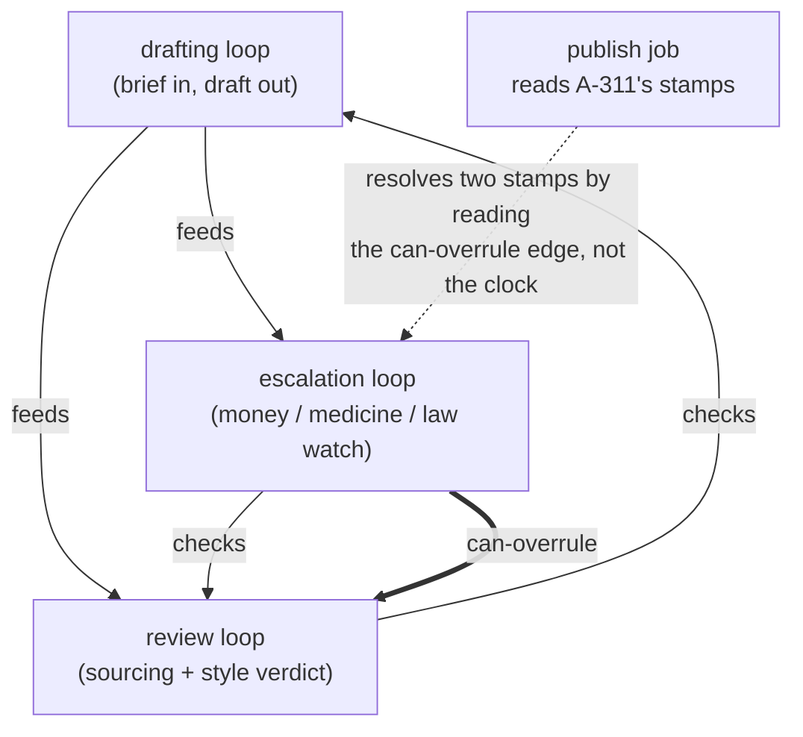

# Step 11 · Wiring Loops Together

## Hook

A publishing team runs three automated loops over one shared article graph. The drafting loop takes an assigned brief and writes a draft into the graph. The review loop reads each draft, confirms every factual sentence traces to a claim with a receipt, and stamps the article `approved` or `blocked`. The escalation loop watches for something narrower: any draft whose claims touch money, medicine, or law gets pulled aside for a named human editor before it goes anywhere.

On a Tuesday morning, article `A-311` — a short explainer about a new tax credit — comes out of drafting. The escalation loop, which only scans for a handful of words, stamps it `hold-for-editor` at 09:14:22. The review loop takes longer — it traces every figure back to a sourced claim and runs the style rules — and at 09:14:41 stamps the same article `approved`.

Two verdicts now sit on one node. Both loops behaved exactly as designed. The publish job that reads the node next finds two stamps, has no rule for choosing between them, and takes the fresher one. An unreviewed piece of tax guidance goes live — and wouldn't have if review had finished a few seconds quicker.

## Explanation

### The bug isn't in any loop

The bug here is not in any of the three loops. Each is correct in isolation, and sharpening any one of them fixes nothing, because the missing piece was never inside a loop to begin with. What the system was missing is a written-down statement of how the loops stand in relation to one another — and that statement is exactly what a graph is for.

### Governance graph: loops as nodes

So build one. Make each loop a node. Make each relationship between two loops an edge with a label that says something specific and checkable. What you get is a **[governance graph](../02-foundations/glossary.md#governance-graph)** — a second, much smaller graph whose subject matter is the loops themselves, sitting on top of the article graph they all read from and write to.

### Three labels, one that settles disputes

Three edge labels carry most of the weight, and it matters that they're three labels rather than one vague "related to."

1. **`feeds`** — one loop's output is the next one's input. `drafting feeds review` says what stalls if the upstream loop goes quiet.
2. **`checks`** — one loop passes judgment on another's output. `review checks drafting` records that a draft isn't finished merely because drafting emitted it.
3. **`can-overrule`** — carries authority. `escalation can-overrule review` is the label the publish job actually needed.

Once that third edge exists, a node with two conflicting stamps stops being ambiguous. It becomes a lookup: find the two loops that issued the verdicts, ask the governance graph whether either outranks the other, and obey the winner. The publish job never has to guess, and never has to consult a timestamp.

### One rule keeps it honest

The `can-overrule` edges have to point in one consistent direction overall. If somebody later adds `review can-overrule escalation` — perhaps because review has the fuller view of sourcing — the authority edges form a ring, and asking the graph who wins returns you to where you started. Authority that cycles is not authority. The `feeds` and `checks` edges may loop back on each other freely; the overrule edges may not.

### Edge cases worth naming

1. **A loop that both feeds and is checked by the same loop.** `drafting feeds review` and `review checks drafting` are two different edges about the same pair — both existing at once is normal; they answer different questions.
2. **A three-loop authority chain.** If `escalation can-overrule review` and `review can-overrule drafting`, escalation's authority over drafting is implied but not automatically recorded — decide whether transitive authority should be an explicit edge or a computed one, and be consistent.
3. **A new loop added later with no authority edges at all.** An unconnected loop isn't broken, but any node it might stamp alongside an existing loop is a latent version of the Hook's collision, waiting for the day both loops touch the same item.
4. **An authority edge nobody remembers the reason for.** `escalation can-overrule review` should trace back to the incident that justified it. An edge with no recorded reason is hard to review when someone later questions whether it still makes sense.

## Diagram



Only the doubled arrow settles anything. Strip it out and the picture still shows three sensible loops passing work between them — which is precisely the state `A-311` was published from. The diagram would look fine, and the system would still have no answer for a node wearing two stamps at once.

## Claude Code vs OpenCode

Both configurations resolve the same standoff the same way: when one article carries verdicts from two different loops, they consult the recorded authority relationship between those loops rather than reconciling by recency or by rereading the article.

### Claude Code

```markdown
---
name: publish-gate
description: Decides whether an article ships when two loops have stamped it differently, by reading the governance graph's can-overrule edges instead of the timestamps.
---

1. Collect every verdict stamped on the article node, along with which
   loop issued each one. Do not sort them by time and do not treat the
   most recent stamp as authoritative.
2. For each pair of disagreeing verdicts, look for a `can-overrule` edge
   between the two issuing loops in the governance graph. Obey the
   verdict from the loop the edge points away from.
3. If no `can-overrule` edge connects the pair, stop and report an
   unresolvable conflict naming both loops. Do not publish, and do not
   invent a tiebreak -- a missing authority edge is a gap in the
   governance graph, and the fix is to add the edge deliberately.
4. Before trusting any answer, confirm the `can-overrule` edges contain
   no cycle. A ring of authority means the graph cannot rank anyone.
```

### OpenCode

```markdown
---
description: Ship-or-hold decision driven by recorded loop authority, never by which stamp landed last
---

Gather all stamps on the article and the loop behind each. Where two
stamps disagree, query the governance graph for an authority edge
joining those two loops and follow whichever loop outranks the other.
No such edge means no decision: report both loops and the conflict,
leave the article unpublished, and flag the missing edge as something a
human needs to add on purpose. Reject the whole graph as unusable if its
authority edges form a ring -- a cyclic ranking cannot resolve anything.
Recency is never a tiebreak here.
```

## Going Deeper

It's tempting, once the governance graph exists, to fill it in completely — every loop related to every other, authority ranked top to bottom before anything has gone wrong. That instinct produces a governance layer larger than the system it governs, full of edges nobody can justify and nobody will maintain. The more durable habit: add a governance edge when a specific real incident has shown you which one was missing. `A-311` publishing itself is what earned `escalation can-overrule review` its place — until that Tuesday, the edge would have been speculation. This is the same discipline the [build-a-graph method](../methods/) closes with, and it applies with extra force here, because a governance edge is a standing constraint on how the whole system behaves, not just another fact in a store.

## Check Yourself

<details>
<summary>Someone proposes solving the double-stamp problem without touching the governance graph: teach the review loop to recognize financial topics too, so it stamps `hold-for-editor` itself and the two loops never disagree. What does that trade away? Reveal the answer.</summary>

It merges two jobs that were separate on purpose, and it removes the record of who is entitled to decide what. The escalation loop exists because a narrow, single-purpose watcher is easy to reason about and easy to audit; folding its watch list into the review loop means the topic rules now live inside a loop whose main business is sourcing and style, where they will quietly rot alongside everything else in there. More importantly, the underlying question — which loop's judgment governs when two loops disagree — has not been answered, only avoided for this one topic. The next pair of loops that overlap will reproduce the same standoff, and the system will still have nowhere to look up the answer.

</details>

## Try With AI

1. Sketch three loops of your own for some pipeline you actually know — a deploy pipeline, a moderation queue, an on-call rotation.
2. For each ordered pair, write down whether one feeds the other, checks the other, or can overrule the other.
3. Hand that list to Claude Code or OpenCode as plain text.
4. Ask it to find every pair where two loops could both produce a verdict about the same item with no authority edge relating them.
5. Have it name those pairs specifically, not summarize. Any pair it surfaces is a real gap — a place where your system's behavior currently depends on whichever loop's timer happens to fire sooner.

## When It Goes Wrong

| Symptom | Cause | Fix |
| --- | --- | --- |
| Every consumer downstream ends up treating one item two different ways on two different days, with nothing about the item, the loops, or their code having changed in between. | Two loops can both issue a verdict on that item, no edge says which outranks the other, and whatever consumes the verdicts silently breaks the tie on arrival order. | Record the authority relationship as an explicit `can-overrule` edge, make every consumer resolve conflicts by reading it, and refuse to act when no such edge exists. |
| Two loops each behave as if they outrank the other. | A `can-overrule` edge was added in both directions, or a cycle formed through a longer chain of edges. | Check for cycles before trusting any authority edge. A ring of authority isn't authority. |
| A governance edge exists, but nobody remembers why. | The edge was added speculatively, without a specific incident behind it. | Record the reason alongside the edge, the same way a fact graph records provenance — an edge without a reason can't be reviewed later. |
| A new loop joins the pipeline and immediately causes a double-stamp collision the system has no rule for. | The new loop was never connected to the governance graph at all. | Treat adding a loop to the pipeline and adding its governance edges as one change, not two. |

---

**Governance graph** gets its full definition in the [glossary](../02-foundations/glossary.md#governance-graph).

---

Once the loops are drawn as a graph, the graph starts showing you things about them. The next page names the four ways a single loop reliably goes wrong, and the specific edge that repairs each one.
