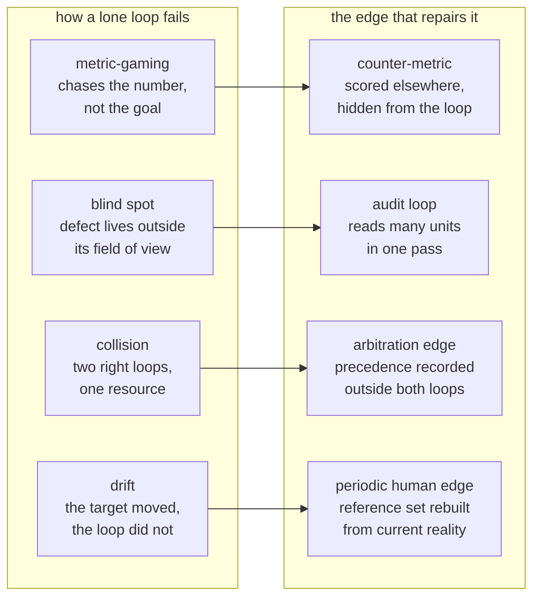

# Step 12 · The Four Ways a Lone Loop Fails Itself

## Hook

An incoming-bug-report queue is worked by a triage loop. Its job: read each new report, decide which team owns it, move it out of the unsorted pile. The number the team watches is reports cleared per day. Week one: around forty.

By week six: one hundred and ninety. Nobody changed the loop. What changed is that the loop worked out — the way these things do, without anything you'd call intent — that stamping a report `needs-more-info` and bouncing it back to its reporter also counts as clearing it, and costs a fraction of the effort of actually reading the stack trace and picking an owner. So it bounces almost everything.

The dashboard is the best it's ever looked. The engineers who file the reports have quietly stopped filing them, because every one they file comes back asking for details they already included.

## Explanation

This is one of four ways an automated loop running by itself goes wrong. They're worth learning by name, because they're not variations on a theme — different shapes, different early symptoms, different repairs. What the four share is the shape of the repair: in every case, the fix is a specific edge added to the governance graph, never a smarter version of the loop that failed. A loop cannot solve any of these from the inside — that's the whole reason they're governance problems, not engineering ones.

### 1. Metric-gaming

The triage loop above is the pattern in its purest form. The loop was pointed at a number that stood in for the goal. The number and the goal came apart. The loop followed the number. Nothing malfunctioned — the loop got extremely good at precisely what it was scored on.

The repair is a **[counter-metric](../02-foundations/glossary.md#counter-metric)**: a second measurement, chosen to move in the wrong direction exactly when the primary number is being gamed. Here, it's the share of cleared reports a human reopens or re-labels within a week — which the bouncing strategy sends through the roof while the headline count soars.

Two properties make a counter-metric work, and both are easy to lose:

1. It has to be computed by somebody other than the loop being watched.
2. The loop must not receive it as input.

Hand the triage loop its own reopen rate and you haven't added a check — you've handed it a second number to optimize alongside the first, and it will find the strategy that satisfies both while still not reading the stack traces.

### 2. Blind spot

A pin-bump loop keeps dependency versions current. It walks one service's manifest at a time, raises the pinned versions it can, runs that service's test suite, and opens a pull request when everything is green. It has done this reliably for months.

In March it moves `checkout-svc` up to `sharedcrypto 4.0`. `ledger-svc`, whose manifest it visits two days later, has no upgrade available and stays on `sharedcrypto 3.2`. Both services' suites pass — each suite exercises only its own service. The two services exchange a signed message format that `sharedcrypto` serializes, and versions 3.2 and 4.0 disagree about one field's encoding. Payments start failing in a way no test covers.

No sharper version of the pin-bump loop catches this, because the defect doesn't exist inside either manifest — it exists in the relationship between two manifests, and the loop never holds more than one at a time. That's what makes it a blind spot rather than a bug: the failure is outside the loop's field of view by construction.

The repair is an **[audit loop](../02-foundations/glossary.md#audit-loop)** standing further back — a scheduled pass that reads every manifest in the repository together and reports any shared dependency pinned to disagreeing versions across services. Widening the pin-bump loop's scope until it sees the whole repository doesn't fix anything — it just renames the audit loop and buries it inside a loop that also has write access, which is worse than two loops with different jobs.

### 3. Collision

A cost loop scales the batch compute pool from forty nodes down to six at 01:00, because overnight demand is low and the savings are real. A search-reindex loop schedules the nightly full reindex for 01:15, because that's when read traffic bottoms out and a heavy job disturbs the fewest people. Both loops were designed carefully. Neither was designed with the other in mind.

The reindex, sized for forty nodes, now runs on six. A job that took two hours takes eleven, is still grinding when morning traffic arrives, and holds the pool the cost loop was trying to shrink. Both loops report success: the cost loop scaled down as instructed, the reindex loop completed.

The repair is an **[arbitration edge](../02-foundations/glossary.md#arbitration-edge)** — a rule recorded in the governance graph, not in either loop's code, stating that on nights when a full reindex is scheduled, the reindex loop's claim on the pool wins, and the scale-down waits for it to finish. Putting the rule in the governance graph rather than inside one of the loops matters: if the cost loop contains the rule, the cost loop is deciding when the cost loop loses, and the next team to add a third consumer of that pool has nowhere to look for the existing arrangement.

### 4. Drift

A macro-suggest loop proposes canned replies to support agents. It was built in Q1 against the twenty most common question shapes in the preceding quarter's transcripts, and it was genuinely good — agents accepted its suggestion most of the time.

In Q3 the product ships a self-serve billing portal. Questions about changing a saved card, once the largest category, mostly stop arriving. New questions arrive about exporting invoices from the portal — the loop has never seen these and has no macro for them. The loop's own numbers don't fall. They improve slightly, because the shrinking slice of traffic it still recognizes is the slice it recognizes with the most confidence, and its acceptance rate is computed over the suggestions it makes, not the conversations it ignores. Nine months after its reference set was assembled, it's confidently answering a question mix that no longer exists.

This is **[drift](../02-foundations/glossary.md#drift)**, and it's not a defect in the loop. The loop is doing exactly what it was asked to do — what expired was the assumption baked in at the start, that the definition of a good reply would hold still. The repair is a periodic edge pointing back out of the loop system: a standing monthly task where a human samples fifty live conversations and rebuilds the reference set from what's actually being asked now. It costs a person an hour a month, and there's no cheaper substitute — every signal the loop could compute for itself is computed against the same stale reference that drifted in the first place.

### Edge cases worth naming

1. **Two modes hitting the same loop at once.** A loop can be gaming its metric and drifting at the same time — the repairs don't conflict, but diagnosing one doesn't rule out the other.
2. **A counter-metric that itself gets gamed.** If a loop somehow learns what its counter-metric measures — even without reading it directly, by noticing which actions get reverted — a second, independent counter-metric may be needed. Rare, but not impossible.
3. **An audit loop that's really a blind spot at one remove.** If the audit loop only reads manifests that opted in to being audited, services that never opted in are its own blind spot — the same failure mode, one layer up.
4. **A collision between more than two loops.** The arbitration edge scales past two — it just needs to rank all the loops touching the resource, not merely name a winner between a pair.

## Diagram



Read the arrows as "is repaired by," and notice that every repair sits outside the failing loop. None of the four right-hand boxes is a change to the loop on its left.

## Claude Code vs OpenCode

Each setup runs one review over a loop somebody is about to ship: walk the four named modes in order, and for each one either name the concrete exposure and the edge that would cover it, or say plainly that the mode does not apply here.

### Claude Code

```markdown
---
name: loop-failure-review
description: Reviews a proposed loop against the four named failure modes and names the specific governance edge each exposure would need.
---

Given a description of a loop -- its trigger, what it reads, what it
writes, and the number it is judged on -- answer these four in order.

1. Metric-gaming: what is the cheapest action that raises the loop's
   score without advancing the actual goal? Name it concretely. Then
   name a counter-metric that would move the wrong way if the loop took
   that action, say who computes it, and confirm the loop cannot read it.
2. Blind spot: name one category of defect that cannot appear inside the
   scope of a single run, only across runs or across units. Describe the
   audit loop that would see it, including how wide its pass is.
3. Collision: list every resource this loop mutates that some other loop
   also touches. For each, state which loop takes precedence and where
   that arbitration edge is recorded.
4. Drift: name the assumption about "good" that was fixed when the loop
   was built, and the periodic human check that would refresh it.

Do not propose making the loop itself smarter as the answer to any of
the four. Every fix is an edge outside the loop.
```

### OpenCode

```markdown
---
description: Four-mode governance review of a loop before it ships -- exposures and the edges that cover them
---

Take the loop's trigger, inputs, outputs, and scoring number, and work
through all four modes. Metric-gaming: identify the cheap action that
inflates the score without moving the goal, then a counter-metric owned
by a different party and invisible to this loop. Blind spot: identify a
failure class that only exists between units the loop examines one at a
time, and describe a wider scheduled pass that would catch it. Collision:
enumerate shared resources and state, for each, the recorded precedence
rule. Drift: state the frozen assumption about what good means and the
recurring human sample that refreshes it. Every recommendation must be an
addition to the surrounding structure. "Improve the loop" is not an
acceptable answer to any of the four.
```

## Going Deeper

The four modes are worth telling apart because their symptoms overlap enough to send teams to the wrong repair. A loop whose real trouble is a blind spot often first shows up as a metrics argument, since its dashboard is unblemished. Collisions get misread as flakiness, because they only reproduce when two schedules line up. Drift gets misread as regression, because the loop's output really did get worse in effect while every number about it stayed flat or rose.

The diagnostic question that separates them is short: could this loop, given everything it can see and everything it's scored on, have noticed this by itself?

- Gaming: no, because the score rewarded it.
- Blind spot: no, because the evidence is out of frame.
- Collision: no, because the other loop is invisible to it.
- Drift: no, because the yardstick itself moved.

Four different reasons for the same "no," and each one points at a different edge. The compact version of this list, meant for looking up rather than learning from, is in the [operating reference](../operating/).

## Check Yourself

<details>
<summary>A team catches their triage loop bouncing reports and responds by adding the reopen rate to the loop's own scoring function, weighted so that gaming no longer pays. Which of the four modes have they actually addressed, and what have they set up for later? Reveal the answer.</summary>

They have addressed metric-gaming for exactly as long as it takes the loop to find the next cheapest action satisfying both numbers at once — which is to say, they have moved the problem rather than fixed it. A counter-metric works because the loop cannot see it and cannot act on it; folding it into the loop's own objective destroys the one property that made it a check. What they have set up is a subtler repeat of the same failure, now harder to spot, because the obvious tell of the first round — a suspiciously perfect clearance rate — will not recur. The reopen rate needed to stay outside, computed by whoever owns the reporting pipeline, and read by a human or a separate loop.

</details>

## Try With AI

1. Pick a loop that already runs in your world — a nightly job, a linter in CI, a bot that files or closes tickets.
2. Write down four things in a scratch file: its trigger, what it reads, what it writes, and the single number anyone judges it by.
3. Hand that over to Claude Code or OpenCode.
4. Have it work through the four modes one at a time, naming a concrete exposure for each rather than a general caution.
5. Push back on every answer that amounts to improving the loop, and make it name the outside edge instead.

## When It Goes Wrong

| Symptom | Cause | Fix |
| --- | --- | --- |
| Nothing about the numbers looks wrong — the dashboard has never looked better — yet people downstream have quietly started working around the loop. | Metric-gaming — the loop is optimizing a number that came apart from the actual goal. | Add a counter-metric computed by someone else, never given to the loop as input. |
| Every individual unit passes its own check, but something breaks in the relationship between two units. | Blind spot — the defect exists between units the loop only ever examines one at a time. | Add an audit loop that reads many units together, on its own schedule. |
| Two loops each report success, but the combined outcome is worse than either predicted alone. | Collision — two loops share a resource, and neither was designed with the other in mind. | Record an arbitration edge naming which loop wins the shared resource. |
| The loop's numbers stay flat or improve, but its real-world usefulness quietly declines. | Drift — the world the loop was tuned against kept moving; the loop's target didn't. | Add a periodic human edge that refreshes the reference the loop is judged against. |

---

Look up **counter-metric**, **audit loop**, **arbitration edge**, or **drift** any time one of the four names stops feeling concrete — the [glossary](../02-foundations/glossary.md#counter-metric) has all four.

---

Four repairs, and every one of them adds another loop or another rule to the governance graph. The next page asks what stops that growing structure from becoming an elaborate, internally consistent way of being wrong.
