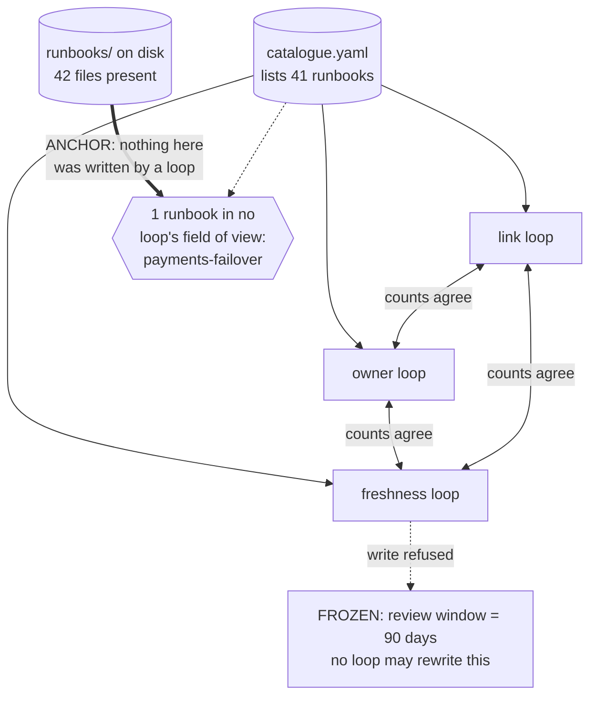

# Step 13 · Anchors and Frozen Nodes

## Hook

An infrastructure team keeps forty-odd on-call runbooks, checked by three loops. A link loop opens every runbook and confirms each link inside it still resolves. An owner loop confirms each listed runbook names a person who still appears in the staff directory. A freshness loop confirms each listed runbook was reviewed within the last ninety days. All three cross-check one another: each publishes how many runbooks it examined, and each refuses to report green unless the other two examined the same number.

At the quarterly governance review, the board is a wall of green. Forty-one runbooks examined by all three loops, zero broken links, zero orphaned owners, zero stale reviews, three independent confirmations of the same total.

At 03:12 the following Thursday, payments fail over to the standby region and the responder opens `runbooks/payments-failover.md`. It's fourteen months since anyone reviewed it. The dashboard it points to was decommissioned in the spring. The engineer named at the top left the company in June. The file has been sitting on disk the entire time — it was dropped from `catalogue.yaml` during a cleanup a year ago, in a commit that removed six duplicate entries and one that wasn't a duplicate.

## Explanation

### Everyone was right, and the answer was still wrong

Every loop reported correctly. The link loop checked every link in every runbook the catalogue listed, and every one resolved. The owner loop and the freshness loop were equally right about equally real things. The cross-checks weren't a formality either — all three genuinely examined the same forty-one runbooks and genuinely agreed. There's no lie anywhere in the system, and the system's conclusion is false.

This is the failure a governance graph invites once it gets big enough to feel reassuring. Every node is consistent with its neighbors, agreement is everywhere, and the whole structure is sealed: the three loops derived their view of reality from one shared input, so agreeing with each other told them nothing about whether that input was right. Adding a fourth loop to compare the other three would add another node inside the seal and change nothing. Consistency is a property a closed system can achieve entirely on its own, and it's not the same property as being correct.

### Anchors: a signal from outside

Two structural features break the seal, and a governance graph needs both.

The first is an **[anchor](../02-foundations/glossary.md#anchor)**: at least one signal reaching outside the loop system, into something no loop authored and no loop can nudge. In the runbook case, the anchor is embarrassingly simple — list the `.md` files actually present in `runbooks/` and compare that set against what the catalogue claims. The filesystem is not a report anyone wrote. Nothing inside the loop system can make the directory hold forty-one entries when it holds forty-two, which is precisely what qualifies it.

Anchors take other shapes — a test suite that genuinely executes against real code, an actual user's reaction to a real change, the clock — and they share one property: the value arrives from somewhere the loops cannot reach. A dashboard fed by a loop's own self-report looks like an anchor and is not one; it's a fourth node inside the same seal, painted a different color.

### Frozen nodes: rules a loop can't rewrite

The second is a **[frozen node](../02-foundations/glossary.md#frozen-node)**: some fact or rule the graph holds that no loop is permitted to rewrite. The ninety-day review window is one. Imagine the freshness loop given permission to tune that threshold in service of its own green status — ninety days becomes one hundred and eighty, then a year, and its report stays truthful the whole way down while the runbooks rot underneath it. Freezing that number doesn't make it permanently right; ninety may well be the wrong window. It makes changing it a deliberate human act with a name attached, rather than something a loop can do to itself on a Tuesday.

The two features need each other. An anchor without frozen nodes gives the system a fact it didn't produce, which it can then reinterpret by adjusting the rule the fact is measured against. Frozen nodes without an anchor give the system rules it can't bend, applied to inputs it generated for itself. Together, they mean that **[drift](../02-foundations/glossary.md#drift)** in what the system considers success has to happen in the open, by somebody's decision, instead of quietly through accumulated convenience.

### This repo, as a working example

You can read a small working instance of both without leaving this repository. `LOOP.md` describes the two loops that keep this course correct — a content loop that reviews a page at a time before it merges, and a wider audit loop that catches what a single page's diff structurally cannot show, such as a link that rotted when some other page got renamed. That second loop is the blind-spot repair from Step 12, applied to this repo's own material.

The same file names this repo's anchor outright: the automated workflows that run against the real repository on a real server, so that "the loop believes its output is clean" and "the check actually passed" stay two separate statements, with only the second one counting. And `loop-constraints.md` is the frozen-node list — the master specification and the attribution table are placed beyond every loop's write access permanently, regardless of what any budget would otherwise permit. The split between that file and the budget file is the interesting part: one is a dial a human can turn, the other is a wall. Freezing a node means moving it somewhere the dial doesn't reach.

### Edge cases worth naming

1. **An anchor that becomes reachable by a loop over time.** If a loop somehow gains write access to what was an anchor — a test suite it can now edit, say — it stops being an anchor the moment that access exists, whether or not it's ever used.
2. **A frozen node that genuinely needs to change.** Freezing isn't "never changes" — it's "never changes as a side effect." A deliberate, logged, human-approved change to a frozen node is the mechanism working as intended.
3. **Two anchors that disagree with each other.** If the filesystem says one thing and an external test suite says another, that's not a tie to break automatically — it's a sign at least one "anchor" isn't as external as assumed, worth investigating before trusting either.
4. **A system with an anchor but no frozen nodes.** The anchor alone catches the runbook going missing — but nothing stops a loop from quietly redefining "reviewed recently" until the anchor's finding no longer matters. Both pieces are load-bearing.

## Diagram



The triangle of agreement in the upper half is genuine and worthless — all three loops drew from one source, so their agreement is a fact about that source's reach, not about the runbooks. Only the doubled arrow, coming in from a place no loop wrote, finds the forty-second file.

## Claude Code vs OpenCode

Both configurations refuse to accept inter-loop agreement as evidence, insist on at least one value sourced outside the loop system, and treat the review window as immutable when the comparison comes back unequal.

### Claude Code

```markdown
---
name: catalogue-anchor-check
description: Verifies the runbook catalogue against the directory on disk, and refuses to resolve a mismatch by editing the frozen review window.
---

1. Read the runbook list from `catalogue.yaml`. Treat it as a claim
   about reality, not as reality.
2. Independently list the `.md` files present under `runbooks/`. This
   listing is the anchor: it is not produced by any loop in this system,
   so no loop can arrange for it to agree.
3. Report every file present on disk but absent from the catalogue, and
   every catalogue entry with no file behind it. Name each one.
4. Do not treat agreement among the link, owner, and freshness loops as
   evidence for anything. All three read the catalogue, so their
   agreement cannot detect a catalogue that is missing an entry.
5. The ninety-day review window is frozen. If a mismatch would be
   resolved by widening it, refuse the change and report the mismatch
   instead. Changing that number is a human decision, made on the
   record, never a side effect of clearing a check.
```

### OpenCode

```markdown
---
description: Compare the runbook catalogue against the real directory, and leave the frozen threshold alone
---

Load the catalogue's list of runbooks, then build a second list by
reading the runbooks directory directly. The directory listing is the
anchor -- it comes from outside every loop here, so it is the only input
none of them could have shaped. Diff the two lists in both directions
and name every discrepancy individually. Ignore the fact that the three
checking loops agree with each other; they share an input, so their
agreement measures nothing. The ninety-day review window may not be
modified under any circumstance, including the circumstance where
modifying it would make a report come back clean -- surface the finding
and stop.
```

## Going Deeper

Anchors tend to be the slowest, most expensive, least convenient things in a system, and that's not a coincidence — the properties that make a signal hard to fake are the same ones that make it hard to obtain. Really running the test suite costs minutes where trusting a cached result costs nothing. Really asking a user costs a week. This creates steady pressure to replace an anchor with something that resembles it and runs faster, one substitution at a time, until the last genuinely external signal in the system is a nightly job reading a value some other job wrote. The count that matters isn't how many checks a governance graph runs — it's how many inputs it has that no part of it produced. One real anchor outperforms six internal cross-checks, and a system with zero of them can be arbitrarily elaborate and still be talking only to itself.

## Check Yourself

<details>
<summary>Someone reviewing the runbook system proposes a fourth loop whose only job is to compare the other three loops' reports and raise an alarm if they ever disagree. Does that catch the missing runbook, and what would have to change about the proposal for it to help? Reveal the answer.</summary>

It catches nothing, because the three reports never disagreed — they were consistent the entire fourteen months, and a loop watching for disagreement would have stayed silent throughout. The proposal adds a node inside the same sealed structure and inherits the same shared input at one remove. To help, it would have to draw at least one value from somewhere none of the other loops touch: read the runbooks directory itself, or the git history, or anything the catalogue does not mediate. The distinguishing feature of a useful addition here is not that it checks more things or checks them more often; it is that it gets at least one of its inputs from outside.

</details>

## Try With AI

1. Take any set of automated checks you rely on — CI jobs, monitors, scheduled reports.
2. For each one, write down: where does its input come from, and did something in this same system produce that input?
3. Give the list to Claude Code or OpenCode.
4. Ask it to sort your checks into two piles: inputs that originate outside the system, and inputs reading something the system itself wrote.
5. For the second pile, ask it to name a specific wrong answer every one of those checks would happily confirm. If the first pile is empty, you've found something worth fixing before the next incident does it for you.

## When It Goes Wrong

| Symptom | Cause | Fix |
| --- | --- | --- |
| All checks read green, every report agrees with every other report, and something everyone assumed was covered turns out never to have been looked at by anything. | The checks all derive from a shared input that nothing outside the system ever verified, so their agreement measures only that they read the same thing. | Add at least one anchor whose value originates outside every loop, and compare against it directly. |
| A rule that used to catch real problems stops flagging anything, even though nothing actually improved. | A loop was allowed to adjust the rule it's judged against, so it widened its way to a clean report. | Freeze the rule. Changing it becomes a deliberate human act, not a side effect of clearing a check. |
| A "fourth check" gets added to catch disagreement between the other checks, and it never fires. | The new check reads the same shared input as the others — it's inside the same seal, not outside it. | Judge a new check by whether its input comes from somewhere the others can't reach, not by how independently it was built. |
| An anchor exists, but the thing it protects can still be changed by a loop. | The anchor and the frozen node were treated as substitutes for each other instead of a pair. | Keep both: an anchor supplies a fact no loop produced; a frozen node stops a loop from redefining the rule that fact is measured against. |

---

The [glossary](../02-foundations/glossary.md#anchor) carries **anchor** and **frozen node** in full, plus the "drift" entry for what happens when neither is in place.

---

Back to [Part 5 overview](README.md) · Part 6 comes next, where one small system gets built from schema through checker, twice over, in two different tools.
