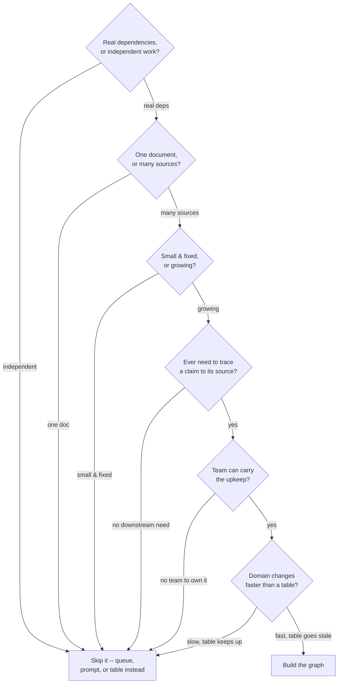

# Step 14 · Six Honest Questions Before You Build

## Hook

Bramble & Co. is three people — a designer, a developer, a part-time bookkeeper. A new operations hire comes back from a conference talking about knowledge graphs, and pitches putting one in front of everything the studio touches.

Four candidates go on the whiteboard:

1. Five client onboarding checklists, each running for a different client, with nobody's steps depending on anybody else's.
2. One forty-page vendor contract legal needs a yes-or-no read on before Friday.
3. A short list of which of the studio's three subcontractors is certified for which of two specialties — changed once in fourteen months.
4. Which of this year's paid invoices trace back to which signed statement of work, needed because an audit is coming and "we're pretty sure it's fine" won't satisfy an auditor.

The pitch treats all four as the same kind of problem — four things the studio doesn't have structured, so four things a graph would fix. Before anyone opens a schema file, the honest move is to ask the same six questions of all four, expecting them to land in different places, because they aren't the same kind of problem at all.

## Explanation

### One question underneath all six

Every one of these six questions is a version of the same underlying check: does the thing you're about to build cost less than the thing it's replacing, once you count the parts that don't show up until later. A schema has to be designed. Extraction has to be run and rerun as new material shows up. Whatever gets merged as "the same thing" has to stay reversible. Every claim needs a record of where it came from. None of that is free, and none of it is optional once you've committed to it — a graph half-built and then abandoned is worse than no graph, because it leaves behind claims nobody is maintaining and nobody has agreed to trust.

### The six questions, against all four candidates

1. **Do the pieces actually depend on each other, or are they just running next to each other?** The five onboarding checklists fail this one outright — nothing about Client A's step 3 has any bearing on Client B's step 3. Independent work with no cross-references needs a queue, not a graph.
2. **Is the honest answer already sitting inside one document?** The vendor contract is single-source: everything legal needs is in that one PDF. A good prompt against that one document beats a schema and an extraction pipeline built to serve exactly one source.
3. **Is the real relationship set small, fixed, and basically done changing?** Three subcontractors, two specialties, one change in over a year — that's a spreadsheet tab, not a graph. A **[schema](../02-foundations/glossary.md#schema)** earns its cost on a relationship set that grows or shifts; it's pure overhead on one that doesn't.
4. **Will anything downstream ever need to ask where a claim came from?** The audit trail candidate looks different here. "We checked, it's fine" isn't a sentence an auditor accepts — every claim needs a **[provenance](../02-foundations/glossary.md#provenance)** record from the moment it's created.
5. **Is there a team here large enough, and sticking around long enough, to carry this as upkeep?** A graph built once and never touched again decays the moment the material changes and nobody updates it. Three people is a real answer, not an automatic disqualifier — but somebody has to actually keep owning it.
6. **How fast does the underlying relationship set turn over?** Invoices and statements of work accumulate all year, steadily — different from "changes once every fourteen months," and the difference between a table someone edits by hand and a system that needs an ongoing extraction step.

Run all four candidates through all six questions and only the invoice-to-SOW tracking passes cleanly: real dependencies, material spread across many documents, a growing relationship set, a real downstream need to trace a claim to its source, a team willing to maintain it, and a pace of change too fast for a quarterly hand-edited table. The other three each fail on a different question — this isn't a checklist that always says no, and it isn't one that always says yes. It's honest in both directions.

### Edge cases worth naming

1. **A candidate that passes five questions and fails only the sixth.** One "skip it" answer is enough — a checklist isn't scored by majority vote. The subcontractor list would still fail even if every other answer looked graph-shaped.
2. **A situation that changes between one run of the checklist and the next.** The Check Yourself answer below covers exactly this — the checklist is meant to be re-asked, not answered once and filed away.
3. **A candidate that's borderline on team size.** "Three people" isn't automatically too small — the real question is whether one of those three has actually agreed to own upkeep, not whether headcount clears some threshold.
4. **Someone reaching for a graph because a tool already exists.** Having graph infrastructure lying around from a previous project isn't a reason to route a new candidate through it — each candidate gets asked the six questions on its own terms, not judged by what's convenient to reuse.

## Diagram



Any single "skip it" answer ends the checklist for that candidate — a graph isn't the tiebreaker for five yeses and one no, because the one no is telling you exactly where the cost stops being worth paying.

## Claude Code vs OpenCode

Both configurations run the same six questions against a described situation, in the same order, and stop at the first question whose answer already settles it rather than working through all six once a verdict is clear.

### Claude Code

```markdown
---
name: pre-build-checklist
description: Runs a described situation through six honest questions and reports build-a-graph or skip-it, naming the question that decided it.
---

1. Read the situation description. Identify what's actually being asked
   for: tracking, answering, or synthesizing something.
2. Ask, in order, stopping at the first "skip it" answer:
   - Do the pieces genuinely depend on each other, or are they
     independent work items?
   - Does the answer live inside one document, or does it require many
     sources?
   - Is the relationship set small and essentially fixed, or does it
     grow?
   - Will anything downstream need to trace a claim back to where it
     came from?
   - Is there a team able to maintain this as ongoing upkeep, not a
     one-time build?
   - Does the underlying domain change faster than a manually-edited
     table could track?
3. Report "build a graph" only if every question points that way.
   Otherwise report "skip it" and name the specific question that ended
   the check -- never just "no" without saying which one.
```

### OpenCode

```markdown
---
description: Check a described situation against six honest pre-build questions and report which one settled it
---

Take the situation as given and work through six questions in order,
stopping the moment one of them settles the case: real dependencies
between the pieces, one document versus many sources, a small fixed
relationship set versus a growing one, a genuine downstream need to
trace a claim to its origin, a team able to maintain this over time
rather than just build it once, and a domain that changes faster than
someone could keep a table current by hand. Only recommend building a
graph if all six point that direction -- and whenever the answer is
"skip it," name the exact question that decided it instead of returning
a bare no.
```

## Going Deeper

Notice that none of the six questions asks whether a graph *could* model the situation. Almost anything can be modeled as nodes and edges — that's close to the definition of a graph, not a reason to reach for one. The six questions are deliberately about cost, ongoing cost specifically, because the expensive part of graph engineering was never drawing the first diagram. It's the extraction pass that has to keep running as new material shows up, the resolution decisions that have to stay reversible, and the provenance records that have to be written honestly every time, forever, or the whole structure quietly turns into decoration nobody trusts. A team that answers all six "yes" and builds the graph anyway without budgeting for that ongoing cost hasn't avoided the mistake this checklist exists to catch — they've just delayed it past the point where the checklist could still help.

## Check Yourself

<details>
<summary>The subcontractor-certification list has changed once in fourteen months, but the ops hire points out that the studio is about to double its subcontractor roster this quarter. Does that change the verdict, and which question moves? Reveal the answer.</summary>

It's worth re-asking, yes — and the question that moves is the last one, how fast the domain changes, not the third one about whether the relationship set is small and fixed. A roster about to double is signaling a coming shift in turnover rate, not proof that the *current* set is already large or already growing; three subcontractors and two specialties is still small today. The honest move isn't to jump straight to "build a graph" on an anticipated future — it's to notice that question six is trending toward "yes" and revisit the checklist once the roster has actually grown, rather than build ahead of a change that hasn't happened yet. A **[pre-build checklist](../02-foundations/glossary.md#pre-build-checklist)** is meant to be asked again when the situation changes, not answered once and filed away.

</details>

## Try With AI

1. Pick something at work or in a personal project you've been tempted to build "real" tracking for — a spreadsheet, a notes file, a shared doc.
2. Describe the situation honestly to Claude Code or OpenCode in a sentence or two, including who else touches it and how often it changes.
3. Ask it to run your six-question checklist against it.
4. See whether it stops early with a clear "skip it, and here's the question that decided it," or works all the way through to a "build a graph" verdict.
5. Decide for yourself whether you agree with where it stopped — especially on the team-size and change-speed questions, the two most likely to need judgment the tool doesn't have access to.

## When It Goes Wrong

| Symptom | Cause | Fix |
| --- | --- | --- |
| Six months after launch, a graph is quietly not being updated, and everyone's gone back to asking each other in chat. | The checklist either never ran, or ran and got overridden by enthusiasm for the idea rather than an honest team-size and maintenance-cost answer. | Run all six questions before any schema work starts, and treat a "no" on team size or change speed as disqualifying on its own. |
| A candidate passes all six questions comfortably, but the resulting graph still feels like overkill in practice. | The questions were answered honestly about the present, but the situation was smaller or slower than it was described as. | Re-run the checklist against what's actually true today, not against how the pitch described it. |
| Two people run the same checklist against the same situation and reach different verdicts. | One or more questions were answered from impression rather than a concrete, checkable fact, like an actual change-frequency count. | Answer each question with a specific number or fact where possible — "changed once in fourteen months," not "doesn't change much." |
| A team skips the checklist entirely because the graph "obviously" fits. | Confidence that a graph *could* model the situation got mistaken for evidence that it's worth the ongoing cost. | Run the six questions anyway — capability was never the thing they're checking. |

---

**Schema**, **provenance**, and **pre-build checklist** are catalogued together in the [glossary](../02-foundations/glossary.md#pre-build-checklist).

---

Back to [Part 6 overview](README.md) · Step 15 takes the one candidate that passed and actually builds it, twice, once per tool.
