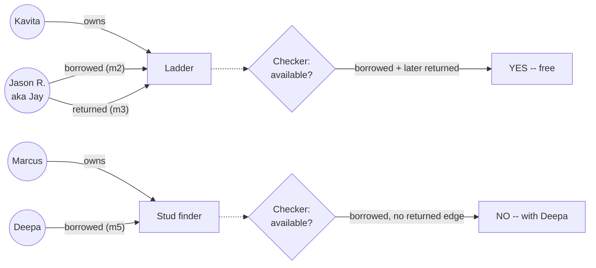

# Step 15 · One Small System, Built Twice

## Hook

Five households on Elm Street run a shared tool cabinet instead of five people each owning a ladder nobody uses twice a year. Coordination happens in a group chat — the actual record of who has what lives scattered across a week of messages:

- *"my ladder's free if anyone needs it"*
- *"Jay here — grabbing the ladder Sat morning, thanks Mrs K!"*
- *"ladder's back, left it on your porch"*
- *"got a stud finder if anyone's doing drywall"*
- *"swung by and grabbed the stud finder from Marcus, thanks!"*

Nobody's malicious and nobody's careless, but Kavita and Deepa are both about to ask the same question the chat can't answer by itself: is the stud finder actually free right now, or is it sitting in somebody's garage?

The chat passed all six of Step 14's questions on its own merits before anyone wrote a line of code: real dependencies (a tool can't be lent to two people at once), material spread across several messages, a set of who-has-what relationships that keeps turning over, a genuine need to answer "who has it, since when," a small but committed five-household team willing to keep it current, and a domain that outpaces anyone's memory within a couple of weeks. This is what building the one candidate that earned it looks like — done once as a Claude Code configuration and once as an OpenCode configuration, checked against each other at the end.

## Explanation

### A schema small enough to hold in your head

The system is deliberately tiny — two entity types, three relationship types, five messages — because the point of this page is watching the whole pipeline complete once, not managing scale. A **[schema](../02-foundations/glossary.md#schema)** comes first:

- Entity types: `Person`, `Tool`.
- Relationship types: `owns` (who originally has a tool), `borrowed` (who currently has someone else's tool), `returned` (closes out a specific `borrowed` edge).

Nothing about drywall projects, weekend plans, or thank-yous belongs in the schema — it's chat texture, not a tracked relationship.

### Extraction and resolution, message by message

Extraction runs each message against that schema and keeps only what fits:

- Message 1 → `owns` edge, Kavita to the ladder.
- Message 2 → `borrowed` edge, "Jay" to the ladder.
- Message 3 → `returned` edge, "Jason R." on the ladder.
- Message 4 → `owns` edge, Marcus to the stud finder.
- Message 5 → `borrowed` edge, Deepa to the stud finder.

Two names extraction pulled out — "Jay" and "Jason R." — resolve to the same `Person` node, the same way "Mrs K" in message 2 resolves to the already-known Kavita rather than minting a second node for her. That's **[resolution](../02-foundations/glossary.md#resolution)**, and it stays reversible: both surface forms remain attached to the one canonical person, with the reasoning — same street, same thread, introduces themselves as Jay in the message that names Kavita as Mrs K — kept alongside the merge rather than thrown away once it's made.

### Provenance, subgraphs, and a grounded check

Every edge keeps **[provenance](../02-foundations/glossary.md#provenance)** — which message produced it and when — so "since when has Deepa had the stud finder" is a lookup, not a scroll back through the chat.

When Kavita only needs to know about the stud finder, the read path builds a task-scoped **[subgraph](../02-foundations/glossary.md#subgraph)**: the `Tool` node for the stud finder plus every edge touching it, nothing about the ladder included, because none of it bears on her question.

The checker at the end of the pipeline decomposes "is the stud finder available" into one falsifying edge — a `borrowed` edge with no later `returned` edge from the same person — the same **[grounded](../02-foundations/glossary.md#grounding)** move Part 4 used on a pull request claim, applied here to a garage.

### Two tools, one graph

The two write-ups below run this exact pipeline against this exact chat, one framed as a Claude Code configuration and one as an OpenCode configuration. Neither actually invokes a tool here — they're this page's own worked reasoning, laid out twice in two houses of style — but the reasoning has to survive the framing difference and land on the identical final graph, or the exercise has failed at the one thing that makes it worth doing twice.

### Edge cases worth naming

1. **A message that resolves to nobody.** If a sixth message mentioned a name that matched neither Kavita, Deepa, Marcus, nor "Jay/Jason R.," it would need its own new `Person` node — resolution only merges when there's a real match, it doesn't force one.
2. **A borrowed edge with two later returned edges.** If the ladder somehow got two `returned` edges from two different people, that's not a bug to silently ignore — it's a contradiction worth surfacing, the same way Step 9 handled two disagreeing claims.
3. **A message with no schema-valid content at all.** "Anyone doing anything fun this weekend?" produces zero edges. An empty extraction result from one message is a normal outcome, not a sign the pipeline is broken.
4. **A tool nobody has claimed ownership of.** If a message said "borrowed the wheelbarrow from someone," with no prior `owns` edge for a wheelbarrow, the pipeline has a `borrowed` edge pointing at a `Tool` node with no owner — worth flagging rather than silently accepting.

## Diagram



The ladder's `borrowed` edge has a `returned` edge after it, so the checker reports it free. The stud finder's `borrowed` edge has nothing after it, so the checker reports it out — using the same two-edge lookup both times, not a guess about how recently anyone posted in the thread.

## Claude Code vs OpenCode

Both tabs run the same six-stage pipeline against the same five messages and arrive at the same final graph and the same two checker verdicts — that agreement is **[dual-tool parity](../02-foundations/glossary.md#dual-tool-parity)**, and it's the thing `labs/step-15-build-twice-verify-parity.sh` actually checks rather than assumes.

### Claude Code

```markdown
---
name: tool-cabinet-graph
description: Builds and reads the Elm Street tool-cabinet graph from five chat messages -- schema through checker, one small system end to end.
---

1. Schema: entity types Person, Tool. Relationship types owns, borrowed,
   returned. Reject anything from the source messages that isn't one of
   these -- weekend plans and thank-yous don't get nodes.
2. Extraction: read each message once. m1 -> owns(Kavita, ladder). m4 ->
   owns(Marcus, stud_finder). m2 -> borrowed(Jay, ladder). m3 ->
   returned(Jason R., ladder). m5 -> borrowed(Deepa, stud_finder). Attach
   each edge to the message id it came from.
3. Resolution: "Jay" (m2) and "Jason R." (m3) are one Person -- same
   thread, m2 introduces itself as Jay while addressing "Mrs K," which
   m1 already established as Kavita. Merge reversibly: keep both surface
   forms on the canonical node, plus the stated reason.
4. Provenance: confirm every edge above still carries its source message
   id and timestamp. An edge with no provenance record does not go in
   the graph, full stop.
5. Subgraph: for "is the stud finder available," return only the Tool
   node for stud_finder plus edges touching it -- exclude the ladder
   entirely.
6. Checker: decompose "available" into one falsifying edge -- a
   borrowed edge on this tool with no later returned edge from the same
   person. Report the verdict and name the edge(s) checked, never a
   guess based on how recently anyone posted.
```

### OpenCode

```markdown
---
description: Build the same Elm Street tool-cabinet graph from the same five messages and answer availability by the same grounded lookup
---

Fix the schema before reading anything: Person and Tool as entity
types, owns / borrowed / returned as the only relationship types.
Extract each of the five messages against it and drop anything that
doesn't fit -- m1 gives owns(Kavita, ladder), m4 gives owns(Marcus,
stud_finder), m2 gives borrowed(Jay, ladder), m3 gives returned(Jason
R., ladder), m5 gives borrowed(Deepa, stud_finder), each edge carrying
its source message id.

Resolve "Jay" and "Jason R." to one Person -- they appear in the same
thread, and m2's self-introduction as Jay lines up with the "Mrs K"
Kavita was already established as in m1. Keep both names on the merged
node along with why they were judged the same, so the merge can be
undone if that reasoning turns out wrong.

To answer whether the stud finder is free, pull only the stud_finder
node and its own edges into a subgraph -- leave the ladder's edges out
entirely, they're not relevant to this question. Then check
availability the grounded way: look for a borrowed edge on this tool
with no later returned edge belonging to the same borrower, and report
exactly that, never an impression from scrolling the chat.
```

## Going Deeper

The two write-ups above look different — one opens with frontmatter and a numbered procedure, the other reads as continuous instructions — and that difference is real, not decorative; it's genuinely how the two tools tend to be configured. What has to stay identical underneath the difference is the schema, the extraction results, the resolution decision, and the checker's decomposition rule. If one tab's schema quietly allowed a `mentioned` relationship type and the other didn't, or if one resolved "Jay" and "Jason R." and the other left them as two separate people, the two final graphs would diverge — on exactly the kind of thing a live team might not notice for weeks. Parity isn't a property you get by writing two configurations that read similarly; it's a property you check by comparing what each one actually produces, which is why a lab script exists for this page instead of a paragraph asserting the two agree.

## Check Yourself

<details>
<summary>A sixth message arrives: "Priya: does anyone know if the stud finder ever got returned?" Should this message produce a new returned edge, and what happens to the checker's verdict if someone extracts one from it anyway? Reveal the answer.</summary>

No new `returned` edge belongs here — the message is a question, not a report of an event, and extraction that turns questions into edges will eventually populate the graph with things nobody actually claimed happened. If someone extracted a `returned` edge from it regardless, the checker would report the stud finder available, and it would be wrong: the edge it's now trusting traces back to Priya wondering aloud, not to anyone returning anything. This is exactly what **[provenance](../02-foundations/glossary.md#provenance)** is for — tracing that wrong edge back to message 6 and seeing it's a question is how the mistake gets caught, rather than staying invisible inside a graph that now confidently agrees with itself.

</details>

## Try With AI

1. Write four or five short, made-up chat messages describing people lending each other two or three items — pets being watched, books, parking spots, anything with a clear "who has it now" question at the end.
2. Ask Claude Code to build the schema-through-checker pipeline against them once.
3. Start a second, separate conversation (or use OpenCode) and ask for the same pipeline built from scratch against the identical messages, without showing it the first attempt.
4. Compare the two final graphs by hand: same entity and relationship types, same resolved people, same checker verdict?
5. Where they disagree, that's the parity gap this page's lab checks for automatically — see if you can tell which of the two made the reasonable call and which one drifted from the source messages.

## When It Goes Wrong

| Symptom | Cause | Fix |
| --- | --- | --- |
| Both configurations run cleanly, but two people using different tools against the same source material end up with graphs that answer the same question differently. | The schema, the resolution rule, or the checker's decomposition rule was left implicit rather than pinned down before either configuration ran. | Fix the schema, the resolution reasoning, and the checker's falsifying-edge rule in writing before building either version, then diff the two final outputs directly. |
| One version resolves two names to one person; the other keeps them separate, and only one produces the right availability verdict. | One configuration had an explicit resolution step and the other didn't, even though neither one errored or looked obviously wrong. | Never assume resolution happened just because a configuration "looks reasonable" — check the actual node count for known duplicate names. |
| A message that's really a question gets extracted as if it reported an event. | Extraction didn't distinguish between a statement of fact and someone asking about one. | Reject extraction from interrogative or speculative phrasing — provenance on the resulting edge is what catches this after the fact if it slips through. |
| Two tools' outputs are compared by reading their instructions side by side, and both look fine. | Instructions can look equally reasonable while still producing different graphs — reading prompts doesn't reveal a silent judgment-call mismatch. | Diff the actual output graphs, never just the instructions that produced them. |

---

This Step leans on five earlier terms at once — **schema**, **resolution**, **provenance**, **subgraph**, **grounding** — plus one new one, **[dual-tool parity](../02-foundations/glossary.md#dual-tool-parity)**, the name for what the lab script actually verifies. The [glossary](../02-foundations/glossary.md#dual-tool-parity) has the compact version of all six.

---

Back to [Part 6 overview](README.md) · Part 7 turns this same judgment outward, onto when to skip graph engineering altogether.
