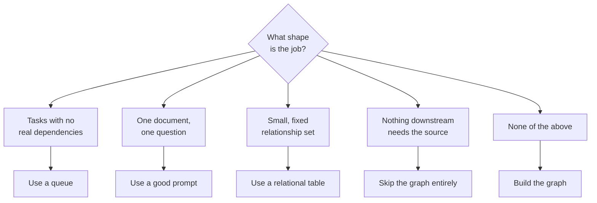

# Step 16 · Recognizing the Skip-It Cases

## Hook

The Fernbank Tool Library lends drills, ladders, and garden equipment out of a converted garage, run entirely by five rotating volunteers and whoever shows up for a Saturday shift. A new volunteer coordinator spends her first week sitting in on every job the library does, and comes back convinced the whole operation should run on a knowledge graph.

Four things end up written on the sign-out clipboard as candidates:

1. This month's twelve open Saturday shifts, each claimed first-come-first-served, with no shift's coverage depending on any other shift getting filled.
2. The single donated liability-waiver template every first-time borrower signs, where the only live question this week is whether clause four covers a borrowed table saw.
3. The pairing between the library's four tool categories — power, hand, garden, ladder — and the two orientation sessions a volunteer has to sit through before handing that category out. Changed once since the library opened three years ago.
4. The scrap of paper at the desk tracking which borrower currently has which tool out, reset and rewritten fresh most weekends.

She's right that none of these four is currently "structured" — living anywhere more durable than a clipboard or somebody's memory. She's not right that the fix is the same for all four — and working out which fix fits which candidate is exactly the judgment this page exists to sharpen.

## Explanation

### Four recognizable shapes, four lighter answers

Four situations come up often enough, across wildly different domains, that it's worth recognizing each one on sight rather than working through a long checklist every time. Each has a lighter-weight answer than a graph, and reaching past that lighter answer straight for a schema and an extraction pipeline doesn't buy anything — it just adds a maintenance obligation nobody asked for.

1. **Independent work items → a queue.** The twelve open shifts fail the dependency test outright — nothing about who takes Saturday's slot bears on who takes Sunday's. A queue lists what's open and marks an item claimed the moment someone takes it, with no schema needed. The tell: if every item could go to a different person working in total isolation and nothing would be lost, that's a queue problem, not a memory problem.
2. **One document, one honest answer → a careful prompt.** The waiver question is single-source: everything relevant sits inside one PDF, and the job is reading it carefully, not connecting it to anything else. Building a **[schema](../02-foundations/glossary.md#schema)** and an extraction step to serve one document, asked one question at a time, is infrastructure for a scale this job will never reach.
3. **Small, settled relationships → a plain table.** Four tool categories, two orientation sessions, one change in three years — that's a four-row, two-column grid a volunteer can read in ten seconds. A schema earns its keep on relationships that keep taking new shapes; on one that's settled and small, it's overhead with nothing to show for it.
4. **Nobody will ever trace a claim back → nothing gets built, not even provenance.** The who-has-what scrap of paper looks the most graph-shaped of the four, since it's genuinely about relationships between borrowers and tools. But nobody at Fernbank has ever needed to prove, three weeks later, exactly which loan record shows the tape measure left on a specific date — the only question anyone asks is "is it out right now." Building **[provenance](../02-foundations/glossary.md#provenance)** is pure cost when nobody will ever ask the question it exists to answer. The scrap of paper is already the right amount of infrastructure.

None of this is a checklist that always lands on "don't build one." A fifth candidate — tracing a damaged power tool back through every borrower who's had it, because the library's insurer now requires proof of a maintenance chain before covering a replacement — would fail none of these four tests: real dependencies between borrowings, material spread across many loan records, a relationship set that keeps growing, and a downstream party that will genuinely ask for the trail. That candidate is what a **[decision aid](../02-foundations/glossary.md#decision-aid)** like this one is for: not talking a team out of every graph, but sorting the situations that don't need one from the rest, quickly, before a schema gets designed for a job a queue or a table already does.

### Edge cases worth naming

1. **A situation that matches two patterns at once.** A candidate could look like both an independent-task queue and a small fixed table — that's fine; either lighter answer works, and there's no need to pick the "more correct" one when both are cheaper than a graph.
2. **A pattern that used to fit and no longer does.** See the Check Yourself question just below — a match today doesn't mean the match holds forever once the underlying job changes.
3. **A candidate that fits none of the four but still seems too small for a "real" graph.** Small and graph-shaped aren't contradictory — Step 15's five-message tool cabinet is exactly that: a genuine graph, just a tiny one.
4. **Someone reaching for an existing graph because it's already there.** A graph built for a previous project doesn't make it the cheap option for an unrelated new candidate — sort each situation on what it actually needs, not on what infrastructure happens to be lying around.

## Diagram



Landing in any of the first four boxes ends the question for that candidate. Only a job that clears all four does the fifth box — building the graph — become the right next move.

## Claude Code vs OpenCode

Both configurations take a described situation and sort it into one of the four skip-it patterns or, failing all four, a build recommendation — naming which pattern matched rather than returning a bare verdict.

### Claude Code

```markdown
---
name: skip-or-build
description: Sorts a described situation into one of four lighter-weight patterns, or recommends building a graph if none of the four fit.
---

1. Read the situation. Identify what's actually needed: getting work
   done, answering a question, tracking a relationship, or proving
   where a claim came from.
2. Check, in order, and stop at the first match:
   - Are the pieces independent of each other, with no piece's outcome
     depending on another's? -> recommend a queue.
   - Does the answer live inside exactly one document or source? ->
     recommend a good prompt against that source.
   - Does the set of relationships stay small and hold roughly still
     over time? -> recommend a plain table.
   - Would no later reader ever need to point back at the source a
     claim originated from? -> recommend skipping structured tracking
     entirely.
3. If none of the four match, recommend building a graph, and name
   which of the four conditions is the one that pushed it past every
   lighter option.
```

### OpenCode

```markdown
---
description: Match a described situation against four lighter-weight patterns before recommending a graph
---

Take the situation as given and check it against four patterns in
order, stopping at the first one that fits: independent tasks with no
real dependencies (a queue handles it), a single document holding the
whole answer (a good prompt handles it), a relationship set that stays
small and holds still (a table handles it), and a case where no later
reader will ever need to point back at where a claim originated (skip
structured tracking altogether). Only recommend a graph when the
situation clears all four -- and say explicitly which condition was
the one that ruled out every lighter option.
```

## Going Deeper

This four-pattern sort and the six-question checklist from Step 14 aren't doing the same job, even though they overlap. The six questions are built for a candidate that's already made it past an obvious "no" — one worth taking seriously, where the honest answer might genuinely be to build. This page's four patterns are built for recognizing the obvious "no" faster, before spending time on a six-question pass at all. Use this page's patterns as the fast first look, and reach for Step 14's longer checklist on whatever's left once the obvious skips are ruled out — running all six questions against Fernbank's twelve open shifts would have reached the same "use a queue" verdict eventually, just with far more effort spent getting there.

## Check Yourself

<details>
<summary>Suppose the library's insurer starts requiring proof of who last had a damaged tool before approving a replacement claim. Which of the four patterns stops applying to the who-has-what scrap of paper, and what changes about the underlying job, not just the paperwork? Reveal the answer.</summary>

The fourth pattern — nothing downstream needs the source — is the one that stops applying, because now something downstream genuinely does: the insurer wants a specific loan traced back to a specific borrower and a specific date. What changes isn't just that a form now exists to fill out; it's that the scrap of paper, rewritten fresh every weekend, is actively hostile to the new job, since last month's entries are already gone by the time a claim comes in. This is also a case worth running through Step 14's full six questions rather than assuming the insurer's requirement alone settles it — a library filing one claim a year might still be better served by keeping dated paper logs in a folder than by building extraction and a schema for an event that happens once annually. The insurer's requirement removes one lighter-weight option; it doesn't automatically hand the graph the job by default.

</details>

## Try With AI

1. Pick something you or your team currently tracks informally — a spreadsheet, a shared doc, a channel everyone scrolls back through when they need an answer.
2. Tell Claude Code or OpenCode what it's for, who else touches it, and roughly how the volume of activity has moved over the past few months.
3. Ask for a verdict: which of this page's four patterns fits, or none of them.
4. Push back once, by describing a small change to the situation — more contributors, a growing relationship set, a new party who'd want to trace a claim.
5. See whether the tool notices the verdict should move, or keeps defending its first answer past the point where the facts changed.

## When It Goes Wrong

| Symptom | Cause | Fix |
| --- | --- | --- |
| Weeks go into designing a schema and an extraction pipeline for something that turns out to be four rows in a spreadsheet, or a dozen independent tickets nobody needed connected in the first place. | Nobody checked the shape of the job against the four common lighter-weight patterns before reaching for a graph. | Run the four patterns first, before any schema work starts, and only move to the longer six-question checklist for whatever's left. |
| A pattern that clearly fit six months ago no longer describes the situation, but nobody's re-checked it. | The four patterns were treated as a one-time verdict instead of something to revisit when the job changes. | Re-run the pattern match whenever the underlying job changes shape, not just at the start. |
| Two people sort the same situation into two different patterns. | The situation was described in general terms rather than with concrete facts — how many items, how often it changes, who needs to trace what. | Describe the situation with specifics before sorting it — "changed once in three years," not "doesn't change much." |
| A team builds a graph for something that fits one of the four patterns, reasoning that "a graph could handle it too." | Capability got confused with cost — almost anything can be modeled as a graph, which isn't the question being asked. | Judge by which option is cheapest for the job, not by which one is capable of doing it. |

---

Look up **schema**, **provenance**, or **decision aid** in the [glossary](../02-foundations/glossary.md#decision-aid) any time one of the four patterns needs a sharper definition.

---

Back to [Part 7 overview](README.md) · Step 17 turns to the graphs that do get built, and how much of one is actually worth building.
