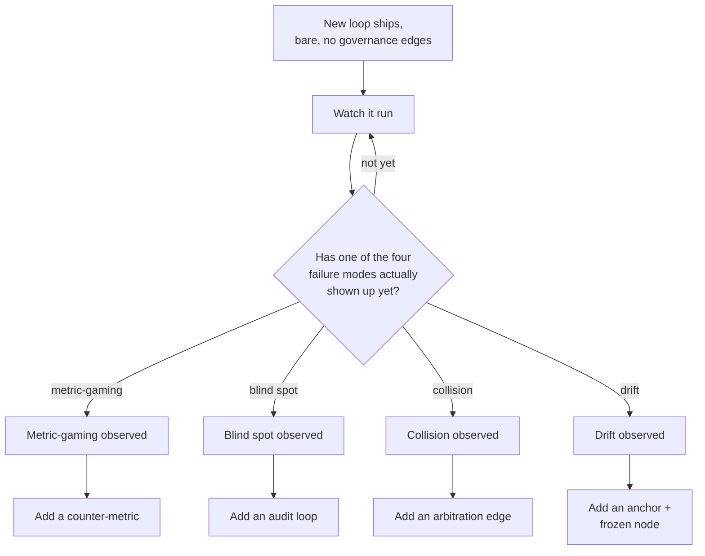

# Step 17 · How Much Governance the Job Actually Needs

## Hook

Verge is a five-person plant-subscription startup. Launch week for its fulfillment system ships two brand-new loops on the same morning: a restock loop that reorders inventory for the warehouse, and a substitution loop that swaps a sold-out plant variety for a similar one when a box gets packed.

Neither loop has touched a single real order yet. The engineer who wired them together had just finished a deep read on the ways a single automated loop can quietly go wrong, and — worried about repeating any of that on day one — added all four fixes before either loop went live:

- A counter-metric watching the restock loop's reorder count.
- An audit loop scanning both loops' actions together every night.
- An arbitration edge naming which loop wins if restock and substitution ever reach for the same product row at once.
- A frozen similarity threshold for substitution, paired with a monthly anchor comparing it against real customer complaints.

Six months and several thousand real orders later:

- The counter-metric has never once fired — restock's job is too simple to game profitably.
- The audit loop has filed one hundred and eighty nightly reports, every single one a false positive, and a rotating on-call engineer has spent a few minutes each morning triaging them anyway.
- The arbitration edge has never been consulted — restock and substitution have never once tried to write the same row. The collision it guards against isn't just rare, it's structurally impossible given how the two loops are scoped.
- In week three, the frozen threshold turned out to be miscalibrated — rejecting substitutions customers would happily have accepted — but fixing it meant routing a change through the review process the freeze exists to enforce, which took two weeks to clear, longer than the mistake it was protecting against would have cost left alone.

Nothing about any of the four fixes was built wrong. Each is a faithful implementation of the repair Step 12 describes. The problem is that all four got installed before a single one of the failures they repair had actually happened.

## Explanation

### Sizing a graph to the job in front of it

A graph — and a governance graph laid over it — should be sized to the job currently in front of it, not to every job a team can imagine it might someday have. That sizing is a **[complexity budget](../02-foundations/glossary.md#complexity-budget)**: a running account of how much structure the current evidence actually justifies, spent deliberately rather than all at once out of general caution.

### Four fixes, four ongoing costs

1. **A counter-metric** needs a second measurement computed, and someone has to own reading it — whether or not the loop it watches has ever gamed anything.
2. **An audit loop** runs on its own schedule and produces reports whether or not there's anything in them, and every report is one a human has to at least glance at. That's where Verge's on-call engineer spent real mornings.
3. **An arbitration edge** is a rule that has to be kept current as the system around it changes, whether or not the two loops it names have ever actually collided.
4. **A frozen node** is the sharpest trade of the four: it removes a failure mode by removing a capability, so every legitimate reason to change that value has to clear a deliberately slower process too — a cost that lands squarely on the case where the frozen value turns out wrong from the start, exactly what happened at Verge in week three.

None of that is an argument against the four fixes. Step 12's triage loop genuinely was gaming its metric, and a counter-metric genuinely was the right repair, paid for by a real, already-occurring cost. The difference at Verge is that nothing had occurred yet. Adding governance ahead of any evidence that a specific failure mode applies to a specific loop is **[premature governance](../02-foundations/glossary.md#premature-governance)** — spending complexity budget on a problem that is, so far, only hypothetical, while a problem that's actually happening gets no more attention than one that never does.

### Wait for the failure, not for disaster

The alternative isn't waiting for a disaster before wiring in anything at all. It's watching a new loop run bare, with nothing but the article graph it reads and writes, until one of the four failure modes actually shows itself. The moment one shows up, the matching fix goes in, informed by what the actual failure looked like rather than a guess made before launch. Verge's restock loop, watched this way, would have gone six months with no governance edges at all and lost nothing — the same six months it actually had, minus one hundred and eighty mornings of triaging reports about nothing and one two-week wait to fix a threshold that was frozen for no reason that ever showed up.

### Edge cases worth naming

1. **Evidence from somewhere other than this system.** A documented incident at a sister company, or a near-identical loop that failed elsewhere, counts as real evidence — see Check Yourself below for exactly this case.
2. **A fix that would have been cheap to add early but expensive to retrofit later.** Complexity budget isn't an argument for always waiting — if a specific piece of governance is dramatically cheaper to design in from day one than to bolt on afterward, that's a real cost difference worth weighing against how likely the failure is, not a reason to ignore the budget.
3. **A governance edge that quietly stopped mattering.** An arbitration edge for a collision that used to be possible, but no longer is because the system was refactored, is now pure cost with no matching risk — the same problem as premature governance, arrived at from the other direction.
4. **Two teams disagreeing about whether an incident "counts."** A near-miss that didn't quite cause damage is still evidence — the bar is "this specific failure mode showed real signs of happening," not "it caused a full outage."

## Diagram



Every arrow into a fix starts from an observed failure, not from the loop shipping. A fix added before its matching box on the left has fired is spending complexity budget on evidence that doesn't exist yet.

## Claude Code vs OpenCode

Both configurations review a proposed set of governance edges against a loop's actual incident history, and flag any edge that has no matching observed failure behind it.

### Claude Code

```markdown
---
name: complexity-budget-review
description: Reviews proposed governance edges against a loop's real incident history and flags any edge with no observed failure behind it.
---

1. List every governance edge proposed or already installed for the
   loop under review -- counter-metric, audit loop, arbitration edge,
   anchor and frozen node, or anything else.
2. For each edge, ask for the specific observed incident that motivated
   it: a real instance of metric-gaming, a real cross-unit defect a
   single-unit view couldn't see, a real resource collision between two
   named loops, or a real case of usefulness declining while the
   loop's own numbers stayed flat.
3. Any edge with no specific incident behind it -- only "this failure
   mode exists in general" -- gets flagged as premature. Report it by
   name, along with the ongoing cost it's already accruing: monitoring
   time, triage time, or process friction on the next legitimate
   change.
4. Do not recommend removing a flagged edge automatically. Recommend
   recording explicitly that it's unproven, and revisiting once real
   evidence exists either way.
```

### OpenCode

```markdown
---
description: Audit a loop's governance edges against its real incident history and flag any with no matching observed failure
---

Take the full list of governance edges attached to a loop -- every
counter-metric, audit loop, arbitration edge, and frozen node -- and
for each one, ask for the specific real incident that justified adding
it, not the general category of risk it belongs to. An edge backed by
"this could theoretically happen" rather than "this happened, here's
when" gets flagged, along with its ongoing cost: whatever monitoring,
triage, or change-review friction it's already imposing regardless of
whether it has ever caught anything. Don't recommend ripping out a
flagged edge on the spot -- recommend marking it explicitly unproven
and setting a real trigger for revisiting it.
```

## Going Deeper

The two mistakes here aren't symmetric, which is part of why premature governance is easy to fall into with good intentions. Under-governing produces a visible failure — a metric obviously being gamed, a defect obviously landing somewhere no test covers — and a visible failure gets fixed, because someone notices it and the fix is a known, named repair from Step 12. Over-governing produces an invisible, ongoing tax: a few minutes here, a slower change-review there, spread across months and multiple people, with no single moment that reads as a problem worth raising. Removing an installed governance edge also feels riskier than never installing it in the first place, even when the honest math says otherwise — nobody wants to be the person who deleted the safeguard right before the one time it would have mattered, so unproven edges tend to accumulate and almost never get retired. The complexity budget framing is meant to counter exactly that asymmetry: treat each edge's cost as continuously due, not a one-time design decision, and revisit the ones with no incident behind them on a real schedule rather than never.

## Check Yourself

<details>
<summary>A payments team is about to launch a pricing loop nearly identical to one that gamed its metric badly at a sister company last year — same reward structure, same incentive to shade numbers. Does "wait for a real failure" mean this team should ship bare and wait for their own version of that failure to happen first? Reveal the answer.</summary>

No — and the reason is worth being precise about, because it's easy to over-read "wait for evidence" as "wait for your own incident specifically." The sister company's failure is evidence: a real, observed instance of metric-gaming under a reward structure this new loop is about to copy, not a hypothetical category of risk. That clears the same bar Verge's restock loop never cleared for any of its four fixes — a specific incident, not a general worry — and installing the matching counter-metric before launch is spending complexity budget against evidence that already exists, just recorded somewhere other than this team's own history. What the payments team shouldn't do is treat that one documented precedent as license to also add an audit loop, an arbitration edge, and a frozen node "while they're in there" — each of those still needs its own matching incident, whether from this system or a comparably close one, not a general sense that thoroughness is free.

</details>

## Try With AI

1. List every governance edge attached to a real system you run or maintain — a monitor, a review gate, a threshold someone locked, a scheduled audit.
2. Next to each one, note the specific incident (if any) it was added in response to.
3. Describe the full list to Claude Code or OpenCode and ask for a split: edges tied to a real, nameable incident versus edges installed on general caution alone.
4. For the second group, have it estimate the ongoing cost — review time, monitoring time, friction on the next change.
5. Decide for yourself whether that second group is worth what it's currently costing to keep.

## When It Goes Wrong

| Symptom | Cause | Fix |
| --- | --- | --- |
| Removing a governance edge feels risky, so a team keeps every one in place, even edges that have caught nothing in months, and review overhead keeps compounding as more get added the same cautious way. | Governance edges got installed against a category of risk rather than an observed incident, so there was never a real trigger for adding them and there's never felt like a safe moment for removing them either. | Require a named, specific incident behind every governance edge before it ships, and schedule a real periodic review that retires edges with none. |
| A clean six-month report gets treated as proof an edge is doing its job. | A quiet dashboard reads the same whether the edge is catching something rare or was never needed at all — the report by itself can't tell those two apart. | Ask what incident justified the edge in the first place, rather than reading its silence as success. |
| A team ships every governance fix from Step 12 on day one, before any loop has run against real data. | Preparing for every failure mode a team has read about gets mistaken for good engineering discipline, rather than premature spending. | Ship the loop bare, watch for an actual failure mode to appear, then add the one matching fix — not all four in advance. |
| Fixing a frozen value takes longer than the mistake it was protecting against would have cost. | The frozen node's review process was sized for a high-stakes value, but got applied to one that was actually low-risk and easy to reverse. | Match the weight of the freeze to the actual cost of getting the value wrong — not every frozen node needs the same process. |

---

**Complexity budget** and **premature governance** are both in the [glossary](../02-foundations/glossary.md#complexity-budget).

---

Back to [Part 7 overview](README.md) · This closes the seventeen-step roadmap — everything from here builds on the judgment these seventeen pages were meant to leave you with.
