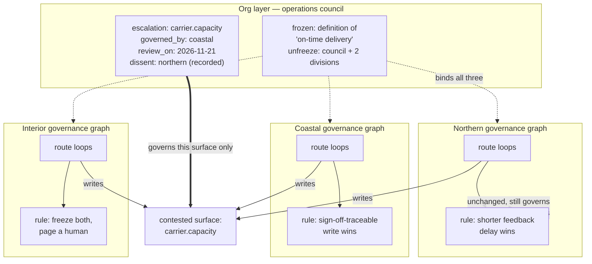

# Governance at Org Scale · When Every Team Has Its Own Governance Graph

> **Ultra-Pro tier (G4).** Assumes Steps 11–13 and Project 8. Those cover wiring loops together inside one team. This page covers what happens when several teams have each done that, correctly and independently, and the results meet.

## Hook

Ridgemont Freight runs three regional divisions, and all three did the right thing.

**Northern** built a governance graph around its route-planning loops eighteen months ago. Its arbitration rule favors the loop with the shorter feedback delay, on the reasoning that a loop learning from yesterday's outcomes should outrank one learning from last quarter's.

**Coastal** built theirs a year later, after a bad week, and its rule is the opposite in spirit: when two loops disagree, the one whose write is traceable to a human sign-off wins, regardless of freshness. That rule exists because Coastal once let two fast loops ratchet each other into a pricing spiral over a weekend.

**Interior**, smallest and newest, has one arbitration rule: on any conflict, freeze both values and page a human. It is slow, it is unambiguous, and for a division with four loops it works.

Each governance graph is internally sound. Each division can explain every edge in theirs. Every one of them would pass the Graph Ready checklist.

Then Ridgemont consolidated its carrier contracts, and a single carrier-capacity value became something all three divisions' loops read and write. Northern's loop updated it from fresh telemetry. Coastal's loop reverted it, because the change carried no sign-off. Northern's loop, seeing stale data, updated it again. Between them they wrote that value 1,900 times in one afternoon, each write locally correct under its own division's rule.

Interior's loop, meanwhile, froze the value and paged a human — who found a field that had changed 1,900 times and no way to tell which change had been the right one.

Nothing here is a bug. Three correct governance systems produced an incoherent result because none of them had standing over the others.

## Explanation

### The failure is structural, not a mistake

It is tempting to look for the error — someone should have coordinated, someone deployed carelessly. There was no error. Northern's rule is defensible. Coastal's rule is defensible and was learned expensively. Interior's rule is the most conservative of the three.

What is missing is not correctness at the division level. It is any answer to the question *whose rule applies here*. Each governance graph implicitly assumes it is the only one, and that assumption is invisible until a value falls under two of them at once.

This is the four-failure-modes problem from Step 12, one level up. A lone loop fails in characteristic ways when nothing checks it. A lone *governance graph* fails the same way when nothing arbitrates between it and its peers — and it fails less visibly, because each participant's logs show it behaving exactly as designed.

### Contested surfaces

The unit that matters at this scale is not the loop or the graph. It is the **contested surface**: a specific field, or a small set of them, that more than one governance domain's loops can write.

Almost nothing is contested. Northern's depot staffing, Coastal's local pricing bands, Interior's maintenance schedule — each has exactly one domain writing it, and those need no org-level machinery at all. The carrier-capacity value is contested. So, it turns out, are four other fields.

Five contested surfaces across three divisions and forty-odd loops. That ratio is typical, and it is the most important thing to know before designing anything here: **org-scale governance is a small amount of machinery applied to a small number of fields**, not a policy layer over everything. A design that governs all forty loops uniformly will be abandoned within two quarters, because it taxes thirty-five loops that were never in conflict.

The first deliverable is therefore not a policy. It is an inventory: for every field, which domains write it. Most orgs have never assembled this, and assembling it resolves a surprising share of the problem outright — several apparent conflicts turn out to be two teams writing what they each thought was their own field.

### The escalation edge

For a genuinely contested surface, the mechanism is one edge type, in a graph that sits above the division graphs and contains almost nothing.

An escalation edge asserts: *on this surface, this domain's rule governs.* It does not merge the governance graphs, does not modify any division's internal arbitration, and does not apply anywhere except the surface it names.

```json
{
  "surface": "carrier.capacity",
  "governed_by": "coastal",
  "rule": "sign-off-traceable write wins over untraceable write, regardless of recency",
  "rationale": "Capacity commitments are contractual. A wrong value is a breach, not a stale reading, so traceability outranks freshness on this field specifically.",
  "decided_by": "Ridgemont operations council, 2026-05-21",
  "review_on": "2026-11-21",
  "dissent": "Northern maintains that stale capacity causes more day-to-day misrouting than untraceable writes cause breaches. Recorded, not adopted."
}
```

Four properties carry the weight:

1. **Scoped to a surface.** `governed_by: coastal` means Coastal's rule applies *to this field*. It grants Coastal nothing else. A blanket grant of authority to one division is a reorganization wearing a graph's clothing, and it will be resisted as one.
2. **The rule is written out.** Not a pointer to Coastal's graph — the actual rule, in the escalation record. Coastal may change its internal rule next quarter; this surface's governance must not change silently as a side effect.
3. **It has a decision date and a review date.** An escalation edge is a judgment made at a moment with information available then. Without `review_on` it becomes permanent by inertia, which is how governance ossifies.
4. **Dissent is recorded, not erased.** Northern's objection is real and may prove right. Recording it means the review in November starts from what was actually argued, rather than from whoever remembers it best.

### Why this is not just a bigger arbitration edge

Project 8's `can-overrule` edge and this escalation edge look similar and differ in one decisive respect: **who is entitled to create one.**

Inside a team, a `can-overrule` edge is a technical decision the team makes about its own loops. At org scale, an escalation edge takes authority away from a division that had it, on a surface that division was writing. That is not a technical decision, and a system that lets any team unilaterally assert one over another's surface will be routed around within a month — teams will rename fields, write through side channels, or simply ignore the layer.

So the edge carries `decided_by`, and that field names a body with standing across the divisions, not an engineer. The graph records the decision; it does not manufacture the authority. Getting this backwards is the single most common way org-scale governance projects fail, and it fails politically rather than technically, which makes it hard to diagnose from inside the system.

### The org-level frozen node

Step 13's frozen nodes gain a second job here. Within one team, freezing a value stops a loop from redefining its own success measure. Across teams, freezing a value stops *a division* from redefining a shared one.

Ridgemont froze the definition of on-time delivery. Not the measurements — the definition. Any division may report its own on-time rate; none may change what the phrase means. Before the freeze, Coastal counted a delivery on time against the customer's requested window, Northern against the internally scheduled window, and the two numbers were routinely compared in the same review.

An org-level frozen node needs one thing its team-level equivalent does not: an unfreezing procedure. A team can decide to unfreeze its own node in a meeting. A shared definition needs a named path — who may propose a change, who must agree, and what happens to historical figures computed under the old definition. Without that path, the freeze is either ignored or becomes a permanent obstacle, and both outcomes discredit the mechanism.

### Edge cases worth naming

- **Cycles across domains.** Northern governs surface X, and its rule defers to whoever governs surface Y — which is Coastal, whose rule defers back on X. Neither division can see this from inside its own graph. Cycle detection has to run at the org layer, over the escalation set, on every change.
- **The unclaimed surface.** A field two divisions write with no escalation edge is the Ridgemont failure, still live. Detect these by inventory, not by waiting for an incident: any surface with more than one writing domain and no governing record is an open finding.
- **Escalation without a live conflict.** A surface can be contested in principle and quiet in practice for years. Writing an escalation edge for it is cheap; discovering you needed one during an incident is not. But `review_on` still applies — an unexercised rule is a rule nobody has tested.
- **Acquisition.** A newly-acquired division arrives with its own governance graph and its own vocabulary. Its surfaces have to be inventoried against the existing set before its loops are connected to anything, and the overlap is usually larger than either side expects.
- **The division that opts out.** Interior's freeze-and-page rule effectively declines to participate in automated arbitration. That is a legitimate position for a small division, and the org layer must be able to represent it — `governed_by: interior` with a rule of "halt and escalate to a human" is a valid escalation edge, not a gap.

## Diagram



The org layer holds two node types and touches one field. Each division's internal rule is untouched and keeps governing everything that division writes alone — which is nearly everything.

## Claude Code vs OpenCode

Both configurations audit an org's escalation set: find contested surfaces with no governing record, detect authority cycles across domains, and flag escalation edges past review — without inventing a rule for anything.

### Claude Code

```markdown
---
name: escalation-auditor
description: Audits an org-level escalation set for ungoverned contested surfaces, cross-domain authority cycles, and expired reviews. Reports only; never asserts governance.
model: claude-opus-4-1-20250805
temperature: 0
tools: [Read]
---

1. Read every division's governance graph and build the write inventory:
   for each surface, the set of domains whose loops write it. Report the
   inventory size and how many surfaces have exactly one writer.
2. Flag every surface with two or more writing domains and no matching
   entry in `escalations.json`. These are ungoverned contested surfaces
   and are the highest-severity finding. List them first.
3. Build a directed graph over the escalation set: an edge from domain A to
   domain B where A's governing rule defers to a surface B governs. Detect
   cycles. Report each cycle as the full ring of surfaces and domains, since
   no single division can see it from inside its own graph.
4. Flag every escalation whose `review_on` date has passed, and every one
   missing `review_on`, `decided_by`, or `rationale` entirely.
5. Flag any escalation whose `decided_by` names an individual or a single
   division rather than a cross-domain body. An escalation asserted by one
   party over another's surface is not enforceable and should be reported
   as procedurally void, whatever its technical merit.
6. Check org-level frozen nodes: flag any lacking a named unfreezing path.
7. Emit findings by severity. Never propose a rule, never fill in a
   `governed_by`, and never resolve a cycle — for each finding, name who is
   entitled to decide it. That is the report's job; deciding is not.
```

### OpenCode

```markdown
---
name: escalation-auditor
description: Audit an org escalation set — ungoverned contested surfaces, cross-domain cycles, expired reviews — reporting only
context: pattern-implementation
---

Read each division's governance graph. Build the write inventory: which
domains write which surfaces. Report how many surfaces have a single writer;
those need nothing from this layer.

Highest severity first: any surface written by two or more domains with no
entry in `escalations.json`. List these before anything else.

Then build a graph over the escalations themselves — domain A to domain B
wherever A's rule defers to a surface B governs — and look for rings. Report
each ring in full, with every surface and domain in it. A division cannot
detect one of these from inside its own graph, which is why it is checked
here.

Flag escalations past `review_on`, and escalations missing `review_on`,
`decided_by`, or `rationale`.

Flag any escalation whose `decided_by` is one person or one division. An
escalation taken over another domain's surface without a cross-domain body
behind it is procedurally void regardless of how sound the rule is. Say so.

Flag org-level frozen nodes with no unfreezing path written down.

Report only. Do not supply a missing rule, do not choose a governing domain,
do not break a cycle. For each finding, name who has standing to decide it.
```

## Going Deeper

The instinct on seeing Ridgemont's 1,900 writes is to standardize: pick one arbitration rule, apply it everywhere, and the incoherence disappears. It does disappear, and something worse takes its place.

Coastal's sign-off rule exists because of a specific weekend that cost real money. Interior's freeze-and-page rule is right for a division whose four loops a single person can hold in mind. Northern's freshness rule suits a division where the dominant failure is stale routing. Standardizing on any one of these exports a rule to two divisions whose failure modes it does not match — and the loops that suffer under it will be worked around locally, which returns the org to ungoverned writes with an added layer of ceremony on top.

The federation reasoning from the [previous page](multi-graph-federation.md) applies almost unchanged. There, two graphs kept separate provenance rules and met at a thin, jointly-owned seam. Here, three governance domains keep separate arbitration rules and meet at a thin, jointly-owned escalation set. Both designs are betting that local correctness under local conditions plus an explicit, reviewed seam beats global uniformity — and both are betting it for the same reason: the local rules encode expensive lessons that a uniform rule would discard without knowing what it was discarding.

Step 17's question about what complexity is worth carrying is the one to keep asking here. Five contested surfaces justify five escalation edges and an auditor that runs on merge. They do not justify a governance platform, a policy DSL, or a standing committee. If the escalation set ever grows past what one person can read in a sitting, that is a signal worth taking seriously — most likely the surfaces were drawn too finely, or the layer has started absorbing decisions the divisions were handling fine on their own.

## Check Yourself

<details>
<summary>A division proposes a shortcut for a newly-discovered contested surface: rather than wait for the operations council, they will write an escalation edge naming themselves as the governing domain, on the grounds that their rule is demonstrably the most conservative of the three and nobody could reasonably object. What is wrong with this, given that they are probably right about the rule? Reveal the answer.</summary>

The rule's merit is not what makes an escalation edge work — its standing is. An escalation edge takes authority over a surface away from divisions that were writing it, and a division cannot grant itself that. What the other divisions receive is a record asserting that their writes to a field they own are now subordinate, decided by the party that benefits. The predictable response is not compliance; it is a workaround — a differently-named field, a write path that bypasses the layer, or quiet non-implementation. The surface ends up ungoverned again, and now the escalation set contains an entry that says otherwise, which is worse than the empty state because the auditor reports it as covered.

The `decided_by` field exists precisely to make this detectable, which is why the auditor flags a single-division value as procedurally void without evaluating the rule at all. Being right about the rule is useful — it is a strong argument to bring to the council, and it will likely carry. But the same conservatism that makes the rule defensible makes it cheap to get endorsed properly, and an endorsed rule survives the disagreement that an asserted one does not.

</details>

## Try With AI

1. Write three tiny governance graphs in separate files, one per imagined team, each with two loops and its own arbitration rule stated in plain words. Make the three rules genuinely different in spirit — favor freshness in one, traceability in another, halt-and-escalate in the third.
2. Give all three a surface they write in common, plus two or three surfaces each that only they write.
3. Have Claude Code or OpenCode assemble the write inventory across all three files and pick out the contested surfaces. Do not tell it which one you planted.
4. Ask it to simulate what happens on the contested surface when all three loops write within the same minute, each applying its own rule. Have it show the sequence of writes.
5. Now add an escalation file naming one domain as governing that surface, with a rationale and a review date, and re-run step 4.
6. Finally, add a second escalation that creates a deliberate cycle — domain A's rule deferring to a surface B governs, and B's back to A — and ask the auditor to find it. Then check whether either team's own governance file contains anything that would have let them notice it alone. That invisibility from inside is the reason the org layer exists at all.

## When It Goes Wrong

| Symptom | Cause | Fix |
| --- | --- | --- |
| Hundreds of writes land on one shared field in a short window, every write locally correct. | A contested surface with no escalation edge. Two domains' rules are each reverting the other. | Inventory writers per surface and add a governing record. Until one exists, make the surface read-only rather than leaving it to fight itself. |
| An escalation edge is technically sound and universally ignored. | It was asserted by one division over another's surface, without a cross-domain body behind it. | Check `decided_by`. Take the same rule to the body with standing and re-record it. The rule was never the problem. |
| Two divisions each believe the other governs a surface, and neither writes to it. | An authority cycle across domains, invisible from inside either governance graph. | Run cycle detection over the escalation set at the org layer on every change. Report the full ring, and have the deciding body break it explicitly. |
| Divisions report incompatible figures for the same metric in the same review. | A shared definition was never frozen, so each division defined it against its own baseline. | Freeze the definition at the org layer — and give it an unfreezing path, or it will be quietly ignored within a quarter. |
| A rule that made sense two years ago is now causing incidents and nobody will change it. | The escalation edge has no `review_on`, so it became permanent by default. | Require a review date on every escalation. Treat a passed date as a finding, not a formality. |
| The org layer has grown to cover most fields, and teams are routing around it. | Surfaces were drawn too finely, or the layer absorbed decisions divisions were handling correctly alone. | Re-inventory. A surface with one writing domain does not belong here. Apply Step 17's budget question to the governance layer itself. |
| A newly-acquired division's loops start conflicting with existing ones immediately on connection. | Its surfaces were never inventoried against the existing set before the loops were wired in. | Inventory first, connect second. Overlap between two independently-built vocabularies is routinely larger than either side estimates. |

---

**Contested surface** and **escalation edge** are this course's working terms for the field under dispute and the record that governs it. The single-team equivalents are Project 8's arbitration edge and Step 13's frozen nodes; the closest structural analogue elsewhere in the tier is the correspondence set in [Multi-Graph Federation](multi-graph-federation.md).

---

Previous: [Multi-Graph Federation](multi-graph-federation.md) · Back to the [advanced tier index](README.md).
