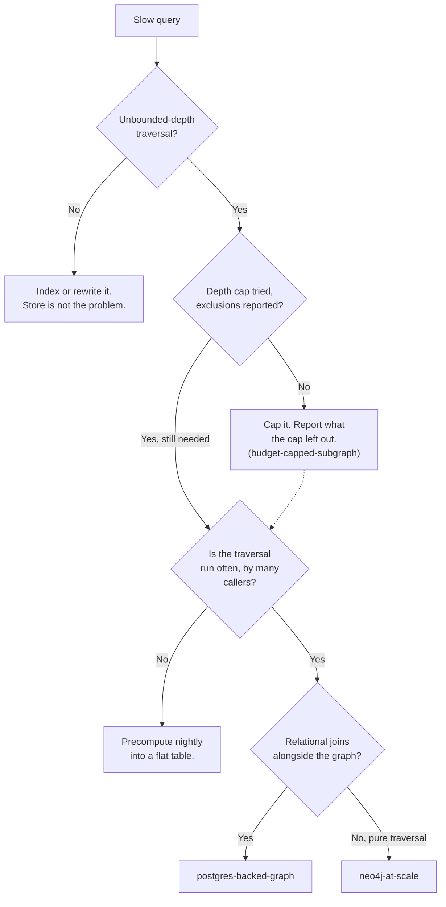

# Graphs at Scale · When SQLite Stops Being Enough

> **Ultra-Pro tier (G4).** Assumes you have shipped at least one graph and worked through [`sqlite-backed-graph`](../../starters/sqlite-backed-graph/). This page is about the moment that kit stops fitting, and how to tell that moment from a moment that merely feels like it.

## Hook

Calderwood Instruments builds laboratory equipment. Two years ago someone on the supply team modeled their parts catalog as a graph: each component a node, each `supplied-by` edge pointing at the firm that provides it, each `depends-on` edge recording that a supplier itself sources something from another firm further upstream. It ran in SQLite, in a file checked into a repo, exactly as the `sqlite-backed-graph` kit lays out. Four hundred nodes. It answered the question it was built for — *who supplies this part* — in under a millisecond, and it did so for two years without anyone thinking about it.

Then a supplier three tiers upstream went into administration, and the question changed. Not *who supplies this part*, but *which of our products are exposed, through any chain of any length, to this one firm*.

The graph had grown too. Acquisitions folded in two more catalogs; the file now holds roughly 2 million edges. The recursive query that answers the new question runs for eleven minutes and returns a result nobody trusts, because it silently stopped following chains at the depth limit someone added last spring to stop it running forever.

Nothing is broken. Every edge is correct. Every receipt is intact. The graph simply outgrew the way it was being asked.

## Explanation

### The question changed before the size did

The instinct is to read this as a size problem: two million edges is too many for SQLite, so move to something bigger. That reading is wrong, and acting on it is how teams end up with a Neo4j cluster serving queries a single file handled fine.

What actually changed at Calderwood was the *shape of the traversal*. "Who supplies this part" is one hop. It stays one hop whether the graph holds four hundred edges or four hundred million, and SQLite with an index on the edge table will answer it at any of those sizes. "Which products are exposed to this firm through a chain of any length" is unbounded multi-hop, and that is a different kind of question — one whose cost grows with the connectivity of the data rather than with your query.

Size determines whether a store is *comfortable*. Traversal shape determines whether it is *appropriate*. Teams that conflate the two migrate for the wrong reason and are surprised when the new store is not faster.

### What multi-hop actually costs

A one-hop lookup touches an index and returns. A recursive traversal re-enters the edge table once per level, carrying a growing frontier of nodes with it, and has to track which nodes it has already visited so a cycle does not spin it forever.

SQLite can express this — `WITH RECURSIVE` is real and it works. What it lacks is any way to make it cheap:

- Every level is another index lookup per frontier node, with no locality between them. A node's neighbors are not stored near it.
- The visited set lives in a temporary table that grows with the traversal.
- There is no query planner in a graph store's sense — nothing decides to walk the traversal from the sparse end instead of the dense one.

A purpose-built graph store keeps a node's adjacency physically next to the node, so following an edge is a pointer hop rather than a lookup. That single difference is most of what you are buying.

### The three-question test

Before moving anything, answer these in order. A migration justified by the third question is a migration that will hold up in review; one justified only by the first is usually premature.

| Question | If yes | If no |
| --- | --- | --- |
| Are the slow queries genuinely unbounded-depth traversals? | Continue to the next question. | Fix the query or the index. The store is not your problem. |
| Have you already tried capping depth and reported what the cap excluded? | Continue. | Do that first — see below. It is often the actual answer. |
| Is the traversal itself the product, run often, by many callers? | A graph store earns its cost. | A nightly batch job writing results into a table is cheaper and easier to audit. |

### Capping depth is a real answer, not a dodge

Calderwood's depth limit was not wrong. It was *undeclared*. A traversal that stops at depth 6 and says so — "17 products exposed within 6 tiers; 4 chains truncated at the limit and not evaluated" — is an honest answer to a bounded question. The same traversal stopping at depth 6 and reporting only "17 products exposed" is a lie by omission, and it is the specific failure that made the supply team stop trusting their own graph.

This is [`budget-capped-subgraph`](../../starters/budget-capped-subgraph/) applied one level up. The pattern's rule holds here unchanged: report what the budget excluded, in the same breath as the result. Many teams that believe they need a new store need only this.

### What you give up by moving

Migration is not free, and the costs are the kind that surface months later:

- **The file stops being readable.** A SQLite graph can be opened, queried, and eyeballed by anyone with the file. A server cannot be inspected from a branch, which means your reviewers lose a tool they were using without noticing.
- **Provenance has to survive the move.** Every receipt from Part 3 must land intact on the other side. A migration that drops `source_document` because the target schema made it awkward has quietly undone the work of Step 8.
- **Two stores, for a while.** Cutovers are rarely atomic. Plan for a period where both hold data, and decide *in advance* which one is authoritative — otherwise you have created exactly the two-graphs-disagreeing problem the course spends Part 3 teaching you to avoid.

### Edge cases worth naming

- **A graph that is large but shallow** — millions of edges, every query one or two hops — belongs in Postgres, not a graph store. Size alone never justifies the move.
- **A graph that is small but densely cyclic** can defeat SQLite at a few thousand nodes, because the frontier explodes even though the node count is modest. Depth, not row count, is the thing to measure.
- **Write-heavy graphs with light traversal** — high-volume extraction, occasional reads — are usually a Postgres story. Graph stores optimize the read path you are barely using.
- **A traversal that is slow only on one node** is usually a data problem: a hub node with a hundred thousand edges, often a resolution failure from Step 7 that merged things it should not have. Fix the graph before moving it.

## Diagram



Three of the five terminal states never leave SQLite. That ratio is the point of the diagram: most graphs that feel like they have outgrown their store have outgrown their *query*.

## Claude Code vs OpenCode

Each configuration below measures the traversal first and refuses to recommend a migration on size alone.

### Claude Code

```markdown
---
name: traversal-profiler
description: Profiles a slow graph query and recommends a store only when traversal shape — not row count — justifies it.
model: claude-opus-4-1-20250805
temperature: 0
tools: [Read, Bash]
---

1. Read the slow query. Classify it as fixed-depth (one or two hops,
   depth known in advance) or unbounded (recursive, depth data-dependent).
   Report the classification before doing anything else.
2. If fixed-depth: check for an index on the edge table's join columns.
   Report that as the finding and STOP. Do not discuss stores.
3. If unbounded: run it at increasing depth caps (2, 4, 6, 8) and record
   for each — rows returned, elapsed time, and chains truncated by the cap.
4. Report the table from step 3. If elapsed time is acceptable at a depth
   where truncation is zero, the answer is a declared cap, not a migration.
   Say so plainly.
5. Only if truncation stays non-zero at acceptable latency, recommend a
   store — and name which of the two it is and why: Postgres if the
   workload also joins non-graph tables, Neo4j if it is pure traversal.
6. Never cite total node or edge count as a reason to migrate. If asked to,
   refuse and restate the finding from step 3.
```

### OpenCode

```markdown
---
name: traversal-profiler
description: Profile a slow graph query; recommend a store change only when traversal depth, not table size, is the cause
context: pattern-implementation
---

First classify the query: fixed-depth (one or two hops) or unbounded
(recursive). State which, before anything else.

Fixed-depth: report whether the edge table's join columns are indexed.
That is the whole finding. Do not raise the subject of a different store.

Unbounded: execute it at depth caps of 2, 4, 6, and 8. For each cap record
rows returned, elapsed time, and how many chains the cap cut short. Return
that as a table.

Read the table before recommending. If some cap gives acceptable latency
with zero chains cut short, the finding is "declare this cap and report
its exclusions" — not "migrate". Recommend a store only when chains are
still being cut short at every acceptable latency, and name which store
and why. Row counts are never a reason on their own; if the caller offers
one as justification, say that it isn't one.
```

## Going Deeper

The ordering of the two stores in the diagram is not a ranking, and reading it as one leads people wrong. Postgres with a recursive CTE and a well-chosen index handles depth-6 traversals over tens of millions of edges perfectly well, and it brings something Neo4j does not: the rest of your data, joinable in the same query. Calderwood's real question — *which products are exposed* — needs product tables, contract dates, and revenue figures alongside the traversal. Answering it in a pure graph store means either federating those tables in or duplicating them, and both of those are worse than a slightly slower join.

Neo4j earns its place when traversal is not one part of the question but the entire question, and when depth is genuinely unbounded rather than merely large. Shortest-path between arbitrary nodes, cycle detection across a whole graph, centrality over the full edge set — these are the cases where a purpose-built engine is not a marginal improvement but a different order of feasible. If your hardest query is depth-4 and joins two ordinary tables, you are not in that territory, and buying into it costs you a store your team already knows how to operate, back up, and reason about.

## Check Yourself

<details>
<summary>A team reports that their graph has crossed 50 million edges and their dashboard has become sluggish, and proposes moving to a dedicated graph store. What is the first thing you should ask for, and why is the edge count not sufficient grounds to approve the move? Reveal the answer.</summary>

Ask for the actual queries the dashboard runs, classified by traversal depth. Edge count tells you how much data is stored; it tells you nothing about how the data is being walked, and only the walk determines whether a graph store helps. A dashboard is very often a set of one-hop aggregate lookups — how many components, how many suppliers, how many flagged — and those are index scans. They get slower with size in a way a better index fixes and a different store does not. If every query turns out to be shallow, moving to Neo4j buys a harder operational story and no speed, because the feature being paid for is adjacency locality on a read path that is not being exercised. The move is justified by a profile showing unbounded traversals that stay too slow even after a declared depth cap — not by the size of the table they run against.

</details>

## Try With AI

1. Build a small graph with a genuine chain in it — twenty or so nodes where some are reachable from others only through four or five intermediate steps. A parts-and-suppliers shape works; so does a "who reports to whom" org chart.
2. Write two queries against it: one that asks a direct question (a node's immediate neighbors) and one that asks a transitive question (everything reachable from a node, at any depth).
3. Ask Claude Code or OpenCode to classify each query as fixed-depth or unbounded, without telling it which is which.
4. Now ask it to run the transitive query with a depth cap of 2, then 4, then unlimited, and to report at each cap how many results came back and how many chains got cut short.
5. Look at the depth-2 result on its own, as if the caps had never been mentioned. Would you have known it was incomplete? That gap — between a truncated answer and a truncated answer that says so — is the entire lesson of this page, and it costs nothing to fix.

## When It Goes Wrong

| Symptom | Cause | Fix |
| --- | --- | --- |
| Migration to a graph store completed cleanly, and the queries are no faster. | The slow queries were shallow. Adjacency locality, the thing the new store provides, is on a read path this workload never takes. | Profile by traversal depth, not by table size. If everything is one or two hops, the fix was an index, and it still is. |
| A traversal returns confidently and the answer is quietly incomplete. | An undeclared depth cap is truncating chains, and the result reports the rows found without reporting the chains abandoned. | Make the cap and its exclusions part of the returned result, not a constant buried in the query. Apply `budget-capped-subgraph` at the traversal level. |
| Query time is fine for every node except a handful, which hang. | Hub nodes with enormous degree — very often an over-eager merge from Step 7 that collapsed several real entities into one. | Investigate the hub as a resolution bug before treating it as a performance one. Reversing a bad merge is cheaper than migrating around it. |
| After the move, edges are present but nobody can say where they came from. | Provenance fields did not survive the schema translation, because the target's edge model made them awkward to carry. | Treat every receipt from Step 8 as a required column in the target schema, and verify the count of edges carrying provenance before and after. A migration that loses receipts has undone Part 3. |
| Two stores are live, and a claim exists in one but not the other. | Cutover left both writable with no declared authority, so writers picked whichever they knew about. | Name one store authoritative for the whole cutover window and make the other read-only. An unowned second copy is the two-graph problem from Part 3, self-inflicted. |

---

**Traversal shape** and **declared cap** name the two ideas this page turns on; both are terminology invented here. [`budget-capped-subgraph`](../../starters/budget-capped-subgraph/) is the kit that implements the second one; the [glossary](../02-foundations/glossary.md#subgraph) covers **subgraph** itself.

---

Next in the advanced tier: [Multi-Graph Federation](multi-graph-federation.md).
