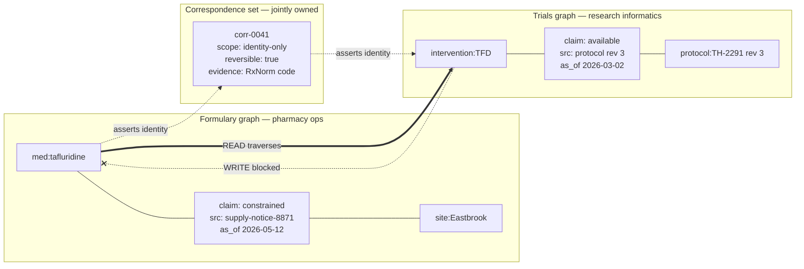

# Multi-Graph Federation · Interoperating Without Merging

> **Ultra-Pro tier (G4).** Assumes Parts 3–5 and the resolution patterns in category B. This page is about the case those patterns do not cover: two graphs that must reference the same thing without becoming one graph.

## Hook

Thornbury Health runs two fact graphs that were never meant to meet.

The **formulary graph** belongs to pharmacy operations. It records which medications the network stocks, at which sites, under which supply contracts. Its provenance rule is procurement-grade: every claim traces to a purchase order or a contract amendment, and a claim without one is not admitted. It changes a few dozen times a week.

The **trials graph** belongs to clinical research. It records which study protocols involve which interventions, which sites are enrolled, and what each protocol's exclusion criteria say. Its provenance rule is different in kind: every claim traces to a protocol document at a specific revision, and a superseded revision's claims are retained forever, because a result published under revision 3 must remain interpretable after revision 4 lands.

Both graphs contain a node for tafluridine.

Last month a supply constraint on tafluridine reached pharmacy operations, and the question that followed was one neither graph could answer alone: *which active studies are affected, and at which sites*. The obvious proposal was to merge the two graphs. It was made, and then withdrawn within a week, once someone worked out what merging would require: one schema both teams accept, one provenance rule that satisfies both a procurement auditor and a research ethics board, and one team owning the result. None of the three is achievable, and two of them are arguably illegal.

The graphs need to interoperate. They must not merge.

## Explanation

### Federation is not deferred merging

The first thing to be clear about, because it decides everything downstream: federation is not a staging area on the way to a merge. It is the end state. You are choosing, permanently, that two graphs will share a reference to the same real-world entity while keeping separate schemas, separate provenance rules, and separate owners.

Everything in category B — [`alias-merge-with-trail`](../../starters/alias-merge-with-trail/), [`confidence-scored-dedup`](../../starters/confidence-scored-dedup/) — answers a different question. Those patterns collapse two mentions *inside one graph* into one canonical node, under one schema, with one team deciding. Federation applies when that collapse is not available: when the two graphs answer to different authorities, and neither can adopt the other's rules without giving up something it exists to guarantee.

### The correspondence edge

The mechanism is a single edge type that lives outside both graphs, in a third, deliberately tiny artifact — call it the correspondence set.

A correspondence asserts: *this node in graph A and this node in graph B refer to the same real-world thing.* It asserts nothing else. In particular it does not assert that their properties agree, that either is correct, or that one may be substituted for the other.

```json
{
  "correspondence_id": "corr-0041",
  "left":  { "graph": "formulary", "node": "med:tafluridine", "as_of": "2026-05-14" },
  "right": { "graph": "trials", "node": "intervention:TFD", "as_of": "2026-05-14" },
  "asserted_by": "R. Adeyemi (pharmacy ops) + K. Lindqvist (research informatics)",
  "evidence": "Both resolve to the same RxNorm ingredient code; confirmed against the 2026-05 formulary import and protocol TH-2291 rev 3.",
  "scope": "identity-only",
  "reversible": true
}
```

Four properties make this work, and dropping any one of them turns federation back into an undocumented merge:

1. **It lives in neither graph.** If the correspondence set lives inside the formulary graph, pharmacy owns it, and research has to file a ticket to correct a statement about their own data. Third artifact, joint ownership.
2. **It carries its own provenance.** A correspondence is a claim like any other and gets a receipt like any other — who asserted it, on what evidence. This is Step 8 applied to the seam rather than to either side.
3. **It is scoped.** `identity-only` means: these denote the same substance. It does not mean the formulary's dosage properties may be read as the trials graph's, and a consumer that does so is misusing the edge.
4. **It is reversible.** Correspondences are wrong sometimes — two similarly-named interventions, a generic conflated with a branded formulation. Reversing one must not require touching either graph.

### Queries cross the seam; writes never do

The rule that keeps federation stable is asymmetric, and it is worth stating baldly: **reads may traverse a correspondence. Writes may not.**

A federated query starts in one graph, hits a correspondence, continues in the other, and returns a result labeled with which graph each part came from. That is the whole feature.

What must never happen is a write in graph A propagating through a correspondence into graph B. The moment that is permitted, the trials graph can be modified by a process that answers to procurement rules, its provenance guarantee is void, and every claim in it becomes unauditable — not merely the propagated ones, because a reader can no longer tell which claims entered under the protocol rule and which arrived through the seam.

### Disagreement is the normal case

Both graphs hold a claim about tafluridine's availability at the Eastbrook site. The formulary graph says constrained, sourced to a supply notice. The trials graph says available, sourced to protocol TH-2291 revision 3, which was written in March.

Neither is wrong. They are answers to different questions asked at different times under different evidence rules. A federated query that returns "available" or "constrained" has destroyed the information that made the answer usable.

What it should return is both, attributed:

```json
{
  "question": "tafluridine availability at Eastbrook",
  "answers": [
    { "graph": "formulary", "value": "constrained", "as_of": "2026-05-12", "source": "supply-notice-8871" },
    { "graph": "trials", "value": "available", "as_of": "2026-03-02", "source": "protocol TH-2291 rev 3" }
  ],
  "correspondence": "corr-0041",
  "reconciled": false
}
```

`"reconciled": false` is the load-bearing field. It says the federation layer noticed the disagreement and deliberately declined to settle it — which is what [`conflict-aware-bundle`](../../starters/conflict-aware-bundle/) does within one graph, applied here across two. Settling it is a clinical decision, and the federation layer has no standing to make it.

### Edge cases worth naming

- **Correspondence chains.** A corresponds to B, B corresponds to C. Do not infer A↔C. Each correspondence was asserted on its own evidence by its own people; transitivity smuggles in an assertion nobody made. If A↔C is true, assert it separately, with its own evidence.
- **One-to-many.** A single formulary entry may correspond to several trial interventions at different concentrations. This is legitimate and must be representable. A schema that assumes correspondences are one-to-one will silently drop the extras.
- **Retirement, not deletion.** When one side removes a node, the correspondence becomes historical, not invalid. Mark it retired with a date. A published result that relied on it must stay interpretable.
- **Timestamp skew.** `as_of` on each side is not decoration. Two graphs refreshed on different cadences will routinely disagree purely because one is newer, and a consumer that cannot see both timestamps will read a staleness artifact as a genuine conflict.
- **The seam has no owner by default.** This is the most common way federation fails in practice — not technically, but organizationally. If nobody is accountable for the correspondence set, it rots, and a rotted seam is worse than none because it is still trusted.

## Diagram



The dotted correspondence links point *into* the middle artifact from both sides — neither graph contains it. The heavy arrow is a federated read. The blocked arrow is the rule that keeps each graph's provenance guarantee intact.

## Claude Code vs OpenCode

Both configurations answer a cross-graph question by traversing a correspondence, and both return every side's answer attributed rather than reconciling them.

### Claude Code

```markdown
---
name: federated-query
description: Answers a question spanning two graphs by traversing a correspondence, returning every side's answer attributed and unreconciled.
model: claude-opus-4-1-20250805
temperature: 0
tools: [Read]
---

1. Read `correspondences.json`. Treat it as read-only for this entire run.
   You may not add, edit, or infer a correspondence.
2. Identify the starting node and which graph it belongs to. State both.
3. Find correspondences naming that node. If none, report that the question
   cannot cross the seam, and STOP — do not guess a counterpart from name
   similarity. A missing correspondence is a finding, not an obstacle.
4. Check each correspondence's `scope`. If it is `identity-only`, you may
   follow it to locate the counterpart node and nothing more. Do not read
   one graph's properties as though they were the other's.
5. Collect the answer from each graph separately. Keep with each: the graph
   it came from, its source, and its `as_of` date.
6. Emit every answer collected. Set `reconciled: false`. If the answers
   differ, say so explicitly and name the correspondence they were joined
   through. Never pick a winner, average them, or prefer the newer one.
7. Do not follow a correspondence chain. If the counterpart node itself has
   a correspondence onward to a third graph, stop and report that a further
   hop exists but was not taken.
```

### OpenCode

```markdown
---
name: federated-query
description: Cross-graph question answering over a correspondence set; returns each graph's answer attributed, never reconciled
context: pattern-implementation
---

Load `correspondences.json` read-only. Nothing in this run may write to it,
and no correspondence may be inferred that isn't already written down.

Name the starting node and its graph. Look for correspondences naming that
node. None found means the question stops here — report that plainly rather
than matching on similar names.

Honor `scope`. An `identity-only` correspondence licenses one thing: finding
the counterpart node. It does not license treating either graph's properties
as the other's.

Query each graph on its own. Carry the graph name, the source, and the
`as_of` date alongside every answer.

Return all answers with `reconciled: false`, naming the correspondence used.
Where answers conflict, state the conflict; the disagreement is the result,
not a problem to clean up before returning. Check `as_of` before calling
anything a conflict at all — two different refresh dates often explain it.

Stop after one hop. If the counterpart has its own onward correspondence,
note that it exists and that you did not follow it.
```

## Going Deeper

The correspondence set is deliberately the smallest artifact in the system, and there is constant pressure to grow it. Someone will propose caching the trials graph's site list in it, to save a lookup. Someone will propose a `preferred_side` field, so callers tired of handling two answers can just get one. Both are reasonable-sounding, and both convert the seam into a third graph — one with no owner, no provenance rule, and no review process, holding data that is now stale in a way neither source team can see.

The discipline that holds is: a correspondence may say *these are the same thing* and *here is who says so, on what evidence*. Everything else belongs in one of the two real graphs, where it has an owner who is accountable for it.

This mirrors the reason Step 3 insists on keeping two kinds of graph apart rather than fusing them for convenience. The impulse is the same — one place to look is easier — and so is the cost. What you lose is not storage efficiency but the ability to say who is answerable for a given claim, and that is the property the whole provenance apparatus from Part 3 exists to protect.

## Check Yourself

<details>
<summary>A well-meaning engineer proposes an optimization: when a federated query finds that both graphs answer the same question and their answers agree, collapse them into a single answer in the response, since returning two identical values is noise. Both graphs still hold their own copy — nothing is being merged. What does this quietly cost? Reveal the answer.</summary>

It costs the consumer the ability to tell agreement from a single source. A response carrying two attributed answers that happen to match says something specific and valuable: two independently-governed graphs, with different evidence rules, arrived at the same conclusion. That is corroboration, and it is a much stronger basis for a decision than one graph's say-so. Collapsed to one value, that response becomes indistinguishable from a response where only one graph had an opinion at all — and a consumer choosing whether to act on a supply constraint has lost exactly the signal that would have told them how much weight the answer carries.

There is a second cost that shows up later. Once agreeing answers collapse, the response shape differs depending on whether the graphs agree, so every consumer needs branching logic for the two cases, and the disagreement path becomes the rarely-exercised one. The uniform two-answer shape is not noise; it is what keeps the disagreement path ordinary rather than exceptional.

</details>

## Try With AI

1. Build two tiny graphs in separate files, with genuinely different schemas — not the same shape twice. One might use `name`/`status`, the other `label`/`state`. Five or six nodes each.
2. Make one real-world thing appear in both, under different identifiers.
3. Write a correspondence file, separate from both graphs, asserting that those two nodes are the same thing. Include who asserted it and on what evidence.
4. Give the two graphs deliberately conflicting claims about that thing, each with its own source and its own `as_of` date.
5. Ask Claude Code or OpenCode to answer a question about that thing using all three files. Do not tell it what to do about the conflict.
6. Check the response. Did both answers come back attributed to their graphs? Or did it pick one, average them, or prefer the newer date? Then ask why it did what it did — a model that reconciled silently can usually justify the choice, which is precisely the problem: the justification is a clinical or commercial judgment it had no standing to make.

## When It Goes Wrong

| Symptom | Cause | Fix |
| --- | --- | --- |
| Claims turn up in one graph that its own team never entered and cannot account for. | A write propagated across a correspondence. | Enforce read-only traversal at the query layer. Then audit for propagated claims and remove them — every one is unprovenanced by that graph's own rule. |
| A federated result reads cleanly and turns out to be wrong in a way neither graph is wrong. | The layer reconciled a genuine disagreement instead of returning both sides. | Return every answer attributed, with `reconciled: false`. Reconciliation is a decision for someone with domain standing, not for the seam. |
| Two nodes are linked that clearly are not the same thing. | A correspondence was inferred from name similarity, or transitively through a chain, rather than asserted on evidence. | Require `evidence` on every correspondence and refuse to infer transitively. Reverse the bad one — this is why `reversible: true` is not optional. |
| A conflict alert fires constantly between two graphs that broadly agree. | Different refresh cadences. The graphs are reporting the same reality at different moments, and the layer is reading staleness as disagreement. | Compare `as_of` before classifying anything as a conflict, and report the skew as the finding when that is what it is. |
| The correspondence set has grown properties, caches, and a preferred side. | Nobody owns it, so every consumer added what they needed. | Name joint owners and hold the scope to identity plus provenance. A seam with its own data is a third graph, and an ungoverned one. |
| A published analysis can no longer be reproduced after one graph removed a node. | The correspondence was deleted along with it. | Retire correspondences with a date; never delete them. Historical results have to stay interpretable, which is why the trials graph keeps superseded revisions in the first place. |

---

**Correspondence** and **seam** name the link and the boundary it spans; both are terminology invented here. The nearest in-graph analogues are [`alias-merge-with-trail`](../../starters/alias-merge-with-trail/) for resolution within one graph and [`conflict-aware-bundle`](../../starters/conflict-aware-bundle/) for keeping a disagreement whole.

---

Previous: [Graphs at Scale](graphs-at-scale.md) · Next: [Governance at Org Scale](governance-at-org-scale.md).
